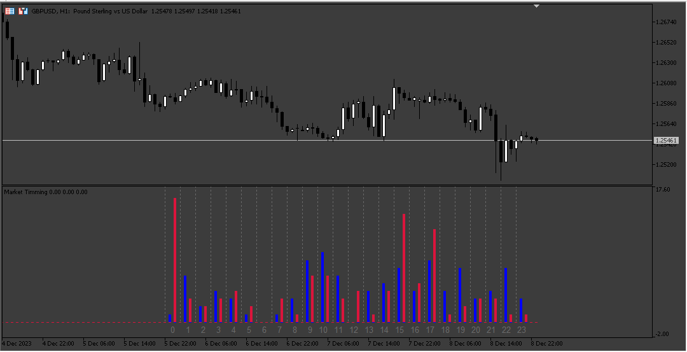
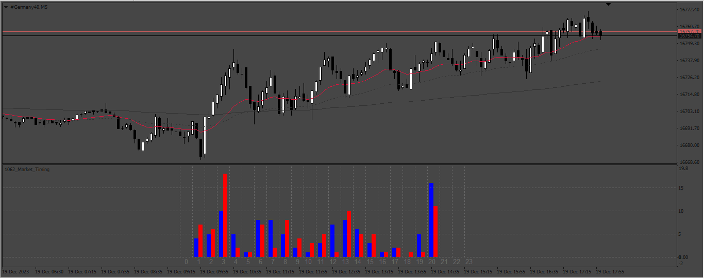
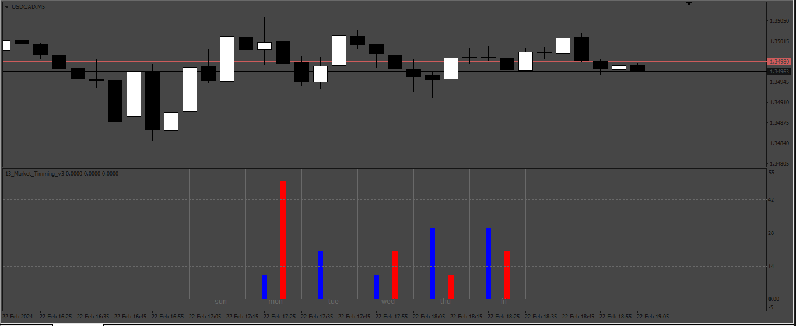

# Market_Timming

> Source: https://fxcodebase.com/code/viewtopic.php?f=17&t=74425  
> Forum: 17 · Topic 74425 · 8 post(s)

---

## Market_Timming

**Apprentice** · Sun Dec 10, 2023 3:15 am

Based on the request.
[https://fxcodebase.com/code/viewtopic.php?f=17&p=153543](https://fxcodebase.com/code/viewtopic.php?f=17&p=153543)

 [Market_Timing.mq4](files/153615/Market_Timing.mq4)

 [Market_Timing.mq5](files/153615/Market_Timing.mq5)

---

## Re: Market_Timming

**Kinslay** · Sun Dec 10, 2023 1:39 pm

Hello Apprentice,

Thank you for your valuable work.

if possible I ask you to add these details:

1) percentage numbers to understand exactly what percentage the indicator releases (you have an example in the attached photo)

2) is there a possibility to place the indicator more central like in your picture? because my indicator is all shifted to the right side of the chart.

3) in the picture in example i have considered the sp500 for the last 30 days, it seems strange to me that the highs and lows for this period are made between 8am and 11pm, could you please double check the calculation if it is correct?
Basically, what I'm looking for is to figure out at what time of day the highs and lows of a daily candle are made and these values report them on the histogram.

4) the indicator seems to work on all instruments except the dax (attached you have the picture) could you fix this problem?

---

## Re: Market_Timming

**Apprentice** · Sat Dec 16, 2023 2:54 pm

We have added your request to the development list.
Development reference 1115

---

## Re: Market_Timming

**Apprentice** · Thu Dec 28, 2023 4:56 am

 [Market_Timing_v2.mq4](files/153818/Market_Timing_v2.mq4)

 [Market_Timming_v2.mq5](files/153818/Market_Timming_v2.mq5)

---

## Re: Market_Timming

**Kinslay** · Fri Dec 29, 2023 9:53 am

Hello Apprentice,

Thank you for your excellent work.
To complete the indicator, I would like to add these calculations and I would like to see these new indications next to the indicator you created.

I would need to see the statistics of when the high and low of the week is generated.
In particular, I would like to see via histogram "not the time" as in the previous indicator but the "day" on which the highs and lows of the week are made.
In the photo I attach an example of how I would like to see it.
I hope you will be able to complete this request of mine and once completed I would like it to be available for both mt4 and mt5

Regards

---

## Re: Market_Timming

**Apprentice** · Tue Jan 02, 2024 12:49 pm

We have added your request to the development list.
Development reference 13

---

## Re: Market_Timming

**Kinslay** · Tue Feb 13, 2024 1:28 pm

Hello Apprentice,

Any news about the request?

Regards

---

## Re: Market_Timming

**Apprentice** · Sat Feb 24, 2024 1:16 pm

 [Market_Timming_v3.mq4](files/154476/Market_Timming_v3.mq4)

 [Market_Timming_v3.mq5](files/154476/Market_Timming_v3.mq5)
