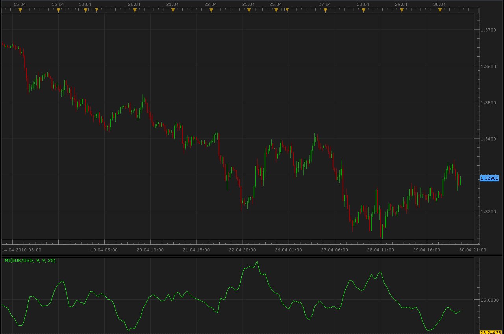

# Mass Index (MI)

> Source: https://fxcodebase.com/code/viewtopic.php?f=17&t=900  
> Forum: 17 · Topic 900 · 3 post(s)

---

## Mass Index (MI)

**Alexander.Gettinger** · Fri Apr 30, 2010 12:28 pm

The mass index serves for finding turns in trends. It is based on changes between maximum and minimum prices. If the amplitude gets wider, the mass index grows; if it gets narrower, the index gets smaller.

Calculation:

MI = SUM (EMA (HIGH - LOW, 9) / EMA (EMA (HIGH - LOW, 9), 9), N)

Where:
SUM — means a sum;
HIGH — the maximum price of the current bar;
LOW — the minimum price of the current bar;
EMA — the exponential moving average;
N — the period of the indicator (the number of values added).

 

The indicator was revised and updated

---

## Re: Mass Index (MI)

**Alexander.Gettinger** · Thu Apr 03, 2014 10:57 am

MQL4 version of Mass Index: [viewtopic.php?f=38&t=60489](https://fxcodebase.com/code/viewtopic.php?f=38&t=60489).

---

## Re: Mass Index (MI)

**Apprentice** · Fri Jun 16, 2017 7:23 am

The indicator was revised and updated.
