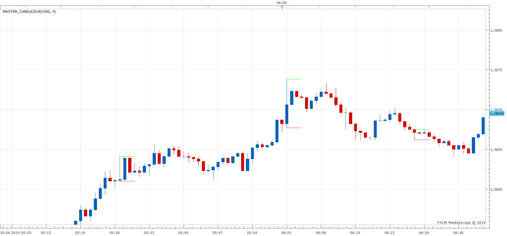

# Master_Candle

> Source: https://fxcodebase.com/code/viewtopic.php?f=17&t=60521  
> Forum: 17 · Topic 60521 · 25 post(s)

---

## Master_Candle

**Apprentice** · Thu Apr 10, 2014 5:54 am

Master_Candle indicator will indicate all candles
These are followed by N candles contained within their range.

 [Master_Candle.lua](files/93449/Master_Candle.lua)

The indicator was revised and updated

---

## Re: Master_Candle

**fxFox.mb** · Fri Apr 25, 2014 5:30 am

Hi Apprentice,

once again I found a case where the mastercandle (Min engulf = 3) is not marked on the chart.
Today on EURAUD H1

Regards fxfox

---

## Re: Master_Candle

**Apprentice** · Fri Apr 25, 2014 8:08 am

Please Re-Download, will do now.

---

## Re: Master_Candle

**fxFox.mb** · Fri Apr 25, 2014 8:24 am

> **Apprentice wrote:**
> Please Re-Download, will do now.

 Thanks a lot - it works

---

## Re: Master_Candle

**Apprentice** · Sun Jun 18, 2017 12:36 pm

The indicator was revised and updated.

---

## Re: Master_Candle

**tyros refa** · Sat Jul 18, 2020 6:41 am

Hi Apprentice

Could you mofify a little this indicator, or add an option, with this condition:

* the body of at least one candle is inside the range of the previous candle.
* no matter the wicks, or the color of the bodies.

When this condition is ok on close, there is a valid master candle.

Thank you

---

## Re: Master_Candle

**Apprentice** · Sun Jul 19, 2020 5:07 pm

Your request is added to the development list.
Development reference 1723.

---

## Re: Master_Candle

**chai88888** · Mon Jul 20, 2020 12:30 am

hi there can you make a strategy base on this indicator.

open a trade on the breakout live or end of turn
stop loss is place on the opposite line of the breakout
limit is place based on the distance between open of the trade to stop loss plus spread.

thanks

---

## Re: Master_Candle

**Apprentice** · Mon Jul 20, 2020 8:21 am

Your request is added to the development list.
Development reference 1741.

---

## Re: Master_Candle

**Apprentice** · Mon Jul 20, 2020 10:14 am

Based on Task 1723

 [Master_Candle.lua](files/136125/Master_Candle.lua)

---

## Re: Master_Candle

**tyros refa** · Mon Jul 20, 2020 4:23 pm

> **Apprentice wrote:**
> Based on Task 1723
>
>
> Master_Candle.lua

You're the boss, Apprentice!

Thank you very much, it's perfect!

---

## Re: Master_Candle

**Apprentice** · Tue Jul 21, 2020 8:53 am

Indicator based strategy.
[viewtopic.php?f=31&t=70205](https://fxcodebase.com/code/viewtopic.php?f=31&t=70205)

---

## Re: Master_Candle

**bruno2017** · Sun Dec 13, 2020 1:35 pm

> **Apprentice wrote:**
> Based on Task 1723
>
>
> Master_Candle.lua

Hello
could you modify this indicator like this:
after the formation of a master candle, cause another to appear only if price closes higher or lower than the master candle.
attached a screenshot
thank you

---

## Re: Master_Candle

**Apprentice** · Sun Dec 13, 2020 1:56 pm

Your request is added to the development list.
Development reference 2452.

---

## Re: Master_Candle

**Apprentice** · Tue Dec 15, 2020 11:50 am

[Master_Candle_bruno2017.lua](files/139582/Master_Candle_bruno2017.lua)

Try this version.

---

## Re: Master_Candle

**bruno2017** · Tue Dec 15, 2020 1:40 pm

> **Apprentice wrote:**
>
>
> Master_Candle_bruno2017.lua
>
>
> Try this version.

sorry it's not that's what I'd like:
when a master candle is valid no other master candle should appear before another master candle
je ne comprend pas la modification que vous avez fait sur l indicateur et désoler je n'ai pas le code de l indicateur

---

## Re: Master_Candle

**bruno2017** · Tue Dec 15, 2020 2:37 pm

> **Apprentice wrote:**
>
>
> Master_Candle_bruno2017.lua
>
>
> Try this version.

In this example an inside bar configuration was identified when the second candle in the configuration closed inside the High/Low range of the previous candle. The first candle, often called "outside bar" (grey background) allows to establish a price channel based on the highest and lowest of this bar outside bar. The price channel is traced until a candle closes over the canal, indicating a buying opportunity (green background).
In this example an inside bar configuration was identified when the second candle in the configuration closed inside the High/Low range of the previous candle. The first candle, often called "outside bar" (grey background) allows to establish a price channel based on the highest and lowest of this bar outside bar. The price channel is traced until a candle closes below the channel, indicating a sales opportunity (red background).

---

## Re: Master_Candle

**Apprentice** · Wed Dec 16, 2020 9:28 am

Your request is added to the development list.
Development reference 2480.

---

## Re: Master_Candle

**bruno2017** · Wed Jan 06, 2021 4:36 am

Hello,
Do you know what is the progress of this request?

---

## Re: Master_Candle

**Apprentice** · Thu Jan 07, 2021 8:32 am

It looks like a screenshot from TradingView. Could you provide a Pine Script?

---

## Re: Master_Candle

**bruno2017** · Thu Jan 07, 2021 9:26 am

Hello I do not have the code it isur nanotrader
can you still do something??

---

## Re: Master_Candle

**bruno2017** · Fri Jan 08, 2021 5:08 am

Bonjour
ce code me semble corect

// This source code is subject to the terms of the GNU License 2.0 at [https://www.gnu.org/licenses/old-licens ... .0.en.html](https://www.gnu.org/licenses/old-licenses/gpl-2.0.en.html)
// © cma

//@version=4
study('Inside Bar Ind/Alert', overlay=true)

bullishBar = 1
bearishBar = -1

isInside() =>
 previousBar = 1
 bodyStatus = (close >= open) ? 1 : -1
 isInsidePattern = high < high[previousBar] and low > low[previousBar]

 isInsidePattern ? bodyStatus : 0

barcolor(isInside() == bullishBar ? color.green : na)
barcolor(isInside() == bearishBar ? color.red : na)

// When is bullish bar paint green
plotshape(isInside() == bullishBar, style=shape.triangleup,
 location=location.abovebar, color=color.green)

// When is bearish bar paint red
plotshape(isInside() == bearishBar, style=shape.triangledown,
 location=location.belowbar, color=color.red)

isInsideBarMade = isInside() == bullishBar or isInside() == bearishBar

alertcondition(isInsideBarMade, title='Inside Bar', message='Inside Bar came up!')

---

## Re: Master_Candle

**Apprentice** · Sat Jan 09, 2021 1:31 am

Your request is added to the development list.
Development reference 51.

---

## Re: Master_Candle

**Apprentice** · Mon Jan 11, 2021 6:13 am

Try this version.
[viewtopic.php?f=17&t=70809](https://fxcodebase.com/code/viewtopic.php?f=17&t=70809)

---

## Re: Master_Candle

**bruno2017** · Mon Jan 11, 2021 1:27 pm

thank you very much
 to use with a trend filter
