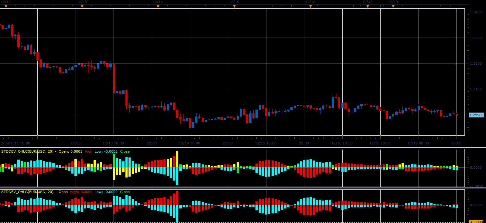

# Max&Min standard deviation

> Source: https://fxcodebase.com/code/viewtopic.php?f=17&t=10149  
> Forum: 17 · Topic 10149 · 4 post(s)

---

## Max&Min standard deviation

**Alexander.Gettinger** · Mon Dec 19, 2011 8:40 pm

Indicator compares the values ​​of standard deviation (StdDev), calculated for the open, close, high and low prices and displays the minimum and maximum values​​. In another version compared high and low only.

 

Download:

 [StdDev_OHLC.lua](files/21249/StdDev_OHLC.lua)

For this indicator must be installed StdDev indicator ([viewtopic.php?f=17&t=870&p=1577](https://fxcodebase.com/code/viewtopic.php?f=17&t=870&p=1577)).

The indicator was revised and updated

---

## Re: Max&Min standard deviation

**jtatalov** · Mon Dec 19, 2011 8:56 pm

I think you're missing something...when you download and implement it doesn't recognize the strings existence.

---

## Re: Max&Min standard deviation

**jtatalov** · Mon Dec 19, 2011 9:14 pm

Never mind, I can't read the post, but when I look at the code I can tell I'm missing an indicator...

---

## Re: Max&Min standard deviation

**Apprentice** · Tue Mar 21, 2017 6:10 am

Indicator was revised and updated.
