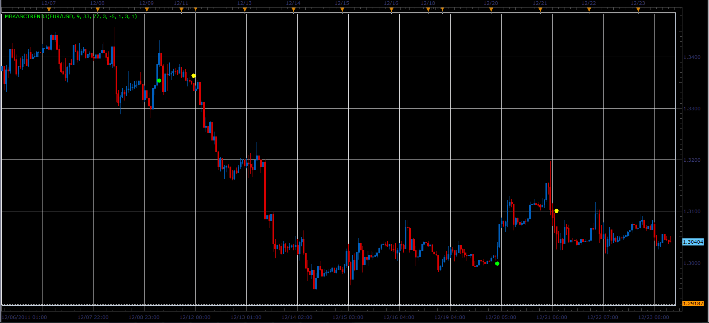

# MBKAsctrend3 indicator

> Source: https://fxcodebase.com/code/viewtopic.php?f=17&t=10399  
> Forum: 17 · Topic 10399 · 3 post(s)

---

## MBKAsctrend3 indicator

**Alexander.Gettinger** · Sun Dec 25, 2011 2:20 pm

This indicator is a ported MQL5 indicator from [http://www.mql5.com/ru/code/775](http://www.mql5.com/ru/code/775) (in Russian).

The indicator shows the dots where trend[i] not equal trend[i-1], where
trend=1, if WPRvalue>UpLevel and WPRlong>=Up1Level and
trend=-1, if WPRvalue<DnLevel and WPRlong<=Dn1Level,
WPRvalue=W1*WPR(WPR_Period1)+W2*WPR(WPR_Period2)+W3*WPR(WPR_Period3).

 

Download:

 [MBKAsctrend3.lua](files/21608/MBKAsctrend3.lua)

---

## Re: MBKAsctrend3 indicator

**Alexander.Gettinger** · Mon Dec 26, 2011 7:06 am

Strategy based on MBKAsctrend3 indicator : [viewtopic.php?f=31&t=10449](https://fxcodebase.com/code/viewtopic.php?f=31&t=10449)

---

## Re: MBKAsctrend3 indicator

**Apprentice** · Tue Mar 13, 2018 11:17 am

The Indicator was revised and updated.
