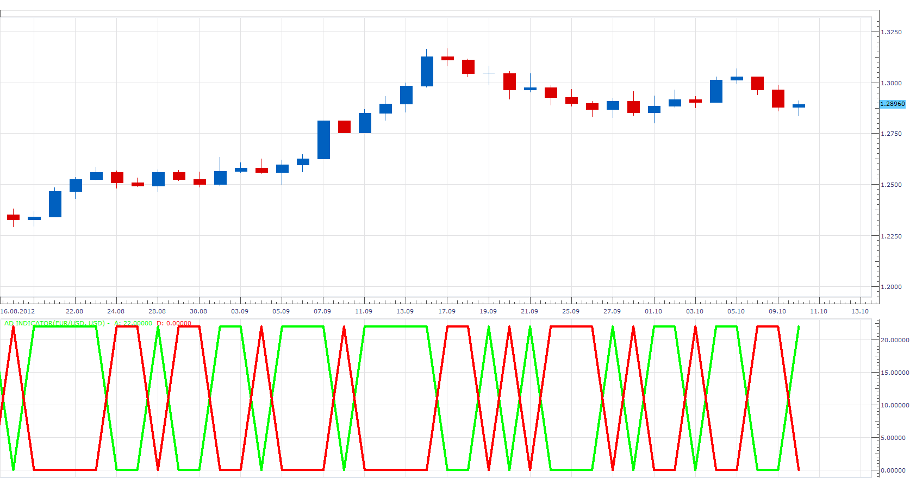
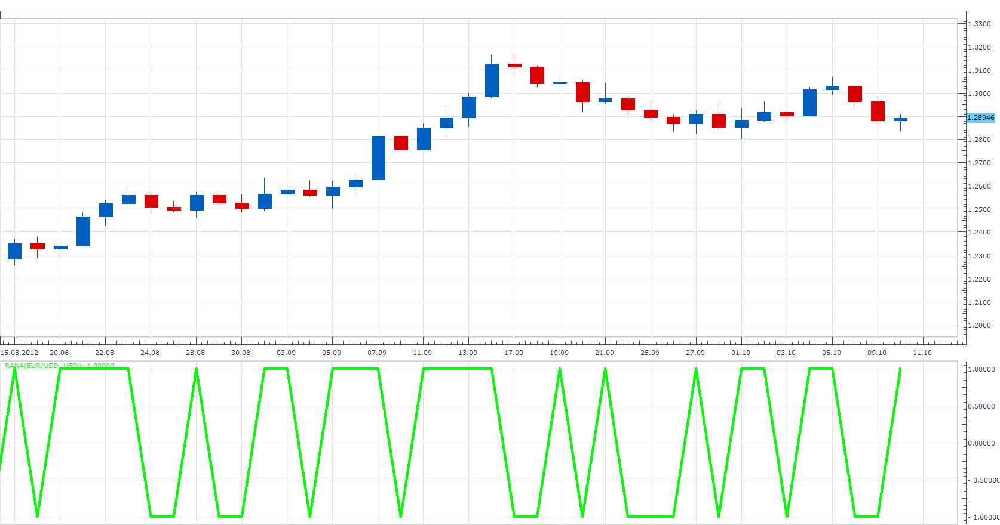

# McClellan Oscillator

> Source: https://fxcodebase.com/code/viewtopic.php?f=17&t=24282  
> Forum: 17 · Topic 24282 · 7 post(s)

---

## McClellan Oscillator

**Apprentice** · Wed Oct 10, 2012 10:19 am

Developed by Sherman and Marian McClellan, the McClellan Oscillator is a breadth indicator derived from Net Advances, the number of advancing issues less the number of declining issues.
McClellan Oscillator= 19-day EMA of RANA - 39-day EMA of RANA
Ratio Adjusted Net Advances (RANA)= (Advances - Declines)/(Advances + Declines)

As You know on Forex market, we do not have a single currency,
according to which all others are measured.
Therefore I have add menu which allows you to select the nominal currency for calculation.

 [McClellan Oscillator.lua](files/41775/McClellan%20Oscillator.lua)

The indicator was revised and updated

---

## Re: McClellan Oscillator

**Apprentice** · Wed Oct 10, 2012 10:23 am

 [AD Indicator.lua](files/41776/AD%20Indicator.lua)

---

## Re: McClellan Oscillator

**Apprentice** · Wed Oct 10, 2012 10:27 am

 [RANA.lua](files/41777/RANA.lua)

---

## Re: McClellan Oscillator

**Apprentice** · Wed Oct 10, 2012 10:37 am

McClellan Summation Index = McClellan Summation Index [-1] +McClellan Oscillator

 [McClellan Summation Index.lua](files/41780/McClellan%20Summation%20Index.lua)

---

## Re: McClellan Oscillator

**Apprentice** · Wed Oct 10, 2012 3:00 pm

Updated.
Please re-download all indicator, I found a few bugs.

---

## Re: McClellan Oscillator

**Alexander.Gettinger** · Thu Apr 03, 2014 12:36 pm

MQL4 version of indicators: [viewtopic.php?f=38&t=60493](https://fxcodebase.com/code/viewtopic.php?f=38&t=60493).

---

## Re: McClellan Oscillator

**Apprentice** · Fri Jun 16, 2017 7:15 am

The indicator was revised and updated.
