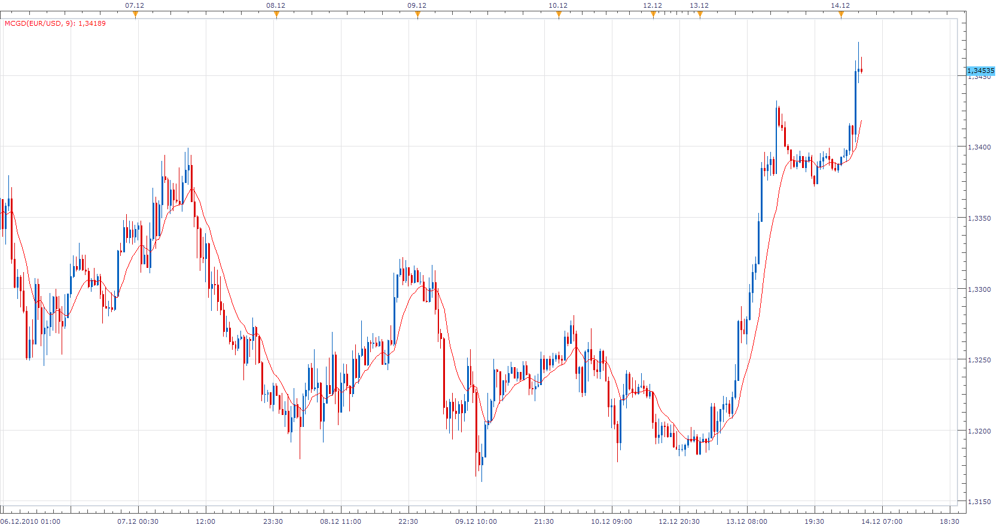

# McGinley Dynamic

> Source: https://fxcodebase.com/code/viewtopic.php?f=17&t=2950  
> Forum: 17 · Topic 2950 · 3 post(s)

---

## McGinley Dynamic

**Apprentice** · Tue Dec 14, 2010 3:43 am

The McGinley Dynamic (MD) technical indicator was designed by John R. McGinley.

McGinley considered that moving averages should not be used as trading systems or signal generators, but instead, they should be used as smoothing mechanisms.

MD tracks price better than any moving average.

McGinley Dynamic Formula ( The formula differs from the standard).
Yesterday's EMA + (Today's close - Yesterday's EMA) / (Today's close / Yesterday's EMA * 125)

 [MCGD.lua](files/6752/MCGD.lua)

 

 [Multi Time Frame McGinley Dynamic.lua](files/6752/Multi%20Time%20Frame%20McGinley%20Dynamic.lua)

MT4/MQ4 version.
[viewtopic.php?f=38&t=65619&p=116950#p116950](https://fxcodebase.com/code/viewtopic.php?f=38&t=65619&p=116950#p116950)

The indicator was revised and updated

---

## Re: McGinley Dynamic

**Apprentice** · Wed Feb 01, 2017 7:34 am

Indicator was revised and updated.

---

## Re: McGinley Dynamic

**Apprentice** · Thu Jan 11, 2018 6:47 am

Multi Time Frame McGinley Dynamic.lua added.
