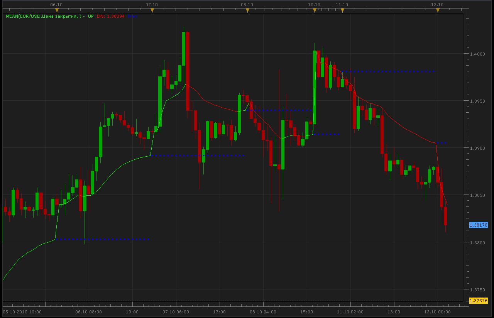

# Mean indicator (closed)

> Source: https://fxcodebase.com/code/viewtopic.php?f=17&t=2378  
> Forum: 17 · Topic 2378 · 10 post(s)

---

## Mean indicator (closed)

**Alexander.Gettinger** · Tue Oct 12, 2010 1:32 am

**Note: new version is available here: [viewtopic.php?f=17&t=2526](https://fxcodebase.com/code/viewtopic.php?f=17&t=2526)**

[viewtopic.php?f=27&t=2369&p=5104#p5104](https://fxcodebase.com/code/viewtopic.php?f=27&t=2369&p=5104#p5104)

 



 [Mean.lua](files/5130/Mean.lua)

 [Mean Calculation.lua](files/5130/Mean%20Calculation.lua)

The indicator was revised and updated

---

## Re: Mean indicator

**hpinvestment** · Tue Oct 12, 2010 7:32 am

Hi Alexander

Can you please explain how this indicator works?

---

## Re: Mean indicator

**posurf** · Wed Oct 13, 2010 2:35 am

Thanks

but is it possible to change the beginning of the time session, especially for the forex.

---

## Re: Mean indicator

**maurosg** · Fri Oct 15, 2010 2:09 pm

Hi Alexander, thanks for the indicator

Thinking in Market profile, it is possible calculate this indicator whith "the mode" instead of "the mean"?

regards

---

## Re: Mean indicator

**virgilio** · Mon Oct 18, 2010 3:13 pm

Is it possible to have a signal/strategy for this indicator?
thank you.

---

## Re: Mean indicator

**Apprentice** · Mon Oct 18, 2010 3:20 pm

Certainly, but you can specify, when, the conditions when the signal generated signals.

---

## Re: Mean indicator

**virgilio** · Tue Oct 19, 2010 10:14 am

The goal is to have a strategy that generates buy/sell orders based on the same conditions as of the indicator.

---

## Re: Mean indicator

**Alexander.Gettinger** · Wed Oct 20, 2010 12:43 am

Indicator updated.
Added other time session for calculation MA.

```lua
function Init()
    indicator:name("Mean indicator");
    indicator:description("Mean indicator");
    indicator:requiredSource(core.Tick);
    indicator:type(core.Indicator);

    indicator.parameters:addGroup("Calculation");
    indicator.parameters:addString("Mode", "Mode", "", "Day");
    indicator.parameters:addStringAlternative("Mode", "M1", "", "M1");
    indicator.parameters:addStringAlternative("Mode", "M5", "", "M5");
    indicator.parameters:addStringAlternative("Mode", "M15", "", "M15");
    indicator.parameters:addStringAlternative("Mode", "H1", "", "H1");
    indicator.parameters:addStringAlternative("Mode", "H2", "", "H2");
    indicator.parameters:addStringAlternative("Mode", "H3", "", "H3");
    indicator.parameters:addStringAlternative("Mode", "H4", "", "H4");
    indicator.parameters:addStringAlternative("Mode", "H6", "", "H6");
    indicator.parameters:addStringAlternative("Mode", "H8", "", "H8");
    indicator.parameters:addStringAlternative("Mode", "Day", "", "Day");
    indicator.parameters:addStringAlternative("Mode", "Month", "", "Month");

    indicator.parameters:addGroup("Style");
    indicator.parameters:addColor("clrUP", "UP Color", "UP Color", core.rgb(0, 255, 0));
    indicator.parameters:addColor("clrDN", "DN Color", "DN Color", core.rgb(255, 0, 0));
    indicator.parameters:addColor("clrPrev", "Prev Color", "Prev Color", core.rgb(0, 0, 255));
    indicator.parameters:addInteger("widthLinReg", "Line width", "Line width", 1, 1, 5);
    indicator.parameters:addInteger("styleLinReg", "Line style", "Line style", core.LINE_SOLID);
    indicator.parameters:setFlag("styleLinReg", core.FLAG_LINE_STYLE);
end

local first;
local source = nil;
local MeanUP=nil;
local MeanDN=nil;
local Buff=nil;
local PrevBuff=nil;
local Mode;

function Prepare()
    source = instance.source;
    Mode=instance.parameters.Mode;
    first = source:first()+2;
    Buff = instance:addInternalStream(first, 0);
    local name = profile:id() .. "(" .. source:name() .. ", " .. instance.parameters.Mode .. ")";
    instance:name(name);
    MeanUP = instance:addStream("MeanUP", core.Line, name .. ".UP", "UP", instance.parameters.clrUP, first);
    MeanDN = instance:addStream("MeanDN", core.Line, name .. ".DN", "DN", instance.parameters.clrDN, first);
    PrevBuff = instance:createTextOutput ("Prev", "Prev", "Wingdings", 10, core.H_Center, core.V_Center, instance.parameters.clrPrev, first);
    MeanUP:setWidth(instance.parameters.widthLinReg);
    MeanUP:setStyle(instance.parameters.styleLinReg);
    MeanDN:setWidth(instance.parameters.widthLinReg);
    MeanDN:setStyle(instance.parameters.styleLinReg);
end

function Update(period, mode)
   if (period>first) then
      local d1,t1;
      d1,t1=source:date(period);
      local table1=core.dateToTable(d1);
      local CurD;
      if Mode=="M1" then
       CurD=table1.min;
      elseif Mode=="M5" then
       CurD=math.floor((table1.min)/5);
      elseif Mode=="M15" then
       CurD=math.floor((table1.min)/15);
      elseif Mode=="H1" then
       CurD=table1.hour;
      elseif Mode=="H2" then
       CurD=math.floor((table1.hour)/2);
      elseif Mode=="H3" then
       CurD=math.floor((table1.hour)/3);
      elseif Mode=="H4" then
       CurD=math.floor((table1.hour)/4);
      elseif Mode=="H6" then
       CurD=math.floor((table1.hour)/6);
      elseif Mode=="H8" then
       CurD=math.floor((table1.hour)/8);
      elseif Mode=="Day" then
       CurD=table1.day;
      elseif Mode=="Month" then
       CurD=table1.month;
      end
      local shift=period;
      local PrevD=CurD;
      while PrevD==CurD and shift>first do
       local d2,t2;
       d2,t2=source:date(shift);
       local table2=core.dateToTable(d2);
       if Mode=="M1" then
        PrevD=table2.min;
       elseif Mode=="M5" then
        PrevD=math.floor((table2.min)/5);
       elseif Mode=="M15" then
        PrevD=math.floor((table2.min)/15);
       elseif Mode=="H1" then
        PrevD=table2.hour;
       elseif Mode=="H2" then
        PrevD=math.floor((table2.hour)/2);
       elseif Mode=="H3" then
        PrevD=math.floor((table2.hour)/3);
       elseif Mode=="H4" then
        PrevD=math.floor((table2.hour)/4);
       elseif Mode=="H6" then
        PrevD=math.floor((table2.hour)/6);
       elseif Mode=="H8" then
        PrevD=math.floor((table2.hour)/8);
       elseif Mode=="Day" then
        PrevD=table2.day;
       elseif Mode=="Month" then
        PrevD=table2.month;
       end
       shift=shift-1;
      end
      shift=shift+1;
     
      if period>=shift+1 then
       Buff[period]=core.avg(source,core.range(shift+1,period));
       if Buff[period]>Buff[period-1] then
        MeanUP[period]=Buff[period];
        if Buff[period-1]<Buff[period-2] then
         MeanUP[period-1]=Buff[period-1];
        end
       else
        MeanDN[period]=Buff[period];
        if Buff[period-1]>Buff[period-2] then
         MeanDN[period-1]=Buff[period-1];
        end
       end
       if period>shift then
        PrevBuff:set(period, Buff[shift], "\159", "");
       end
      end
   
   end
end
```

---

## Re: Mean indicator (closed)

**Apprentice** · Mon Jan 30, 2017 7:03 am

Indicator was revised and updated.

---

## Re: Mean indicator (closed)

**Apprentice** · Wed Jun 28, 2017 8:34 am

The strategy based on this indicator is available here.
[viewtopic.php?f=31&t=64850](https://fxcodebase.com/code/viewtopic.php?f=31&t=64850)
