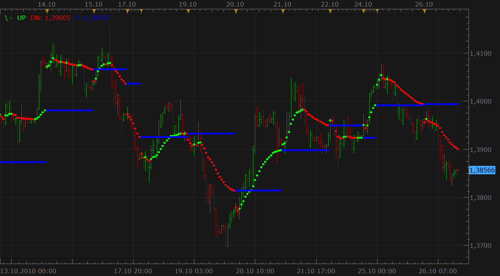
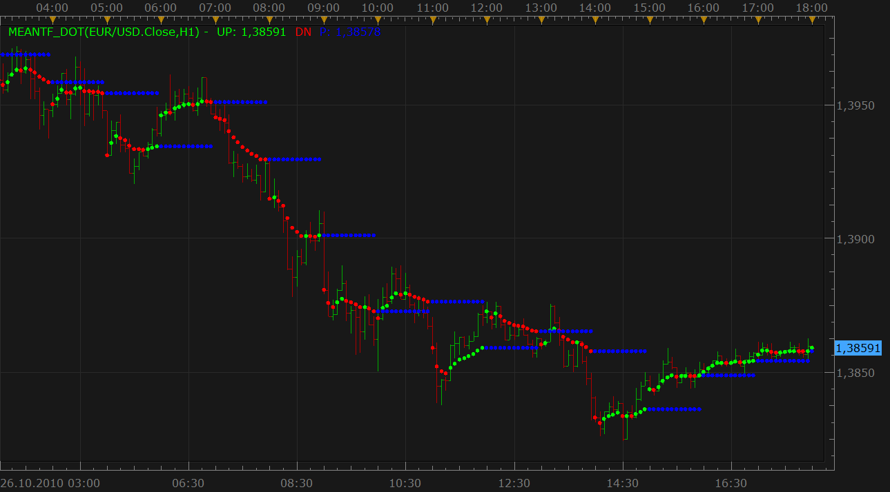

# Mean indicator (new version)

> Source: https://fxcodebase.com/code/viewtopic.php?f=17&t=2526  
> Forum: 17 · Topic 2526 · 11 post(s)

---

## Mean indicator (new version)

**Nikolay.Gekht** · Tue Oct 26, 2010 4:49 pm

Mean indicator was proposed by **posurf** here [viewtopic.php?f=27&t=2369](https://fxcodebase.com/code/viewtopic.php?f=27&t=2369) and was initially developed and presented here: [viewtopic.php?f=17&t=2378](https://fxcodebase.com/code/viewtopic.php?f=17&t=2378)

The indicator is another version of trend detecting routine with day-wide stop levels.

The indicator shows an average price of all the bars of the current day (the day is since midnight by New York time).

Comparing the previous version, this indicator:

1) The display style is changed from lines to dots, so now the indicator does not "hide" 1-bar switches between red and green as it was in the previous version.

2) The indicator now works correctly on "alive" data, not on historical data only.

3) The indicator code is significantly optimized.

4) "Prev" stream now is the regular price stream, so it can be used in the strategies among Up and Down streams.

Note! Please pay attention that the indicator calculates the average value from the beginning of the day! In case the first candle of the day is not loaded yet, the value of the indicator can change in case more data is loaded. Moreover, that means that the indicator is almost useless for on the default data set (300 bars) for m1 and m5 timeframes.

 

Download:

 [Mean_dot.lua](files/5584/Mean_dot.lua)

MT4/MQ4 version
[viewtopic.php?f=38&t=64140](https://fxcodebase.com/code/viewtopic.php?f=38&t=64140)

The indicator was revised and updated

---

## Chosen TF version

**Nikolay.Gekht** · Tue Oct 26, 2010 5:07 pm

The advanced version of the indicator. You can choose timeframe from start of which you want to calculate the average value. For example, you can calculate "1-hour" instead of "since midnight" averages.

Another things is that 1-day is not since midnight by New York time, but since 17:00 EST (when a new trading day begins).

 

download:

 [MeanTF_dot.lua](files/5586/MeanTF_dot.lua)

---

## Re: Mean indicator (new version)

**gnarlyarbitrage** · Fri Jul 05, 2013 3:01 pm

I'm requesting that the option to have yearly lines/averages be added as well as the amount of pips price is away from said average, maybe as a different style than the dots.

Thanks!

---

## Re: Mean indicator (new version)

**Apprentice** · Mon Jul 22, 2013 6:56 am

Yearly data source is not available for now.

---

## Re: Mean indicator (new version)

**mjf1288** · Mon Jul 22, 2013 11:43 am

> **Apprentice wrote:**
> Yearly data source is not available for now.

Could we get the option for a quarterly mean (3 months)?

---

## Re: Mean indicator (new version)

**Apprentice** · Sat Jul 27, 2013 3:06 am

Quarterly data source is not available also.
We do not have Q1, Q2, Q3, Q4 time frames.

---

## Re: Mean indicator (new version)

**Apprentice** · Sat Jul 29, 2017 9:48 am

The indicator was revised and updated.

---

## Re: Mean indicator (new version)

**mjf1288** · Thu Mar 13, 2025 7:17 pm

Can we create a strategy for this indicator, very simple logic:

1. price cross/touch- choice of current mean selection or previous mean selection or both
2. direction- long/short
3. stop/limit

---

## Re: Mean indicator (new version)

**Apprentice** · Sun Mar 16, 2025 3:05 pm

We have added your request to the development list.
Development reference 201

---

## Re: Mean indicator (new version)

**Apprentice** · Wed Mar 19, 2025 3:19 pm

Indicator based strategy.
[https://fxcodebase.com/code/viewtopic.p ... 90#p158690](https://fxcodebase.com/code/viewtopic.php?f=31&t=75735&p=158690#p158690)

---

## Re: Mean indicator (new version)

**mjf1288** · Sun Jul 13, 2025 9:55 am

Is it possible to convert the Mean dot TF indicator to Pinescript so that we can use it on Tradingview?

This would be very very helpful.

Thank you,
Matthew
