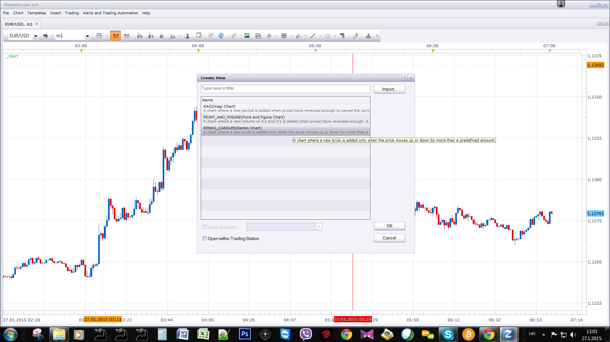
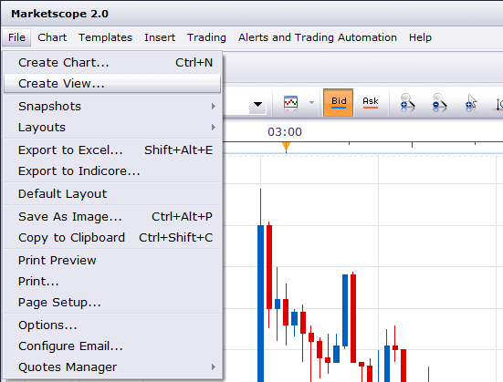
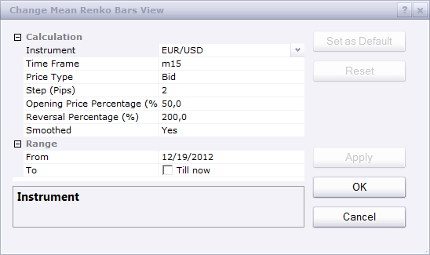
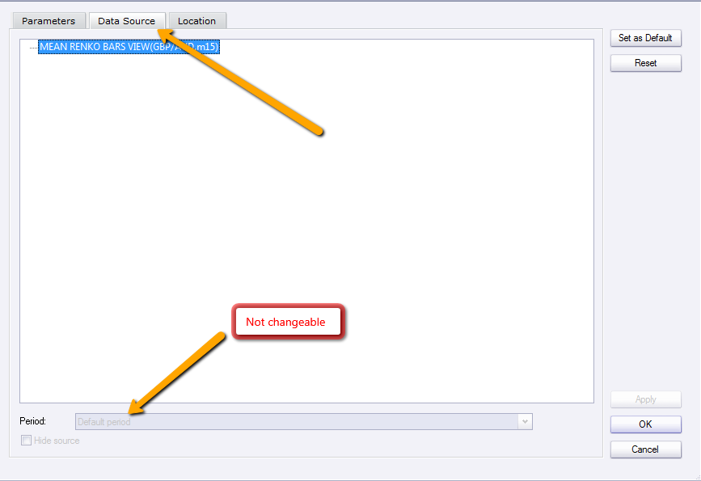

# Mean Renko Bars View (Obsolete)

> Source: https://fxcodebase.com/code/viewtopic.php?f=17&t=60743  
> Forum: 17 · Topic 60743 · 59 post(s)

---

## Mean Renko Bars View (Obsolete)

**Apprentice** · Sat May 31, 2014 1:50 am

Mean Renko Bars View is Obsolete.
Please use preinstalled Renko Candles.

 

Posted by request.
[viewtopic.php?f=27&t=60742](https://fxcodebase.com/code/viewtopic.php?f=27&t=60742)
Also known as the ultimate Renko bars.

 [Mean Renko Bars View.lua](files/94224/Mean%20Renko%20Bars%20View.lua)

 [Future Mean Renko Bars View.lua](files/94224/Future%20Mean%20Renko%20Bars%20View.lua)

---

## Re: Mean Renko Bars View

**GiFtzw3rg** · Tue Jun 10, 2014 11:39 am

Hi Apprentice,
can i use this Renko with Tick Data? Works this correctly?

Otherwise Mean Renko is only a viewable indicator based on the time which is choosen.

Thanks for answer says
GiFtzw3rg

---

## Re: Mean Renko Bars View

**Apprentice** · Wed Jun 11, 2014 2:25 am

Sure, unfortunately Tick Time frame, and source,
will not get you long way, because the Server / TS data retrieval limits.
Development team have promised to improve this in the future.

m1 could be good compromise.

---

## Re: Mean Renko Bars View

**Miguelator** · Thu Jun 12, 2014 12:58 am

Time Frame 4 Hs
Step 10 pips

---

## Re: Mean Renko Bars View

**GiFtzw3rg** · Tue Jun 17, 2014 2:34 am

So if i understand this right, the time frame
will update the Mean Renko with the choosen one.

Means when i will do a 10 Pips MR in a 1 Minute
time frame every 1 Min. the MR will be updated.

If i do a 10 Pip MR in 4H Time Frame the MR will be updated
every 4H. Is this correct?

Otherwise when i want to use Tickdata i have to wait a long period of time
to get enough data to see more than one MR Candle.
Is that also right?

Thanks for answer.

---

## Re: Mean Renko Bars View

**Apprentice** · Tue Jun 17, 2014 12:13 pm

New Renko candle will be created only if price moves for a set number of pips.
New Candle creation (on regular chart) is not relevant to the Renko chart.

Passage of time is not relavantan.
You can have N Renko for one regular price if the shift is significant.
Or One Renko for N regular, if price shift from negligible.

Higher time frame candles are usually longer.
Will Contain more price action.
If you are using Tick, you can wait a long time for New Renko bar.

---

## Re: Mean Renko Bars View

**saturn** · Wed Jun 18, 2014 3:42 pm

Hi guys, is this an indicator or strategy? I've imported this and when I go to add indicator I don't see this in there. Could you please let me know how to use it? Thanks for your help

---

## Re: Mean Renko Bars View

**Apprentice** · Thu Jun 19, 2014 2:55 am

Mean Renko Bars is not Strategy or Indicator.
It is View, Fairly now MarketScope concept.
You'll find it in the View section.

---

## Re: Mean Renko Bars View

**volnmar** · Wed Aug 20, 2014 3:41 am

Please do you have any news about TICK renko?

---

## Re: Mean Renko Bars View

**Apprentice** · Wed Aug 20, 2014 2:14 pm

Unfortunately no new developments on this front.

---

## Re: Mean Renko Bars View

**trendwatch** · Fri Sep 19, 2014 1:17 am

Any idea when the view feauture will work properly? It's really of no use if it's not running from tick data. Better to not include it in the software. Really don't want to have to use $h!t mt4. TS2 has much more potential!

---

## Re: Mean Renko Bars View

**Apprentice** · Fri Sep 19, 2014 3:30 am

Unfortunately I can not do much on the Indicator, side.
Tick Data availability is FXCM / TS issue.

---

## Re: Mean Renko Bars View

**7510109079** · Mon Oct 06, 2014 12:19 pm

From my side when using the mean renko bars with Tick (T) data, the bars are formed properly and at the correct 'time' i.e. when sufficient pip movement in each direction.

The problem i have is lack of historical data - is this what you were referring to Apprentice, when you mentioned "Server / TS data retrieval limits"??

If i leave the tick chart open for a couple of hours, enough history is generated but if i close the chart and re-open it i only get a default 45mins bar history again (regardless of the pip step used)!

You say use the m1 but this is useless for live trading as the bars only update each minute so if you get a big move, 10 or so bars paint instantly and all at once, when the new minute commences and your entry position is missed.

If this is a data retrieval limit, is it a simple thing for the developers to change or is it more involved than that?

many thx

---

## Re: Mean Renko Bars View

**Apprentice** · Tue Oct 07, 2014 8:42 am

It is Outside is my reach.

---

## Re: Mean Renko Bars View

**Univest** · Mon Nov 03, 2014 3:16 pm

Thank you for the Mean renko. Could you please add logicounter for it if possible?
Its very hard to see the upper and lower limit to be hit for new renko box to be created.

Thank you

---

## Re: Mean Renko Bars View

**Apprentice** · Tue Nov 04, 2014 2:16 am

Can you explain "logicounter"

---

## Re: Mean Renko Bars View

**Univest** · Tue Nov 04, 2014 7:26 am

Its basically the upper and lower price level
which has to be hit before a new renko bar is created. Please watch:
Thank you

[https://www.youtube.com/watch?v=N3ErRTVIymo](https://www.youtube.com/watch?v=N3ErRTVIymo)

---

## Re: Mean Renko Bars View

**Apprentice** · Wed Nov 05, 2014 4:31 am

In fact this has already been requests in the past.
Unfortunately, I have not had time to address this.

---

## Re: Mean Renko Bars View

**7510109079** · Fri Nov 07, 2014 5:39 am

Yes, I also made the logicounter request. It is unfortunate that there is not enough time to address this as I share Univest's sentiment. Although the mean renko is a good version it can be confusing trying to see where a new brick is next to be formed.

In theory such an indicator only needs to calc and plot **2 lines** - a High and a Low.

**A second request regarding this Mean Renko then:**

Is it possible to adapt the Renko Strategy...
http://fxcodebase.com/code/viewtopic.php?f=31&t=60750#p94243

... so that it would work with this Mean Renko using the Tick interval. The power of this is that it would enable us to trade renko bricks in real time as the Tick option is not available in the standard Renko view (and trying to trade from m1 is useless as many bricks can print at period end/close).

Is this possible in theory or are there limitations involved?

thx

---

## Re: Mean Renko Bars View

**Apprentice** · Sat Nov 08, 2014 6:06 am

It is possible, unfortunately I have not found the time for this.

---

## Re: Mean Renko Bars View

**7510109079** · Mon Nov 10, 2014 5:10 am

I hope time can be found Apprentice.

With FXCMs new spread/commissions price structure, renko bar scalping is now a viable strategy. We just require the Tick feed strategy either on renko or mean renko

---

## Re: Mean Renko Bars View

**7510109079** · Mon Nov 10, 2014 7:23 am

"We just require the Tick feed strategy either on renko or mean renko"

Correction, actually on the Renko, not the mean renko

---

## Re: Mean Renko Bars View

**Univest** · Wed Nov 12, 2014 4:50 pm

Hope you can find the time.

there seems to be a bug with all renko views and indicators except the tick renko that
bricks do not update in real time eventough price surpasses the predefined pip setting.
can anyone confirm this please?

---

## Re: Mean Renko Bars View

**Apprentice** · Thu Nov 13, 2014 5:47 am

You have to understand Mean Renko Bars View dynamics.
Open and close value are set at time of opening.
Only High / Low will reflect the actual price movement.
If price goes beyond the set limit, the new bar is generated.

---

## Re: Mean Renko Bars View

**Univest** · Thu Nov 13, 2014 10:07 am

Yes correct. But eventhought price exceeds set limits no bar in created.
Thanks

---

## Re: Mean Renko Bars View

**7510109079** · Wed Nov 19, 2014 10:35 am

This answer has been posted before.

The reason the bricks do not appear on time on anything other than a Tick view is that the chart is only refreshed at the end of the timeframe interval.

Hence if you are displaying either Renko (no tick available anyway) or Mean Renko at e.g. m1
then the bricks will only be painted at the end of every 1 minute period. Depending on the price movement during the last minute this could well paint a whole bunch of bricks all at once or none at all. Similarly for e.g. H2 period - the chart will only paint the relevant bricks every 2 hours at the beginning of a new 2 hr period open.

Only Mean Renko Tick view will paint the bricks in real time with no delay

---

## Re: Mean Renko Bars View

**Jasmin** · Thu Nov 20, 2014 1:22 pm

hello guys can somebody do a strategy for the mean renko bars i do not know how to do it is this even posible with chart view

---

## Re: Mean Renko Bars View

**Apprentice** · Fri Nov 21, 2014 3:23 am

Your request is added to the development list.

---

## Re: Mean Renko Bars View

**jenniferFX888** · Wed Nov 26, 2014 7:00 pm

Hi Miguelator,

Would you please share the green and red dots indicator. Its looks like the DT-ZigZag-Lauer MQL4.

Thank you in advance,
jennifer

---

## Re: Mean Renko Bars View

**Apprentice** · Sun Nov 30, 2014 2:21 pm

I believe this is Fractal-based Support / Resistance Lines Indicator.
[http://74.52.98.34/code/viewtopic.php?f ... fecd#p8455](http://74.52.98.34/code/viewtopic.php?f=17&t=367&p=8455&hilit=FBSR.lua&sid=8a3601ae80c43178fb5cd914c039fecd#p8455)

---

## Re: Mean Renko Bars View

**jenniferFX888** · Wed Dec 03, 2014 1:55 am

Hi Apprentice,

What i am looking is the DT-ZigZag-Lauer MQL4 from MT4. If you can convert it to Marketscope lua.

very very appreciated,
jennifer

---

## Re: Mean Renko Bars View

**Apprentice** · Wed Dec 03, 2014 5:33 am

Your request is added to the development list.

---

## Re: Mean Renko Bars View

**jvsagar** · Sat Dec 06, 2014 10:43 am

mr.apprentice,
 there has been a few requests to add a logicounter to the mean renko bars view .To know more about it please see this you tube video mentioned below.This is being sold by indicatorwarehouse.com for MT4. we need it in lua for Trade station. Also can an EA be written for this view ? I trade Gold using this Mean Renko bars view on M5 chart with renko bar size at 400 median 50 and reversal at 400%. works fantastically well. Attached is the self-explanatory You Tube address.
 [https://www.youtube.com/watch?v=ibVJ1pz ... 6o&index=2](https://www.youtube.com/watch?v=ibVJ1pz6tS0&list=PL4JwBULHiR-uEpALCkTE6sHP0qKk5I66o&index=2)
 Hope you respond quickly.
 jv sagar

---

## Re: Mean Renko Bars View

**jenniferFX888** · Sun Dec 07, 2014 7:37 pm

Hi Apprentice and Jvsagar,

Can you guys explain to me what are Opening Price Percentage and Reversal Percentage use on Mean Renko for and for Smoothed should I set to Yes or No?

@ Jvsagar I changed to 400% the bars showed long wicks instead of reversal bars as 200%

Thank you,

Jennifer

---

## Re: Mean Renko Bars View

**jvsagar** · Mon Dec 08, 2014 12:22 pm

jennifer,
 you can contact me thro" my e-mail
[[email protected]](https://fxcodebase.com/cdn-cgi/l/email-protection#f59f838694929487c7c5c5ccb59298949c99db969a98)

---

## Re: Mean Renko Bars View

**elioswd** · Wed Dec 10, 2014 1:44 am

Hello !
is there any way to let Mean Renko update on chart cause i need to open a new chart every 20 minutes to get it updated with the new price and bricks !
Thanks

---

## Re: Mean Renko Bars View

**elioswd** · Wed Dec 10, 2014 5:20 am

Hello
how we can add Median Renko to trading station !is this indicator available here ? thanks

---

## Re: Mean Renko Bars View

**Apprentice** · Fri Dec 12, 2014 4:41 am

I believe Median Renko and Mean Renko Bars are synonymous.

---

## Re: Mean Renko Bars View

**daniel.kovacik** · Tue Jan 20, 2015 2:10 pm

Hello,

- Probably you found out that this indicator is lagging. Its a good indicator, thans for your work!
- I was thinking if there is a possible way to make those bricks update faster.
- You know, there was clearly visible movement of 2 pips but no new brick appeared.
- Could you please look at it when you ll find some free time.

PS: Also bid/ask line overlay indicator doesnt work with it. Those line dont move correctly

Thanks
DK

---

## Re: Mean Renko Bars View

**daniel.kovacik** · Tue Jan 20, 2015 4:22 pm

For example: what if last 15 bricks will be updated throught tick data and development of those bricks before will be same.

It would be better to see real development of bricks from the middle of previous one.
Somthing like this: [https://www.youtube.com/watch?v=N3ErRTVIymo](https://www.youtube.com/watch?v=N3ErRTVIymo)
LOGI counter from 4:25 min of video.

Because here the movement is updated after one minute interval and amount of tick data which FXCM provide is really small.

Thanks
DK

---

## Re: Mean Renko Bars View

**juju1024** · Tue Jan 20, 2015 6:07 pm

Hi Daniel,
Have you trying Tick for no lag time frame ?

---

## Re: Mean Renko Bars View

**daniel.kovacik** · Wed Jan 21, 2015 9:06 am

Hello,

- I ve tried ticks but the main issue with tick on mean renko is that I cant see bricks of the whole day.
- My set of this indicator is 1 min. 2 pips bricks. Update of bricks is really slow because its after 1 min.
- Do you think that last 15 bricks can be calculated by thicks and those before would be by min.
- Its not good for scalping when development of bricks isnt corresponding with price.
- Maybe if bricks will be updated every sec, that would help but I am afraid that 1 min. is the lowest or not?

PS: When I use thicks on 2 pips bricks I see only 12 bricks and no indicators appear there. So what If last 12 bricks will be calculated by thicks. I mean 2 source of data for calculation.

Thanks
DK

---

## Re: Mean Renko Bars View (Obsolete)

**juju1024** · Mon Feb 16, 2015 11:46 pm

hi,
can you add a "no wick" option on this system of mean renko ?
Thanks

---

## Re: Mean Renko Bars View (Obsolete)

**Apprentice** · Tue Feb 17, 2015 3:35 pm

Your request is added to the development list.

---

## Re: Mean Renko Bars View (Obsolete)

**daniel.kovacik** · Sat Mar 14, 2015 8:48 am

Hello,

could you add projection of 5 future bricks up and down with transparency and different colours from renko chart?
And possible update of movement faster than 1 min. Because when price drastically move up/down we dont see any new bricks at that period of time. Only when new candle will appear on the lowest timeframe we can see new bricks.

Thanks
Regards
DK

---

## Re: Mean Renko Bars View (Obsolete)

**zl068565** · Mon Sep 14, 2015 8:14 am

Hey Apprentice,

I know this thread is obsolete but just a quick question. You know how its possible in regular candlestick to choose different time frame for the data source of the indicator? Can that be made possible for this mean renko?

Thanks.

---

## Re: Mean Renko Bars View (Obsolete)

**Apprentice** · Tue Sep 15, 2015 4:13 am

Only via parametric sections.

---

## Re: Mean Renko Bars View (Obsolete)

**zl068565** · Wed Sep 16, 2015 7:14 am

> **Apprentice wrote:**
>
>
> The attachment **Capture.PNG** is no longer available
>
>
> Only via parametric sections.

Hi apprentice,

I meant for use of stacking 2 Time frame indicator into the renko view. That is possible in regular candle stick because I can just change the data source. This option is not open in this mean renko view.

 

*See this*

---

## Re: Mean Renko Bars View (Obsolete)

**daniel.kovacik** · Wed Sep 16, 2015 10:21 am

Hi,

What if update of each brick would be in 1s timeframe, not 1 min? Wouldnt it be better without that lagging?

I saw on this web a view for timeframes which are not possible to use with just TS2, also could you tell me name of that view. I am looking for timeframe where I ll be able to see for example 10s candles... or just 1s candles...

Thanks
Regards,
DK

---

## Re: Mean Renko Bars View (Obsolete)

**zl068565** · Sun Sep 27, 2015 4:22 pm

> **zl068565 wrote:**
>
>
> > **Apprentice wrote:**
> >
> >
> > Capture.PNG
> >
> >
> > Only via parametric sections.
>
>
>
> Hi apprentice,
>
> I meant for use of stacking 2 Time frame indicator into the renko view. That is possible in regular candle stick because I can just change the data source. This option is not open in this mean renko view.
>
>
>
> 2015-09-16_0737.png

Hey Apprentice do you have any solution?

---

## Re: Mean Renko Bars View (Obsolete)

**tmdabc** · Sun Oct 18, 2015 11:12 pm

RENKO is very useful ，but stop is hard to set when jump in，
so we need RENKO based on high or low，when price type is buy，choose high to draw RENKO，
when price type is sell，choose low to draw RENKO，
can you help ？
thanks a lot

---

## Re: Mean Renko Bars View (Obsolete)

**Apprentice** · Mon Oct 19, 2015 2:50 am

Your request is added to the development list.

---

## Re: Mean Renko Bars View (Obsolete)

**tmdabc** · Mon Oct 19, 2015 7:58 am

> **Apprentice wrote:**
> Your request is added to the development list.

thank you very much

---

## Re: Mean Renko Bars View (Obsolete)

**cnikitopoulos94** · Tue Dec 01, 2015 8:39 pm

Hello FxCodeBase,

There are a few things that I would like to request so i can get a better understanding of how I can code with Mean Renko Bars. Is there any chance Apprentice or any other representative can create a simple strategy for Mean Renko Bars? Anything easy or complicated is ok. I just need to understand the gist of it.

I.E. With the Renko bars when reading the code (Highly Adaptable Moving Average) MooMooFX said that you would need to have the indicator constantly update or Refresh itself when a new bar is closed , I didnt understand how he did it when I was looking at the code.

---

## Re: Mean Renko Bars View (Obsolete)

**cnikitopoulos94** · Tue Dec 01, 2015 8:51 pm

I.E. is it possible to make a MACD ?

---

## Re: Mean Renko Bars View (Obsolete) ALERT

**douvanik** · Wed Jul 19, 2017 3:14 pm

Hi can you please make an alert for mean renko for every new candle pops ? Thanks.

---

## Re: Mean Renko Bars View (Obsolete)

**Apprentice** · Thu Jul 20, 2017 4:44 am

Your request is added to the development list, Under Id Number 3827
 If someone is interested to do this task, please contact me.

---

## Re: Mean Renko Bars View (Obsolete)

**Apprentice** · Mon Jul 24, 2017 8:08 am

[Mean Renko Bars View.lua](files/113707/Mean%20Renko%20Bars%20View.lua)

Try this version.

---

## Re: Mean Renko Bars View

**Alexander.Gettinger** · Fri Feb 22, 2019 2:31 pm

> **jenniferFX888 wrote:**
> What i am looking is the DT-ZigZag-Lauer MQL4 from MT4. If you can convert it to Marketscope lua.
>
> jennifer

Please try this indicator:

 [DT_ZigZag_Lauer.lua](files/124073/DT_ZigZag_Lauer.lua)
