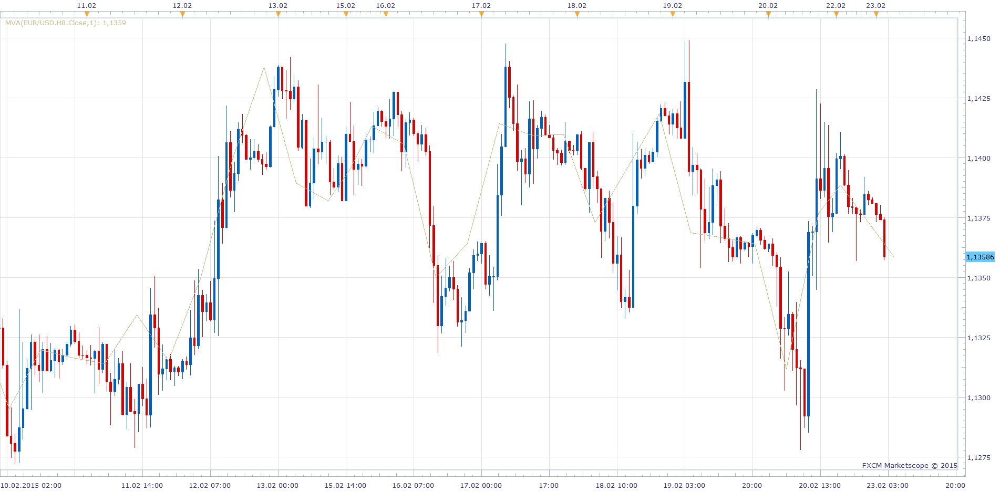
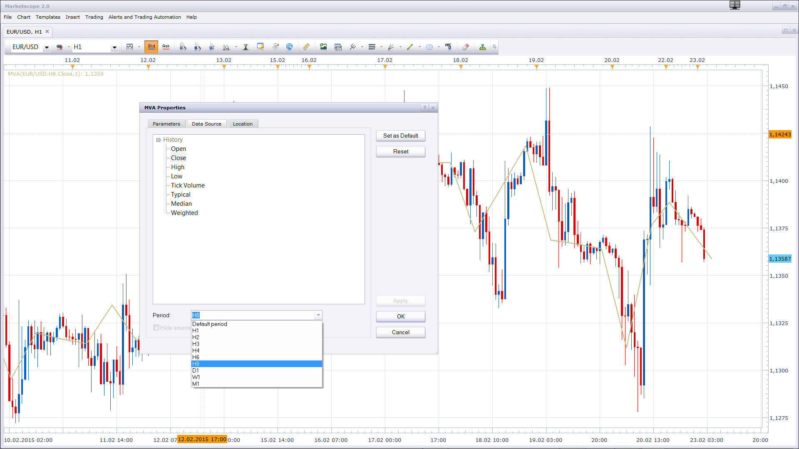

# Median, Typical, Weighted prices

> Source: https://fxcodebase.com/code/viewtopic.php?f=17&t=718  
> Forum: 17 · Topic 718 · 5 post(s)

---

## Median, Typical, Weighted prices

**Nikolay.Gekht** · Tue Apr 20, 2010 5:19 pm

Very simple indicator which shows the median ((high + low) / 2), typical ((high + low + close) / 3) or weighted (((high + low + 2 x close) / 4)) price of the bar.

download:

 [Median.lua](files/1304/Median.lua)

The indicator was revised and updated

---

## Re: Median, Typical, Weighted prices

**fthingf** · Thu Apr 22, 2010 7:56 am

This is exactly what I have been looking for. Thank you!

---

## Re: Median, Typical, Weighted prices

**birillo** · Mon Feb 23, 2015 2:04 am

Hi Nicolaj,
It would be nice to have the possibility of choosing the Time Frame.
For example in Dayly charts to have the possibility of plotting Weekly, Monthly and Quatery Typical Prices.
Now you can see only the Median, Typical and Weighted of the current Time Frame.
Thanks
G Boroni

---

## Re: Median, Typical, Weighted prices

**Apprentice** · Mon Feb 23, 2015 2:14 am

 

You can not do that already.

1. Add MVA to Chart
2. Select MVA period 1
3. Select MVA source (Open, Close, High, Low, Median, Typical or Weighted)
4. Select MVA source Time Frame

---

## Re: Median, Typical, Weighted prices

**Apprentice** · Tue Jul 18, 2017 7:39 am

The indicator was revised and updated.
