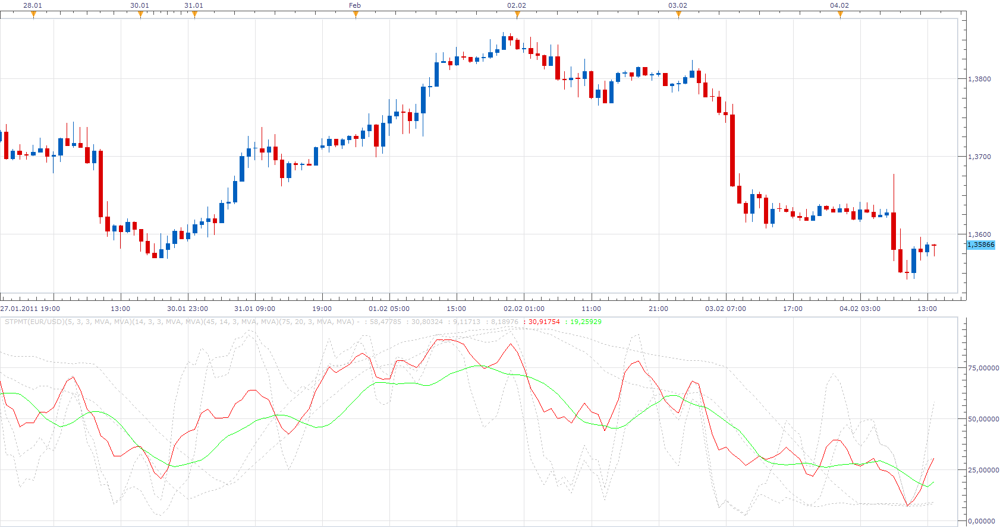
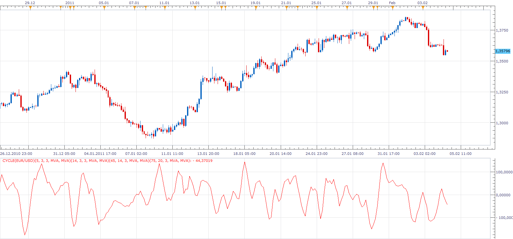

# Medium Term Weighted Stochastics (STPMT)

> Source: https://fxcodebase.com/code/viewtopic.php?f=17&t=3329  
> Forum: 17 · Topic 3329 · 14 post(s)

---

## Medium Term Weighted Stochastics (STPMT)

**Apprentice** · Fri Feb 04, 2011 2:57 pm

The indicator is calculated by the formula
STPMT = [4.1*sto(5,3,3) + 2.5*sto(14,3,3) + sto(45,14,3) + 4*sto(75,20,3)] / 11.6

In addition to the indicator, the indicator shows the moving average of it and individual components.

 [STPMT.lua](files/7945/STPMT.lua)

The indicator was revised and updated

---

## Re: Medium Term Weighted Stochastics (STPMT)

**bourik** · Fri Feb 04, 2011 3:34 pm

Thanks you very much Apprentice

Jérôme

---

## Re: Medium Term Weighted Stochastics (STPMT)

**bourik** · Sun Feb 06, 2011 8:04 am

Hello

I'm ashamed of all my requests but is it possible to make the indicator called "cycle", which is the difference between the STPMT and is MM9

Respectfully

Jérôme

---

## Re: Medium Term Weighted Stochastics (STPMT)

**Apprentice** · Sun Feb 06, 2011 8:50 am

Sure, but you will have to be more eloquent in giving, the request.
MM9 is 9 period moving avegage of STPMT?

---

## Re: Medium Term Weighted Stochastics (STPMT)

**bourik** · Sun Feb 06, 2011 11:40 am

this is the code of the indicator "cycle" for MT4 : it's the difference between the STPMT and the MM9 of the STPMT

sorry but like you can see my english is very poor and I can't explain better how is calculate this indicator

Code: [Select all](https://fxcodebase.com/code/)
`//| Cycles

#property copyright ""
#property link ""

#property indicator_separate_window
#property indicator_buffers 7
#property indicator_color7 Red

// buffers
double Cycle[];
double Buffer1[];
double Buffer2[];
double Buffer3[];
double Buffer4[];
double STPMT[];
double STPMT_MA[];

//| Custom indicator initialization function |

int init() {
string short_name;
short_name="Cycles";
IndicatorShortName(short_name);
// indicators
IndicatorBuffers(7);
SetIndexBuffer(0, Buffer1);
SetIndexBuffer(1, Buffer2);
SetIndexBuffer(2, Buffer3);
SetIndexBuffer(3, Buffer4);
SetIndexBuffer(4, STPMT);
SetIndexBuffer(5, STPMT_MA);
SetIndexBuffer(6, Cycle);

SetIndexStyle(0, DRAW_NONE);
SetIndexStyle(1, DRAW_NONE);
SetIndexStyle(2, DRAW_NONE);
SetIndexStyle(3, DRAW_NONE);
SetIndexStyle(4, DRAW_NONE);
SetIndexStyle(5, DRAW_NONE);
SetIndexStyle(6, DRAW_LINE, EMPTY, 1);

//
return(0);
}

//| iteration function |

int start() {

int index = 0;
int counted_bars=IndicatorCounted();

int limit = Bars - counted_bars;

for(index=0;index<limit;index++) {
Buffer1[index] = iStochastic( NULL, 0, 5, 3, 3, MODE_SMA, 0, MODE_SIGNAL, index);
Buffer2[index] = iStochastic( NULL, 0, 14, 3, 3, MODE_SMA, 0, MODE_SIGNAL, index);
Buffer3[index] = iStochastic( NULL, 0, 45, 14, 3, MODE_SMA, 0, MODE_SIGNAL, index);
Buffer4[index] = iStochastic( NULL, 0, 75, 20, 3, MODE_SMA, 0, MODE_SIGNAL, index);
STPMT[index] = (4.1 * Buffer1[index] + 2.5 * Buffer2[index] + Buffer3[index] + 4 * Buffer4[index]) / 11.6;
}
for(index=0;index<limit;index++) {
STPMT_MA[index] = iMAOnArray(STPMT, 0, 9, 0, MODE_SMA, index);
Cycle[index] = (STPMT[index] - STPMT_MA[index])*6;
}
return(0);
}`
I hope it would be enough for my request

---

## Re: Medium Term Weighted Stochastics (STPMT)

**Apprentice** · Sun Feb 06, 2011 3:19 pm

I hope this version suits your needs.

Cycle indicator is calculated on the basis of Medium Term Weighted Stochastics components.
The formula of this indicator.

Cycle[period]= (STPMT[period]- STPMT_MA[period])*6;

 [Cycle.lua](files/7977/Cycle.lua)

---

## Re: Medium Term Weighted Stochastics (STPMT)

**bourik** · Mon Feb 07, 2011 2:44 am

It's perfect

Thanks a lot Apprentice and have a good week

---

## Re: Medium Term Weighted Stochastics (STPMT)

**Apprentice** · Sat Feb 18, 2017 4:45 am

Indicator was revised and updated.

---

## Re: Medium Term Weighted Stochastics (STPMT)

**scandisk** · Fri Mar 24, 2017 1:55 am

Hi Apprentice

I wanted custom levels and line color and thickness added to the STPMT.

Thanks

---

## Re: Medium Term Weighted Stochastics (STPMT)

**Apprentice** · Sat Mar 25, 2017 6:55 am

Try it now.

---

## Re: Medium Term Weighted Stochastics (STPMT)

**scandisk** · Sun Mar 26, 2017 1:05 am

Hi Apprentice

Awesome thanks again!! I just wanted one more request to add 5 custom levels instead of just 2?

Thanks!!!!

---

## Re: Medium Term Weighted Stochastics (STPMT)

**Apprentice** · Sun Mar 26, 2017 6:21 am

[Cycle.lua](files/111689/Cycle.lua)

 [STPMT.lua](files/111689/STPMT.lua)

Try this version.

---

## Re: Medium Term Weighted Stochastics (STPMT)

**scandisk** · Sun Mar 26, 2017 12:32 pm

> **Apprentice wrote:**
>
>
> Cycle.lua
>
>
>
>
> STPMT.lua
>
>
> Try this version.

Hi Apprentice

You added levels for cycles only? I would like for STMPT if you don't mind thanks your the best!!

---

## Re: Medium Term Weighted Stochastics (STPMT)

**Apprentice** · Mon Mar 27, 2017 11:21 am

Was added to STMPT.lua also.
