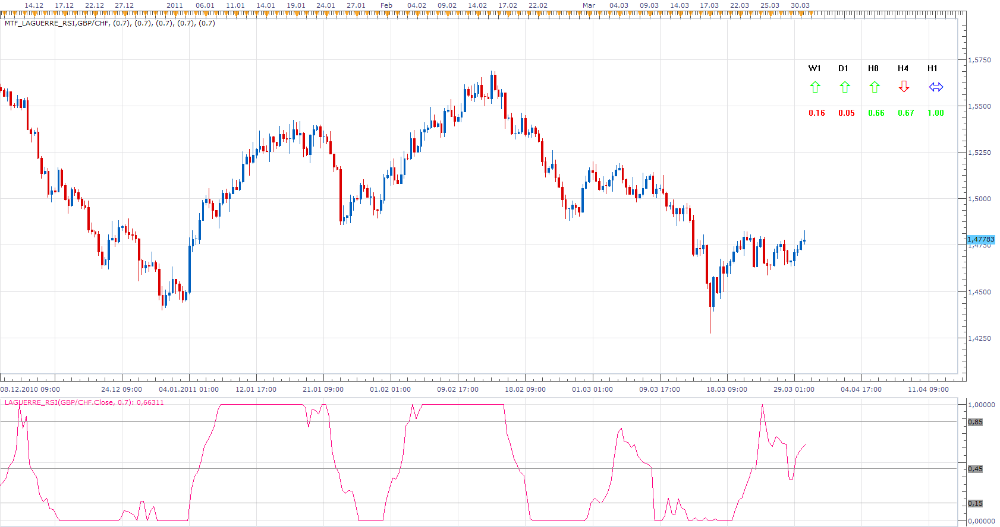

# MFT Laguerre RSI

> Source: https://fxcodebase.com/code/viewtopic.php?f=17&t=3780  
> Forum: 17 · Topic 3780 · 3 post(s)

---

## MFT Laguerre RSI

**Apprentice** · Wed Mar 30, 2011 7:50 am

A version that shows multiple time frames values of Laguerre RSI.

 [MTF_Laguerre_RSI.lua](files/9197/MTF_Laguerre_RSI.lua)

Please download and install Laguerre__RSI.
[viewtopic.php?f=17&t=331](https://fxcodebase.com/code/viewtopic.php?f=17&t=331)

---

## Re: MFT Laguerre RSI

**Apprentice** · Mon Feb 01, 2016 4:48 pm

Major Update.

---

## Re: MFT Laguerre RSI

**Apprentice** · Thu May 10, 2018 6:08 am

The indicator was revised and updated.
