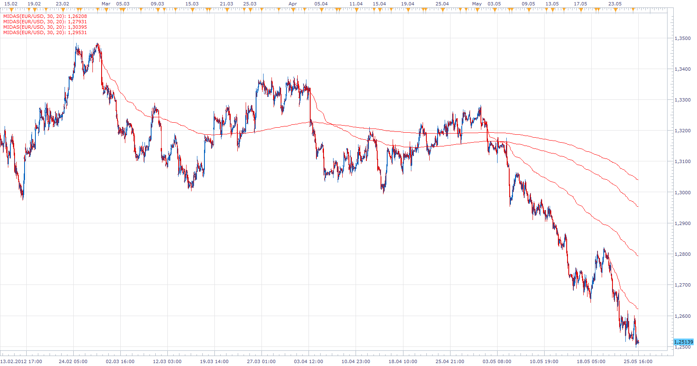

# MIDAS

> Source: https://fxcodebase.com/code/viewtopic.php?f=17&t=19194  
> Forum: 17 · Topic 19194 · 12 post(s)

---

## MIDAS

**Apprentice** · Sat May 26, 2012 4:28 am

If you select other starting time, use F5 to refresh the chart.

 [MIDAS.lua](files/34114/MIDAS.lua)

MT4/MQ4 version.
[viewtopic.php?f=38&t=67188](https://fxcodebase.com/code/viewtopic.php?f=38&t=67188)

---

## Re: MIDAS

**Coondawg71** · Sun Aug 18, 2013 8:31 am

Question:

What exactly is the parameter "number volume bars" referring to???

thanks,

sjc

---

## Re: MIDAS load past 2004

**Coondawg71** · Sun Aug 18, 2013 9:41 am

I can't get the indicator to load any further back than the year 2004. Can that be corrected?

Thanks,

sjc

---

## Re: MIDAS

**Apprentice** · Mon Aug 19, 2013 2:08 am

This parameter is redudantan.
I have remove it from the list of parameters.

---

## Re: MIDAS

**Coondawg71** · Mon Aug 19, 2013 5:14 pm

Can we please request the parameters that allow user to change line width and style as well.

Thanks,

sjc

---

## Re: MIDAS

**Apprentice** · Tue Aug 20, 2013 1:55 am

Style Option Added.

---

## Re: MIDAS

**Apprentice** · Wed Aug 01, 2018 10:09 am

The Indicator was revised and updated.

---

## Re: MIDAS

**logicgate** · Wed Dec 19, 2018 6:08 pm

My friend Apprentice, would you be so kind to also compile the MT4 version of this indi?

God Bless

---

## Re: MIDAS

**logicgate** · Thu Dec 20, 2018 6:16 am

Also, if possible, add a multi timeframe ability to it, so we can overlay the MIDAS of 1hour on the 5min chart for example. Thanks!

---

## Re: MIDAS

**Apprentice** · Thu Dec 20, 2018 2:45 pm

Your request is added to the development list under Id Number 4381

---

## Re: MIDAS

**Apprentice** · Sat Dec 22, 2018 8:46 am

MT4/MQ4 version.
[viewtopic.php?f=38&t=67188](https://fxcodebase.com/code/viewtopic.php?f=38&t=67188)

---

## Re: MIDAS

**DanPhi74** · Fri Dec 28, 2018 2:20 pm

Hi Apprentice,
I'd like to choose the starting date and time YYYY,MM,DD HH,MM for the midas.
Could you add it to the indi ?
Best regards
Daniel
