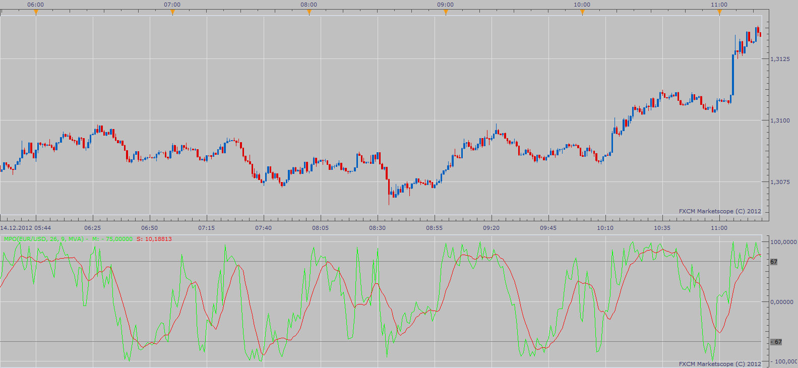

# Midpoint Oscillator

> Source: https://fxcodebase.com/code/viewtopic.php?f=17&t=27748  
> Forum: 17 · Topic 27748 · 3 post(s)

---

## Midpoint Oscillator

**Apprentice** · Sun Dec 16, 2012 2:28 pm

As described in the Nov 1991 edition of S&C magazine.

%M=100* (2*Close-High(N)-Low(N))/(High(N)-Low(N))

 [MPO.lua](files/48601/MPO.lua)

The indicator was revised and updated

---

## Re: Midpoint Oscillator

**Alexander.Gettinger** · Tue Sep 23, 2014 10:58 am

MQL4 version of Midpoint oscillator: [viewtopic.php?f=38&t=61237](https://fxcodebase.com/code/viewtopic.php?f=38&t=61237).

---

## Re: Midpoint Oscillator

**Apprentice** · Fri Jun 23, 2017 7:07 am

The indicator was revised and updated.
