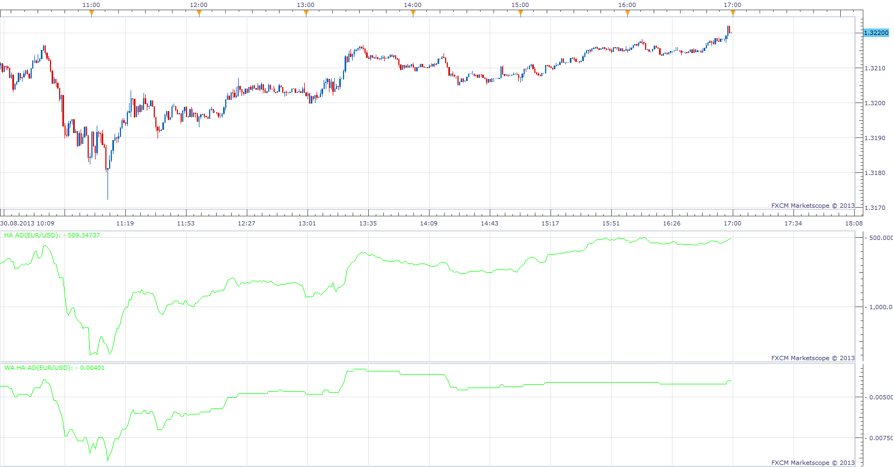

# Min Max Volume

> Source: https://fxcodebase.com/code/viewtopic.php?f=17&t=59373  
> Forum: 17 · Topic 59373 · 5 post(s)

---

## Min Max Volume

**Apprentice** · Sun Sep 01, 2013 12:01 pm

Indicator will mark the candles with max / min volume for the specified period.

 [Min Max Volume.lua](files/89073/Min%20Max%20Volume.lua)

The indicator was revised and updated

---

## Positiv Negativ Volume

**Apprentice** · Sun Sep 01, 2013 12:18 pm

Source> Source[previous]
volume
Source< Source[previous]
- volume

As source u can select one of this two options.
1. Price
2. Heiken Ashi

 [Positiv Negativ Volume.lua](files/89075/Positiv%20Negativ%20Volume.lua)

---

## Heiken Ashi Accumulation/Distribution

**Apprentice** · Sun Sep 01, 2013 12:41 pm

This Accumulation / Distribution use original Accumulation / Distribution algorithm.
Instead of regular they use Heiken Ashi Price Candles.

 [HA AD.lua](files/89076/HA%20AD.lua)

 [WA HA AD.lua](files/89076/WA%20HA%20AD.lua)

---

## Re: Min Max Volume

**Alexander.Gettinger** · Thu Sep 26, 2013 3:07 pm

MQL4 version of indicators: [viewtopic.php?f=38&t=59590](https://fxcodebase.com/code/viewtopic.php?f=38&t=59590).

---

## Re: Min Max Volume

**Apprentice** · Thu Jun 22, 2017 6:19 am

The indicator was revised and updated.
