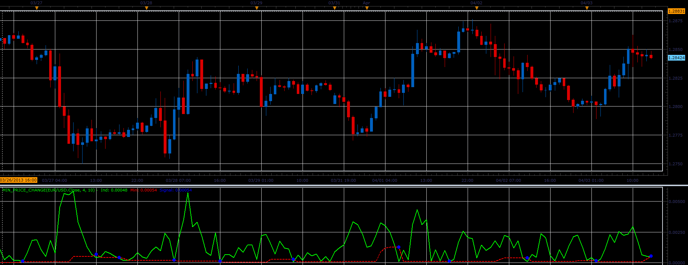

# Min price change oscillator

> Source: https://fxcodebase.com/code/viewtopic.php?f=17&t=34064  
> Forum: 17 · Topic 34064 · 3 post(s)

---

## Min price change oscillator

**Alexander.Gettinger** · Wed Apr 03, 2013 3:07 pm

This indicator is a ported MQL5 indicators from [http://www.mql5.com/en/code/1582](http://www.mql5.com/en/code/1582)

Formulas:
Ind[i] = sum of Range from (i-ChangesPeriod+1) to i, where
Range[i] = Price[i]-Price[i-1].
Min[i] - minimum value of Ind from (i-CheckPeriod) to (i-1).

 

Download:

 [Min_Price_Change.lua](files/57903/Min_Price_Change.lua)

The indicator was revised and updated

---

## Re: Min price change oscillator

**Alexander.Gettinger** · Wed Apr 10, 2013 4:14 pm

MQL4 version of this oscillator: [viewtopic.php?f=38&t=34363](https://fxcodebase.com/code/viewtopic.php?f=38&t=34363)

---

## Re: Min price change oscillator

**Apprentice** · Tue May 09, 2017 6:24 am

Indicator was revised and updated.
