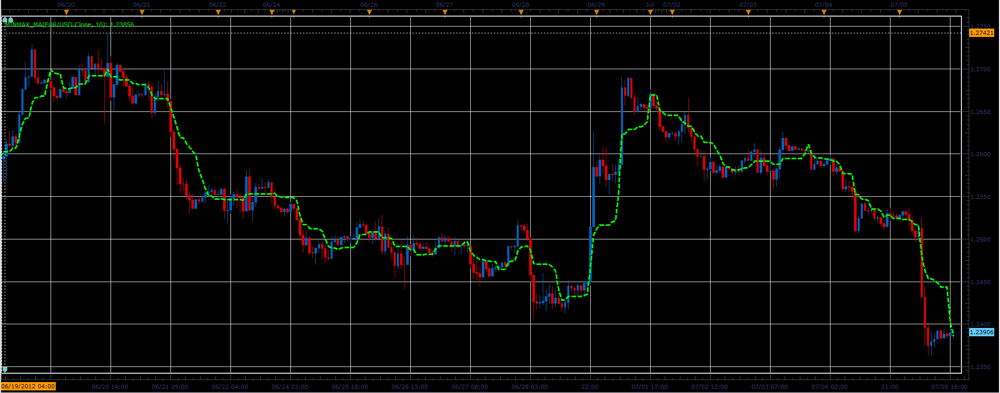

# MinMax moving average

> Source: https://fxcodebase.com/code/viewtopic.php?f=17&t=20879  
> Forum: 17 · Topic 20879 · 2 post(s)

---

## MinMax moving average

**Alexander.Gettinger** · Thu Jul 05, 2012 5:10 pm

Formula:
MinMaxMA[i]=(Min+Max)/2, where
Min, Max - minimum and maximum prices in range from (i-Period+1) to (i).

 

Download:

 [MinMax_MA.lua](files/36568/MinMax_MA.lua)

The indicator was revised and updated

---

## Re: MinMax moving average

**Apprentice** · Tue Apr 04, 2017 6:16 am

Indicator was revised and updated.
