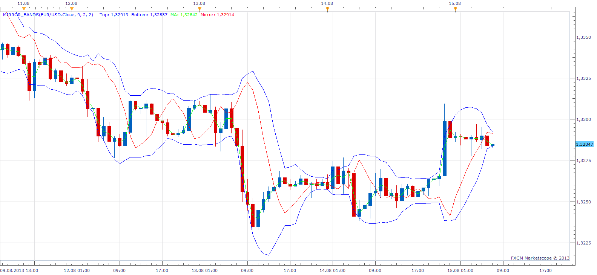

# Mirror Bands

> Source: https://fxcodebase.com/code/viewtopic.php?f=17&t=59154  
> Forum: 17 · Topic 59154 · 3 post(s)

---

## Mirror Bands

**Apprentice** · Thu Aug 15, 2013 6:07 am

Entry Buy when Green line cross above Red line,
Entry Sell when Green line cross below Red line.

Mirror =(Top-(ma-Bottom))

Simplified
Mirror =ma1*2 - ma2

 [Mirror_Bands.lua](files/88631/Mirror_Bands.lua)

---

## Re: Mirror Bands

**Alexander.Gettinger** · Thu Aug 29, 2013 10:48 am

MQL4 version of indicator: [http://www.fxcodebase.com/code/viewtopi ... 38&t=59346](http://www.fxcodebase.com/code/viewtopic.php?f=38&t=59346).

---

## Re: Mirror Bands

**Apprentice** · Fri Jul 06, 2018 6:32 am

The indicator was revised and updated.
