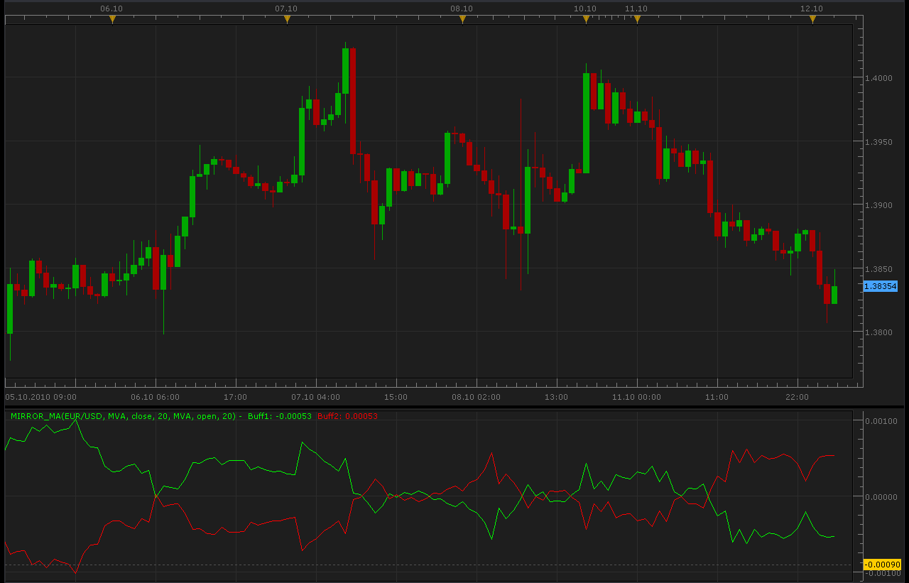
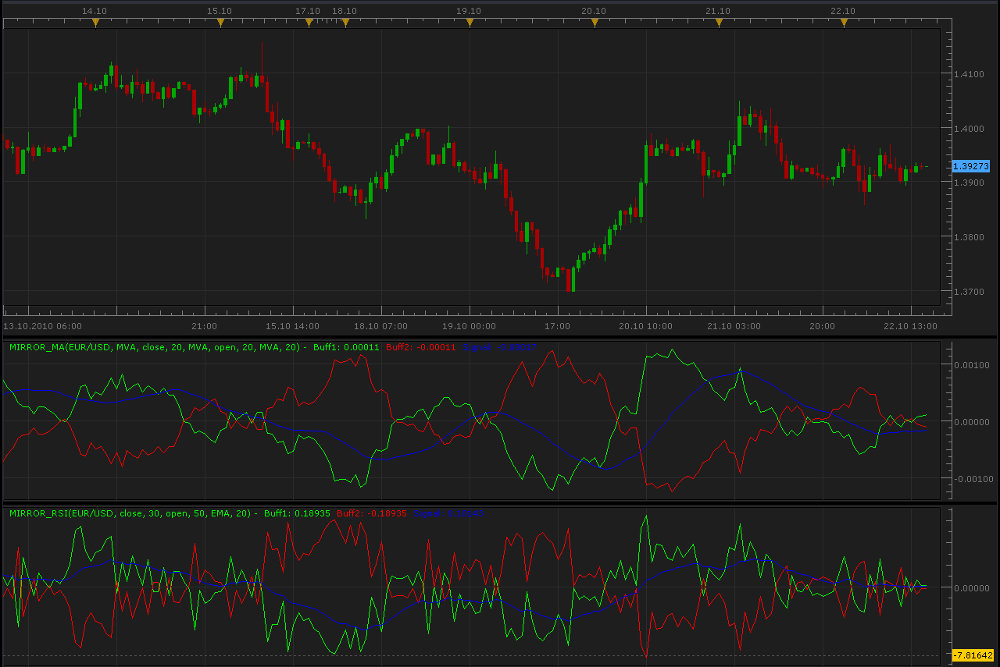

# Mirror MA indicator

> Source: https://fxcodebase.com/code/viewtopic.php?f=17&t=2381  
> Forum: 17 · Topic 2381 · 4 post(s)

---

## Mirror MA indicator

**Alexander.Gettinger** · Tue Oct 12, 2010 2:38 am

Formulas:
Line1=MA1[Method1, Price1, Period1] - MA2[Method2,Price2, Period2],
Line2=-Line1.

 



```lua
function Init()
    indicator:name("Mirror MA indicator");
    indicator:description("Mirror MA indicator");
    indicator:requiredSource(core.Bar);
    indicator:type(core.Oscillator);

    indicator.parameters:addGroup("Calculation");
    indicator.parameters:addString("Method1", "Method1", "", "MVA");
    indicator.parameters:addStringAlternative("Method1", "MVA", "", "MVA");
    indicator.parameters:addStringAlternative("Method1", "EMA", "", "EMA");
    indicator.parameters:addStringAlternative("Method1", "KAMA", "", "KAMA");
    indicator.parameters:addStringAlternative("Method1", "LWMA", "", "LWMA");
    indicator.parameters:addStringAlternative("Method1", "TMA", "", "TMA");
    indicator.parameters:addString("Price1", "Price1", "", "close");
    indicator.parameters:addStringAlternative("Price1", "open", "", "open");
    indicator.parameters:addStringAlternative("Price1", "close", "", "close");
    indicator.parameters:addStringAlternative("Price1", "high", "", "high");
    indicator.parameters:addStringAlternative("Price1", "low", "", "low");
    indicator.parameters:addStringAlternative("Price1", "median", "", "median");
    indicator.parameters:addStringAlternative("Price1", "typical", "", "typical");
    indicator.parameters:addStringAlternative("Price1", "weighted", "", "weighted");
    indicator.parameters:addInteger("Period1", "Period1", "", 20);
    indicator.parameters:addString("Method2", "Method2", "", "MVA");
    indicator.parameters:addStringAlternative("Method2", "MVA", "", "MVA");
    indicator.parameters:addStringAlternative("Method2", "EMA", "", "EMA");
    indicator.parameters:addStringAlternative("Method2", "KAMA", "", "KAMA");
    indicator.parameters:addStringAlternative("Method2", "LWMA", "", "LWMA");
    indicator.parameters:addStringAlternative("Method2", "TMA", "", "TMA");
    indicator.parameters:addString("Price2", "Price2", "", "open");
    indicator.parameters:addStringAlternative("Price2", "open", "", "open");
    indicator.parameters:addStringAlternative("Price2", "close", "", "close");
    indicator.parameters:addStringAlternative("Price2", "high", "", "high");
    indicator.parameters:addStringAlternative("Price2", "low", "", "low");
    indicator.parameters:addStringAlternative("Price2", "median", "", "median");
    indicator.parameters:addStringAlternative("Price2", "typical", "", "typical");
    indicator.parameters:addStringAlternative("Price2", "weighted", "", "weighted");
    indicator.parameters:addInteger("Period2", "Period2", "", 20);

    indicator.parameters:addGroup("Style");
    indicator.parameters:addColor("clr1", "Color 1", "Color 1", core.rgb(0, 255, 0));
    indicator.parameters:addColor("clr2", "Color 2", "Color 2", core.rgb(255, 0, 0));
    indicator.parameters:addInteger("widthLinReg", "Line width", "Line width", 1, 1, 5);
    indicator.parameters:addInteger("styleLinReg", "Line style", "Line style", core.LINE_SOLID);
    indicator.parameters:setFlag("styleLinReg", core.FLAG_LINE_STYLE);
end

local first;
local source = nil;
local Method1;
local Method2;
local Price1;
local Price2;
local Period1;
local Period2;
local MA1;
local MA2;
local Buff1=nil;
local Buff2=nil;

function Prepare()
    source = instance.source;
    Method1=instance.parameters.Method1;
    Price1=instance.parameters.Price1;
    Period1=instance.parameters.Period1;
    Method2=instance.parameters.Method2;
    Price2=instance.parameters.Price2;
    Period2=instance.parameters.Period2;
    if Price1=="open" then
     MA1 = core.indicators:create(Method1, source.open, Period1);
    elseif Price1=="close" then
     MA1 = core.indicators:create(Method1, source.close, Period1);
    elseif Price1=="high" then
     MA1 = core.indicators:create(Method1, source.high, Period1);
    elseif Price1=="low" then
     MA1 = core.indicators:create(Method1, source.low, Period1);
    elseif Price1=="median" then
     MA1 = core.indicators:create(Method1, source.median, Period1);
    elseif Price1=="typical" then
     MA1 = core.indicators:create(Method1, source.typical, Period1);
    else
     MA1 = core.indicators:create(Method1, source.weighted, Period1);
    end
   
    if Price2=="open" then
     MA2 = core.indicators:create(Method2, source.open, Period2);
    elseif Price2=="close" then
     MA2 = core.indicators:create(Method2, source.close, Period2);
    elseif Price2=="high" then
     MA2 = core.indicators:create(Method2, source.high, Period2);
    elseif Price2=="low" then
     MA2 = core.indicators:create(Method2, source.low, Period2);
    elseif Price2=="median" then
     MA2 = core.indicators:create(Method2, source.median, Period2);
    elseif Price2=="typical" then
     MA2 = core.indicators:create(Method2, source.typical, Period2);
    else
     MA2 = core.indicators:create(Method2, source.weighted, Period2);
    end
     
    first = math.max(MA1.DATA:first(),MA2.DATA:first())+2;
    local name = profile:id() .. "(" .. source:name() .. ", " .. instance.parameters.Method1 .. ", " .. instance.parameters.Price1 .. ", " .. instance.parameters.Period1 .. ", " .. instance.parameters.Method2 .. ", " .. instance.parameters.Price2 .. ", " .. instance.parameters.Period2 .. ")";
    instance:name(name);
    Buff1 = instance:addStream("Buff1", core.Line, name .. ".Buff1", "Buff1", instance.parameters.clr1, first);
    Buff2 = instance:addStream("Buff2", core.Line, name .. ".Buff2", "Buff2", instance.parameters.clr2, first);
    Buff1:setWidth(instance.parameters.widthLinReg);
    Buff1:setStyle(instance.parameters.styleLinReg);
    Buff2:setWidth(instance.parameters.widthLinReg);
    Buff2:setStyle(instance.parameters.styleLinReg);
end

function Update(period, mode)
   if (period>first) then
    MA1:update(mode);
    MA2:update(mode);
    Buff1[period]=MA1.DATA[period]-MA2.DATA[period];
    Buff2[period]=MA2.DATA[period]-MA1.DATA[period];
   end
   
end
```

---

## Re: Mirror MA indicator

**Alexander.Gettinger** · Sun Oct 24, 2010 10:54 am

Update Mirror MA indicator: added signal line.
Added Mirror RSI indicator with signal line.

 



Mirror MA:

```lua
function Init()
    indicator:name("Mirror MA indicator");
    indicator:description("Mirror MA indicator");
    indicator:requiredSource(core.Bar);
    indicator:type(core.Oscillator);

    indicator.parameters:addGroup("Calculation");
    indicator.parameters:addString("Method1", "Method1", "", "MVA");
    indicator.parameters:addStringAlternative("Method1", "MVA", "", "MVA");
    indicator.parameters:addStringAlternative("Method1", "EMA", "", "EMA");
    indicator.parameters:addStringAlternative("Method1", "KAMA", "", "KAMA");
    indicator.parameters:addStringAlternative("Method1", "LWMA", "", "LWMA");
    indicator.parameters:addStringAlternative("Method1", "TMA", "", "TMA");
    indicator.parameters:addString("Price1", "Price1", "", "close");
    indicator.parameters:addStringAlternative("Price1", "open", "", "open");
    indicator.parameters:addStringAlternative("Price1", "close", "", "close");
    indicator.parameters:addStringAlternative("Price1", "high", "", "high");
    indicator.parameters:addStringAlternative("Price1", "low", "", "low");
    indicator.parameters:addStringAlternative("Price1", "median", "", "median");
    indicator.parameters:addStringAlternative("Price1", "typical", "", "typical");
    indicator.parameters:addStringAlternative("Price1", "weighted", "", "weighted");
    indicator.parameters:addInteger("Period1", "Period1", "", 20);
    indicator.parameters:addString("Method2", "Method2", "", "MVA");
    indicator.parameters:addStringAlternative("Method2", "MVA", "", "MVA");
    indicator.parameters:addStringAlternative("Method2", "EMA", "", "EMA");
    indicator.parameters:addStringAlternative("Method2", "KAMA", "", "KAMA");
    indicator.parameters:addStringAlternative("Method2", "LWMA", "", "LWMA");
    indicator.parameters:addStringAlternative("Method2", "TMA", "", "TMA");
    indicator.parameters:addString("Price2", "Price2", "", "open");
    indicator.parameters:addStringAlternative("Price2", "open", "", "open");
    indicator.parameters:addStringAlternative("Price2", "close", "", "close");
    indicator.parameters:addStringAlternative("Price2", "high", "", "high");
    indicator.parameters:addStringAlternative("Price2", "low", "", "low");
    indicator.parameters:addStringAlternative("Price2", "median", "", "median");
    indicator.parameters:addStringAlternative("Price2", "typical", "", "typical");
    indicator.parameters:addStringAlternative("Price2", "weighted", "", "weighted");
    indicator.parameters:addInteger("Period2", "Period2", "", 20);
    indicator.parameters:addString("MethodSig", "MethodSig", "", "MVA");
    indicator.parameters:addStringAlternative("MethodSig", "MVA", "", "MVA");
    indicator.parameters:addStringAlternative("MethodSig", "EMA", "", "EMA");
    indicator.parameters:addStringAlternative("MethodSig", "KAMA", "", "KAMA");
    indicator.parameters:addStringAlternative("MethodSig", "LWMA", "", "LWMA");
    indicator.parameters:addStringAlternative("MethodSig", "TMA", "", "TMA");
    indicator.parameters:addInteger("PeriodSig", "PeriodSig", "", 20);

    indicator.parameters:addGroup("Style");
    indicator.parameters:addColor("clr1", "Color 1", "Color 1", core.rgb(0, 255, 0));
    indicator.parameters:addColor("clr2", "Color 2", "Color 2", core.rgb(255, 0, 0));
    indicator.parameters:addColor("clrSig", "Color Signal", "Color Signal", core.rgb(0, 0, 255));
    indicator.parameters:addInteger("widthLinReg", "Line width", "Line width", 1, 1, 5);
    indicator.parameters:addInteger("styleLinReg", "Line style", "Line style", core.LINE_SOLID);
    indicator.parameters:setFlag("styleLinReg", core.FLAG_LINE_STYLE);
end

local first;
local source = nil;
local Method1;
local Method2;
local MethodSig;
local Price1;
local Price2;
local Period1;
local Period2;
local PeriodSig;
local MA1;
local MA2;
local MASig;
local Buff1=nil;
local Buff2=nil;
local BuffSig=nil;

function Prepare()
    source = instance.source;
    Method1=instance.parameters.Method1;
    Price1=instance.parameters.Price1;
    Period1=instance.parameters.Period1;
    Method2=instance.parameters.Method2;
    Price2=instance.parameters.Price2;
    Period2=instance.parameters.Period2;
    MethodSig=instance.parameters.MethodSig;
    PeriodSig=instance.parameters.PeriodSig;
    if Price1=="open" then
     MA1 = core.indicators:create(Method1, source.open, Period1);
    elseif Price1=="close" then
     MA1 = core.indicators:create(Method1, source.close, Period1);
    elseif Price1=="high" then
     MA1 = core.indicators:create(Method1, source.high, Period1);
    elseif Price1=="low" then
     MA1 = core.indicators:create(Method1, source.low, Period1);
    elseif Price1=="median" then
     MA1 = core.indicators:create(Method1, source.median, Period1);
    elseif Price1=="typical" then
     MA1 = core.indicators:create(Method1, source.typical, Period1);
    else
     MA1 = core.indicators:create(Method1, source.weighted, Period1);
    end
   
    if Price2=="open" then
     MA2 = core.indicators:create(Method2, source.open, Period2);
    elseif Price2=="close" then
     MA2 = core.indicators:create(Method2, source.close, Period2);
    elseif Price2=="high" then
     MA2 = core.indicators:create(Method2, source.high, Period2);
    elseif Price2=="low" then
     MA2 = core.indicators:create(Method2, source.low, Period2);
    elseif Price2=="median" then
     MA2 = core.indicators:create(Method2, source.median, Period2);
    elseif Price2=="typical" then
     MA2 = core.indicators:create(Method2, source.typical, Period2);
    else
     MA2 = core.indicators:create(Method2, source.weighted, Period2);
    end
     
    first = math.max(MA1.DATA:first(),MA2.DATA:first())+2;
    local name = profile:id() .. "(" .. source:name() .. ", " .. instance.parameters.Method1 .. ", " .. instance.parameters.Price1 .. ", " .. instance.parameters.Period1 .. ", " .. instance.parameters.Method2 .. ", " .. instance.parameters.Price2 .. ", " .. instance.parameters.Period2 .. ", " .. instance.parameters.MethodSig .. ", " .. instance.parameters.PeriodSig .. ")";
    instance:name(name);
    Buff1 = instance:addStream("Buff1", core.Line, name .. ".Buff1", "Buff1", instance.parameters.clr1, first);
    Buff2 = instance:addStream("Buff2", core.Line, name .. ".Buff2", "Buff2", instance.parameters.clr2, first);
    BuffSig = instance:addStream("BuffSig", core.Line, name .. ".Signal", "Signal", instance.parameters.clrSig, first);
    Buff1:setWidth(instance.parameters.widthLinReg);
    Buff1:setStyle(instance.parameters.styleLinReg);
    Buff2:setWidth(instance.parameters.widthLinReg);
    Buff2:setStyle(instance.parameters.styleLinReg);
    BuffSig:setWidth(instance.parameters.widthLinReg);
    BuffSig:setStyle(instance.parameters.styleLinReg);
    MASig = core.indicators:create(MethodSig, Buff1, PeriodSig);
end

function Update(period, mode)
   if (period>first) then
    MA1:update(mode);
    MA2:update(mode);
    Buff1[period]=MA1.DATA[period]-MA2.DATA[period];
    Buff2[period]=MA2.DATA[period]-MA1.DATA[period];
    MASig:update(mode);
    BuffSig[period]=MASig.DATA[period];
   end
   
end
```

Mirror RSI:

```lua
function Init()
    indicator:name("Mirror RSI indicator");
    indicator:description("Mirror RSI indicator");
    indicator:requiredSource(core.Bar);
    indicator:type(core.Oscillator);

    indicator.parameters:addGroup("Calculation");
    indicator.parameters:addString("Price1", "Price1", "", "close");
    indicator.parameters:addStringAlternative("Price1", "open", "", "open");
    indicator.parameters:addStringAlternative("Price1", "close", "", "close");
    indicator.parameters:addStringAlternative("Price1", "high", "", "high");
    indicator.parameters:addStringAlternative("Price1", "low", "", "low");
    indicator.parameters:addStringAlternative("Price1", "median", "", "median");
    indicator.parameters:addStringAlternative("Price1", "typical", "", "typical");
    indicator.parameters:addStringAlternative("Price1", "weighted", "", "weighted");
    indicator.parameters:addInteger("Period1", "Period1", "", 20);
    indicator.parameters:addString("Price2", "Price2", "", "open");
    indicator.parameters:addStringAlternative("Price2", "open", "", "open");
    indicator.parameters:addStringAlternative("Price2", "close", "", "close");
    indicator.parameters:addStringAlternative("Price2", "high", "", "high");
    indicator.parameters:addStringAlternative("Price2", "low", "", "low");
    indicator.parameters:addStringAlternative("Price2", "median", "", "median");
    indicator.parameters:addStringAlternative("Price2", "typical", "", "typical");
    indicator.parameters:addStringAlternative("Price2", "weighted", "", "weighted");
    indicator.parameters:addInteger("Period2", "Period2", "", 20);
    indicator.parameters:addString("MethodSig", "MethodSig", "", "MVA");
    indicator.parameters:addStringAlternative("MethodSig", "MVA", "", "MVA");
    indicator.parameters:addStringAlternative("MethodSig", "EMA", "", "EMA");
    indicator.parameters:addStringAlternative("MethodSig", "KAMA", "", "KAMA");
    indicator.parameters:addStringAlternative("MethodSig", "LWMA", "", "LWMA");
    indicator.parameters:addStringAlternative("MethodSig", "TMA", "", "TMA");
    indicator.parameters:addInteger("PeriodSig", "PeriodSig", "", 20);

    indicator.parameters:addGroup("Style");
    indicator.parameters:addColor("clr1", "Color 1", "Color 1", core.rgb(0, 255, 0));
    indicator.parameters:addColor("clr2", "Color 2", "Color 2", core.rgb(255, 0, 0));
    indicator.parameters:addColor("clrSig", "Color Signal", "Color Signal", core.rgb(0, 0, 255));
    indicator.parameters:addInteger("widthLinReg", "Line width", "Line width", 1, 1, 5);
    indicator.parameters:addInteger("styleLinReg", "Line style", "Line style", core.LINE_SOLID);
    indicator.parameters:setFlag("styleLinReg", core.FLAG_LINE_STYLE);
end

local first;
local source = nil;
local Price1;
local Price2;
local Period1;
local Period2;
local MethodSig;
local PeriodSig;
local RSI1;
local RSI2;
local MASig;
local Buff1=nil;
local Buff2=nil;
local BuffSig=nil;

function Prepare()
    source = instance.source;
    Price1=instance.parameters.Price1;
    Period1=instance.parameters.Period1;
    Price2=instance.parameters.Price2;
    Period2=instance.parameters.Period2;
    MethodSig=instance.parameters.MethodSig;
    PeriodSig=instance.parameters.PeriodSig;
    if Price1=="open" then
     RSI1 = core.indicators:create("RSI", source.open, Period1);
    elseif Price1=="close" then
     RSI1 = core.indicators:create("RSI", source.close, Period1);
    elseif Price1=="high" then
     RSI1 = core.indicators:create("RSI", source.high, Period1);
    elseif Price1=="low" then
     RSI1 = core.indicators:create("RSI", source.low, Period1);
    elseif Price1=="median" then
     RSI1 = core.indicators:create("RSI", source.median, Period1);
    elseif Price1=="typical" then
     RSI1 = core.indicators:create("RSI", source.typical, Period1);
    else
     RSI1 = core.indicators:create("RSI", source.weighted, Period1);
    end
   
    if Price2=="open" then
     RSI2 = core.indicators:create("RSI", source.open, Period2);
    elseif Price2=="close" then
     RSI2 = core.indicators:create("RSI", source.close, Period2);
    elseif Price2=="high" then
     RSI2 = core.indicators:create("RSI", source.high, Period2);
    elseif Price2=="low" then
     RSI2 = core.indicators:create("RSI", source.low, Period2);
    elseif Price2=="median" then
     RSI2 = core.indicators:create("RSI", source.median, Period2);
    elseif Price2=="typical" then
     RSI2 = core.indicators:create("RSI", source.typical, Period2);
    else
     RSI2 = core.indicators:create("RSI", source.weighted, Period2);
    end
     
    first = math.max(RSI1.DATA:first(),RSI2.DATA:first())+2;
    local name = profile:id() .. "(" .. source:name() .. ", "  .. instance.parameters.Price1 .. ", " .. instance.parameters.Period1 ..  ", " .. instance.parameters.Price2 .. ", " .. instance.parameters.Period2 .. ", " .. instance.parameters.MethodSig .. ", " .. instance.parameters.PeriodSig .. ")";
    instance:name(name);
    Buff1 = instance:addStream("Buff1", core.Line, name .. ".Buff1", "Buff1", instance.parameters.clr1, first);
    Buff2 = instance:addStream("Buff2", core.Line, name .. ".Buff2", "Buff2", instance.parameters.clr2, first);
    BuffSig = instance:addStream("BuffSig", core.Line, name .. ".Signal", "Signal", instance.parameters.clrSig, first);
    Buff1:setWidth(instance.parameters.widthLinReg);
    Buff1:setStyle(instance.parameters.styleLinReg);
    Buff2:setWidth(instance.parameters.widthLinReg);
    Buff2:setStyle(instance.parameters.styleLinReg);
    BuffSig:setWidth(instance.parameters.widthLinReg);
    BuffSig:setStyle(instance.parameters.styleLinReg);
    MASig = core.indicators:create(MethodSig, Buff1, PeriodSig);
end

function Update(period, mode)
   if (period>first) then
    RSI1:update(mode);
    RSI2:update(mode);
    Buff1[period]=RSI1.DATA[period]-RSI2.DATA[period];
    Buff2[period]=RSI2.DATA[period]-RSI1.DATA[period];
    MASig:update(mode);
    BuffSig[period]=MASig.DATA[period];
   end
   
end
```

---

## Re: Mirror MA indicator

**Apprentice** · Fri Jun 10, 2016 3:38 am

Mq4 version is available here.
[viewtopic.php?f=38&t=63591](https://fxcodebase.com/code/viewtopic.php?f=38&t=63591)

---

## Re: Mirror MA indicator

**Apprentice** · Tue Aug 07, 2018 5:14 am

The indicator was revised and updated.
