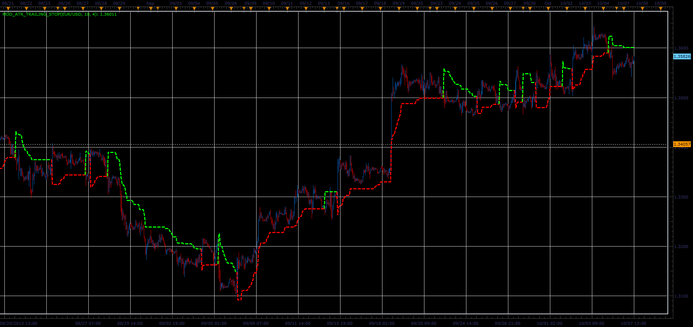

# Modified ATR Stop Level indicator

> Source: https://fxcodebase.com/code/viewtopic.php?f=17&t=59637  
> Forum: 17 · Topic 59637 · 2 post(s)

---

## Modified ATR Stop Level indicator

**Alexander.Gettinger** · Wed Oct 09, 2013 5:55 pm

The indicator can be used to calculate the stop levels for trading.

Formulas:
TS[i] = Max(TS[i-1], Close[i]-loss), if Close[i]>TS[i-1] and Close[i-1]>TS[i-1],
TS[i] = Min(TS[i-1], Close[i]+loss), if Close[i]<TS[i-1] and Close[i-1]<TS[i-1],
TS[i] = Close[i]-loss, if Close[i]>TS[i-1],
TS[i] = Close[i]+loss, if Close[i]<TS[i-1], where
loss = Coeff*WMA(Diff, Period),
WMA - Wilder Exponential Moving Average,
Diff[i] = Max(HiLo, Href, Lref),
HiLo[i] = Min(High[i]-Low[i], MVA(High-Low, Period)),
Href[i] = High[i]-Close[i-1], if Low[i]<=High[i-1],
Href[i] = (High[i]+High[i-1]-Low[i]-Close[i-1])/2, if Low[i]>High[i-1],
Lref[i] = Close[i-1]-Low[i], if High[i]>=Low[i-1],
Lref[i] = (Close[i-1]+High[i]-Low[i-1]-Low[i])/2, if High[i]<Low[i-1].

 

Download:

 [Mod_ATR_Trailing_Stop.lua](files/89929/Mod_ATR_Trailing_Stop.lua)

For this indicator must be installed Averages indicator ([viewtopic.php?f=17&t=2430](https://fxcodebase.com/code/viewtopic.php?f=17&t=2430)).

The indicator was revised and updated

---

## Re: Modified ATR Stop Level indicator

**Apprentice** · Mon Jun 12, 2017 6:11 am

The indicator was revised and updated.
