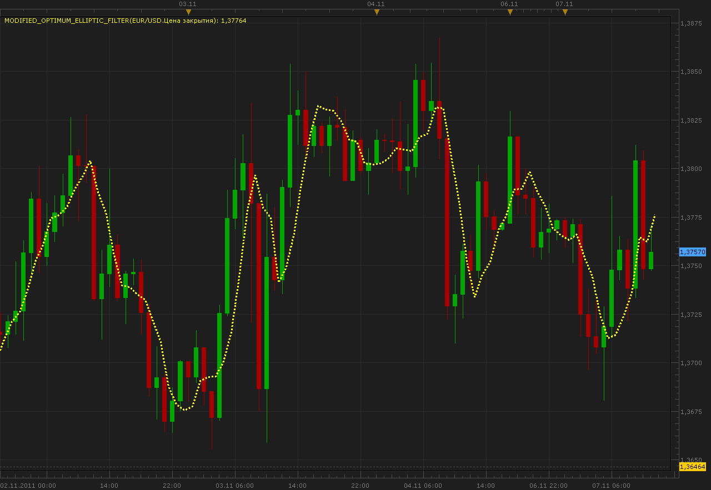

# Modified Optimum Elliptic Filter

> Source: https://fxcodebase.com/code/viewtopic.php?f=17&t=7889  
> Forum: 17 · Topic 7889 · 3 post(s)

---

## Modified Optimum Elliptic Filter

**Alexander.Gettinger** · Mon Nov 07, 2011 11:17 am

This indicator is a ported MQL5 indicators from [http://www.mql5.com/ru/code/597](http://www.mql5.com/ru/code/597) (in Russian).
The indicator uses modified elliptic filter from John Ehlers book "Cybernetic Analysis for Stocks and Futures: Cutting-Edge DSP Technology to Improve Your Trading".

 

Download:

 [Modified_Optimum_Elliptic_Filter.lua](files/17491/Modified_Optimum_Elliptic_Filter.lua)

The indicator was revised and updated

---

## Re: Modified Optimum Elliptic Filter

**Blackcat2** · Mon Nov 07, 2011 7:02 pm

How to use this indicator?

---

## Re: Modified Optimum Elliptic Filter

**Apprentice** · Sun Mar 19, 2017 10:51 am

Indicator was revised and updated.
