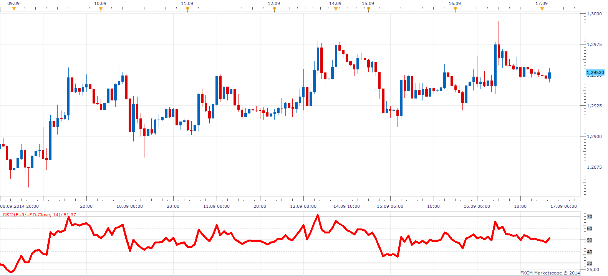

# Modified RSI

> Source: https://fxcodebase.com/code/viewtopic.php?f=17&t=61165  
> Forum: 17 · Topic 61165 · 6 post(s)

---

## Modified RSI

**reef FX** · Tue Sep 16, 2014 5:57 pm

I've modified the original RSI code provided in trading station to allow it to auto-scale the same way price does. This version also allows you to add the 40 and 60 levels if you want to.

Hope you find this useful!

 [RSI2.lua](files/95940/RSI2.lua)

The indicator was revised and updated

---

## Re: Modified RSI

**7510109079** · Wed Sep 17, 2014 12:06 pm

nice thx

---

## Re: Modified RSI

**7510109079** · Wed Sep 17, 2014 12:07 pm

i use the 25/75 levels. Any chance you could add that one too?

---

## Re: Modified RSI

**reef FX** · Thu Sep 18, 2014 5:37 pm

Sure will do that over the weekend

---

## Re: Modified RSI

**reef FX** · Mon Sep 22, 2014 9:41 pm

@7510109079, do you want only the 25 and 75 levels. Or the 25, 30, 70, and 75?

---

## Re: Modified RSI

**Apprentice** · Fri Jun 23, 2017 7:18 am

The indicator was revised and updated.
