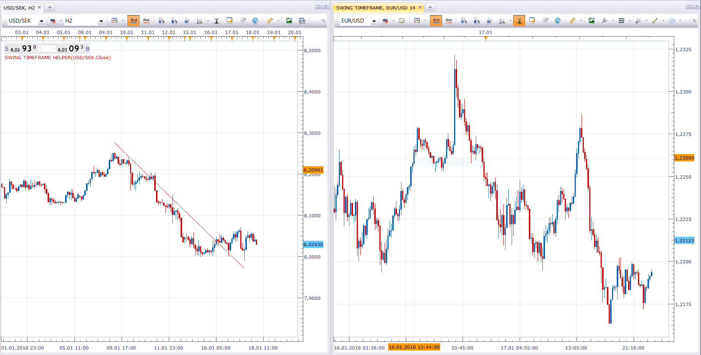

# Modified Time frame based on the Swing length

> Source: https://fxcodebase.com/code/viewtopic.php?f=17&t=65645  
> Forum: 17 · Topic 65645 · 6 post(s)

---

## Modified Time frame based on the Swing length

**Apprentice** · Thu Jan 18, 2018 5:29 am

Based on the request.
[viewtopic.php?f=27&t=65639](https://fxcodebase.com/code/viewtopic.php?f=27&t=65639)

 

1. Define Swing with Swing timeframe helper

 

2. Add Swing timeframe view.

 [Swing timeframe helper.lua](files/117109/Swing%20timeframe%20helper.lua)

 [Swing timeframe.lua](files/117109/Swing%20timeframe.lua)

 [Swing timeframe with Time Frame Selector.lua](files/117109/Swing%20timeframe%20with%20Time%20Frame%20Selector.lua)

---

## Re: Modified Time frame based on the Swing length

**High&Low** · Sat Jan 20, 2018 11:28 pm

Thank you for your time.
 It works perfect.

---

## Re: Modified Time frame based on the Swing length

**High&Low** · Sun Oct 07, 2018 10:33 pm

Hi,

Could you please check the indicator ?

It shows only for 3 months, I would be thankful to increase the number of History candle if there is any limit.

I am using the "Create View" option as showed in the picture above and choosing the date back 2 years ago, but it goes back only for 3 months. I have checked different time frames and results were the same.

Thanks

---

## Re: Modified Time frame based on the Swing length

**Apprentice** · Mon Oct 08, 2018 5:35 am

Try top use higher time frames.

---

## Re: Modified Time frame based on the Swing length

**High&Low** · Tue Oct 09, 2018 12:33 am

Thank you for the reply.

Even when I choose the Daily time frame it does not go back more than about 3 months.

I would be thankful if you could check it.

---

## Re: Modified Time frame based on the Swing length

**Apprentice** · Sun Oct 14, 2018 3:46 am

Swing timeframe with Time Frame Selector.lua added.
Try it.
