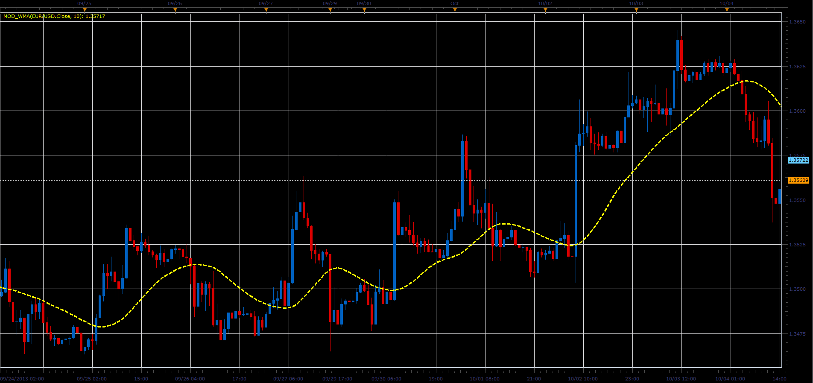

# Modified Wilders smooting average indicator

> Source: https://fxcodebase.com/code/viewtopic.php?f=17&t=59622  
> Forum: 17 · Topic 59622 · 2 post(s)

---

## Modified Wilders smooting average indicator

**Alexander.Gettinger** · Tue Oct 08, 2013 12:00 pm

The indicator is very similar to the WMA.

Formulas for WMA:
WMA[i] = (Price[i] - WMA[i-1])*k + WMA[i-1], where
k = 1/Length.

Formulas for Mod. WMA:
ModWMA[i] = (MVA(i) - ModWMA[i-1])*k + ModWMA[i-1], where
k = 1/Length.

 

Download:

 [Mod_WMA.lua](files/89896/Mod_WMA.lua)

The indicator was revised and updated

---

## Re: Modified Wilders smooting average indicator

**Apprentice** · Mon Jun 12, 2017 6:15 am

The indicator was revised and updated.
