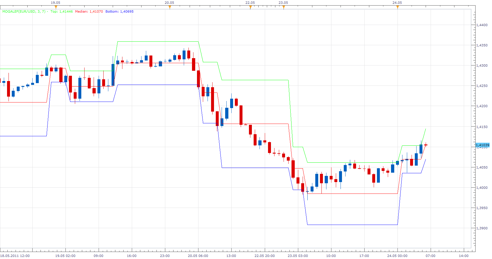

# Mogalef Bands

> Source: https://fxcodebase.com/code/viewtopic.php?f=17&t=4449  
> Forum: 17 · Topic 4449 · 23 post(s)

---

## Mogalef Bands

**Apprentice** · Mon May 23, 2011 5:00 pm



Median = LinearReg((Open+High+Low+(2*Close))/5);
Deviation = StandardDev(Median);

Top Band = Median + Multiplier*Deviation;
Bottom Band = Median -Multiplier*Deviation;

if Median[period]<Top[period-1] and Median[period] > Bottom[period-1] then
	DEV[period]= DEV[period-1];
	Top[period] = Top[period-1];
	Bottom[period] =Bottom[period-1];
	Median[period]= Median[period-1];
end

 [Mogalef.lua](files/10972/Mogalef.lua)

The indicator was revised and updated

---

## Re: Mogalef Bands

**Terminus** · Tue May 24, 2011 3:02 am

Hello Apprentice,

thank you for your reply.
But to see your attachment picture this is not the same.
Look my attachment and you can have informations about this indicator here :
[http://www.mogalef.com](http://www.mogalef.com)

Recall of the code in pro Realtime language :

```
CP=(open+high+low+2*close)/5
F=LinearRegression[3](CP)
E=std[7](F)

if barindex<8 then
Mediane = undefined
BandeHaute = undefined
BandeBasse = undefined

Else
BandeHaute = F+(E*2)
BandeBasse = F-(E*2)

if F<BandeHaute[1] and F>BandeBasse[1] then
E=E[1]
BandeHaute=BandeHaute[1]
BandeBasse=BandeBasse[1]
endif

Mediane =(BandeHaute+BandeBasse)/2
Endif

return BandeHaute coloured (255,154,51) as"Mogalef Bande Haute", Mediane coloured (102,0,204) as "Mogalef Mediane", BandeBasse coloured (0,204,255) as "Mogalef Bande Basse"
```

---

## Re: Mogalef Bands

**Apprentice** · Tue May 24, 2011 5:05 am

Thanks for the warning.
Corrected.

---

## Re: Mogalef Bands

**Terminus** · Tue May 24, 2011 7:43 am

Thank you very much for you're reactivity.
It seems to be near Mogalef bands but without the same reactivity
the gap of the bands is later in you code than this of prorealtime code
Look the comparaison of the two graphics EURUSD in Daily

---

## Re: Mogalef Bands

**Apprentice** · Tue May 24, 2011 8:41 am

The problem is that I got Partial and three of four different formulas for this indicator.
So I'm not sure that it the right one.

---

## Re: Mogalef Bands

**Terminus** · Tue May 24, 2011 10:08 am

ok , i understand you because the divulgation of this code is very recent.
I know that the ProRealtime code i give you has been validate by Eric Lefort (one of the the authors)

Maby the problem is her (traduction):
"C'est bien la régression linéaire du cours pondéré qui est prise en compte dans la cassure des bandes, et non pas le cours pondéré lui-même. "
"It is good the linear regression of the balanced course(price) which is taken into account in the break of bands(strips), and not the balanced course(price) itself. "

if t-you speak french you have a lot of informations in the web site www/.pro-at.com
you

HERE i find the code by the autor (Reference version for free distribution):

```
express MOGALEFBands
// Version de référence pour diffusion gratuite

vars
input $N(2,10,3),$ET(5,15,7);
series MogH,MogB,MogM,etyp;
series xx,yy,zz,e,mm;
numeric i,SumXY,SumX2,SumY,SumX,a,b;
series X,Y,Z,MogRegLin,CoursP;

calculation

// Calcul du cours pondéré Mogalef
CoursP = ((h+l+o+c+c)/5); // Fin du calcul

// on calcule la régression linéaire----------------------------------------
for i = 0 to $N-1
begin
X = i;
Y = CoursP;
SumX = SumX + X;
SumX2 = SumX2 + Power(X,2);
SumXY = SumXY + X*Y;
SumY = SumY + Y;
end
b = (SumXY - SumX*SumY/$N)/(SumX2 - (1/$N)*Power(SumX,2));
a = (SumY - b*SumX)/$N;
Z = a + b*X[0];
SumX = 0;
SumX2 = 0;
SumXY = 0;
SumY = 0;
if Z = void then // Si rég lin pas définie
MogRegLin = Close;
else
MogRegLin = Z; // Fin régression linéaire---------------------------------

// Calcul des bandes Mogalef------------------------------------------------
// Reprise des niveaux Mogalef précédents.
StdDev(MogRegLin,etyp,$ET); //calcul écart type de longueur ET
xx=MogH[1];
yy=MogB[1];
e=etyp[1];
zz=Z[1];
mm=MogM[1];
// Pas de décalage si la RegLine est à l'intérieur des anciennes bandes
If ((MogRegLin < xx) and (MogRegLin >yy)) then
begin
etyp=e;
MogH=xx;
MogB=yy;
MogM=mm;
end
else //Si décalage tracé des nouvelles bandes
begin
MogH= (MogRegLin + (etyp*2));
MogB= (MogRegLin - (etyp*2));
MogM= MogRegLin;
end // Fin calcul bandes Mogalef---------------------------------------

interpretation
begin
end

// Affichage
plot (MogH,Yellow,2);
plot (MogB, cyan,2);
plot (MogM,blue,1);

plotband (MogH,"Yellow",2,MogM,"blue",1,"lightgreen");
plotband (MogM,"Blue",1,MogB,"cyan",2,"lightred");
```

---

## Re: Mogalef Bands

**Terminus** · Tue May 24, 2011 10:17 am

POST SCRIPTUM : this the code for FutureStation Nano WHSelfinvest

---

## Re: Mogalef Bands

**Blackcat2** · Tue May 24, 2011 8:31 pm

This is an interesting indicator... I'm currently testing this..

How many % identical compared to the original / intended code?

Can I please have the option to change line width and style?

Thanks..
BC

---

## Re: Mogalef Bands

**Apprentice** · Wed May 25, 2011 3:45 am

Line Style Option Added.

---

## Re: Mogalef Bands

**Terminus** · Wed May 25, 2011 8:55 am

Hello Aprentice,

have you seen my new post with the code source based of the author for the mogalef Bands?
Are you understand it .(FutureStation Nano WHSelfinvest language)
Is it different of the proRealtime version who had problem with a candle delay ?
Tanks for your answer.

---

## Re: Mogalef Bands

**Apprentice** · Wed May 25, 2011 1:14 pm

To Terminus
Can you please test this version.
The strange thing, I got this result using a completely different algorithm.

 [Mogalef.lua](files/11029/Mogalef.lua)

---

## Re: Mogalef Bands

**Terminus** · Wed May 25, 2011 1:58 pm

No modification at the screen... Same problem, one candle too late ....
a real headache ...

Maby the code in ninja trader station can help you........

Thank you for your work !

```
code pour Ninjatrader 7.XX:

#region Using declarations
using System;
using System.ComponentModel;
using System.Diagnostics;
using System.Drawing;
using System.Drawing.Drawing2D;
using System.Xml.Serialization;
using NinjaTrader.Cbi;
using NinjaTrader.Data;
using NinjaTrader.Gui.Chart;
#endregion

// This namespace holds all indicators and is required. Do not change it.
namespace NinjaTrader.Indicator
{
/// <summary>
/// </summary>
[Description("Mogalef band")]
public class MogalefBand : Indicator
{
#region Variables
// Wizard generated variables
private double coeff = 2; // Default setting for Period
// User defined variables (add any user defined variables below)
private DataSeries CP;
private DataSeries F;

#endregion

/// <summary>
/// This method is used to configure the indicator and is called once before any bar data is loaded.
/// </summary>
protected override void Initialize()
{
Add(new Plot(Color.FromKnownColor(KnownColor.Magenta), PlotStyle.Line, "Base"));
Plots[0].Pen.Width = 2;
Add(new Plot(Color.FromKnownColor(KnownColor.Gold), PlotStyle.Line, "BandUp"));
Plots[1].Pen.Width = 2;
Add(new Plot(Color.FromKnownColor(KnownColor.SkyBlue), PlotStyle.Line, "BandDown"));
Plots[2].Pen.Width = 2;
CalculateOnBarClose = true;
Overlay = true;
PriceTypeSupported = false;
CP = new DataSeries(this);
F = new DataSeries(this);
}

protected double MyLinReg(IDataSeries data,int period)
{
double sumX = (double) period * (period - 1) * 0.5;
double divisor = sumX * sumX - (double) period * period * (period - 1) * (2 * period - 1) / 6;
double sumXY = 0;

for (int count = 0; count < period && CurrentBar - count >= 0; count++)
sumXY += count * data[count];
double slope = ((double)period * sumXY - sumX * SUM(data, period)[0]) / divisor;
double intercept = (SUM(data, period)[0] - slope * sumX) / period;

return(intercept + slope * (period - 1));
}
/// <summary>
/// Called on each bar update event (incoming tick)
/// </summary>
protected override void OnBarUpdate()
{
// Use this method for calculating your indicator values. Assign a value to each
// plot below by replacing 'Close[0]' with your own formula.
CP.Set( (Open[0]+High[0]+Low[0]+2*Close[0])/5 ) ;
F.Set( MyLinReg(CP,3));
if( CurrentBar < 9 || (F[0] > BandUp[1] || F[0] < BandDown[1]) ) {
double E = StdDev(F,7)[0];
Base.Set(F[0]);
BandUp.Set(F[0]+coeff*E);
BandDown.Set(F[0]-coeff*E);
} else {
Base.Set(Base[1]);
BandUp.Set(BandUp[1]);
BandDown.Set(BandDown[1]);
}
}

#region Properties
[Browsable(false)] // this line prevents the data series from being displayed in the indicator properties dialog, do not remove
[XmlIgnore()] // this line ensures that the indicator can be saved/recovered as part of a chart template, do not remove
public DataSeries Base
{
get { return Values[0]; }
}
public DataSeries BandUp
{
get { return Values[1]; }
}
public DataSeries BandDown
{
get { return Values[2]; }
}
[Description("Number of standard Deviation")]
[Category("Parameters")]
public double Coeff
{
get { return coeff; }
set { coeff = Math.Max(0.1, value); }
}
#endregion
}
}

#region NinjaScript generated code. Neither change nor remove.
// This namespace holds all indicators and is required. Do not change it.
namespace NinjaTrader.Indicator
{
public partial class Indicator : IndicatorBase
{
private MogalefBand[] cacheMogalefBand = null;

private static MogalefBand checkMogalefBand = new MogalefBand();

/// <summary>
/// Mogalef band
/// </summary>
/// <returns></returns>
public MogalefBand MogalefBand(double coeff)
{
return MogalefBand(Input, coeff);
}

/// <summary>
/// Mogalef band
/// </summary>
/// <returns></returns>
public MogalefBand MogalefBand(Data.IDataSeries input, double coeff)
{
if (cacheMogalefBand != null)
for (int idx = 0; idx < cacheMogalefBand.Length; idx++)
if (Math.Abs(cacheMogalefBand[idx].Coeff - coeff) <= double.Epsilon && cacheMogalefBand[idx].EqualsInput(input))
return cacheMogalefBand[idx];

lock (checkMogalefBand)
{
checkMogalefBand.Coeff = coeff;
coeff = checkMogalefBand.Coeff;

if (cacheMogalefBand != null)
for (int idx = 0; idx < cacheMogalefBand.Length; idx++)
if (Math.Abs(cacheMogalefBand[idx].Coeff - coeff) <= double.Epsilon && cacheMogalefBand[idx].EqualsInput(input))
return cacheMogalefBand[idx];

MogalefBand indicator = new MogalefBand();
indicator.BarsRequired = BarsRequired;
indicator.CalculateOnBarClose = CalculateOnBarClose;
#if NT7
indicator.ForceMaximumBarsLookBack256 = ForceMaximumBarsLookBack256;
indicator.MaximumBarsLookBack = MaximumBarsLookBack;
#endif
indicator.Input = input;
indicator.Coeff = coeff;
Indicators.Add(indicator);
indicator.SetUp();

MogalefBand[] tmp = new MogalefBand[cacheMogalefBand == null ? 1 : cacheMogalefBand.Length + 1];
if (cacheMogalefBand != null)
cacheMogalefBand.CopyTo(tmp, 0);
tmp[tmp.Length - 1] = indicator;
cacheMogalefBand = tmp;
return indicator;
}
}
}
}

// This namespace holds all market analyzer column definitions and is required. Do not change it.
namespace NinjaTrader.MarketAnalyzer
{
public partial class Column : ColumnBase
{
/// <summary>
/// Mogalef band
/// </summary>
/// <returns></returns>
[Gui.Design.WizardCondition("Indicator")]
public Indicator.MogalefBand MogalefBand(double coeff)
{
return _indicator.MogalefBand(Input, coeff);
}

/// <summary>
/// Mogalef band
/// </summary>
/// <returns></returns>
public Indicator.MogalefBand MogalefBand(Data.IDataSeries input, double coeff)
{
return _indicator.MogalefBand(input, coeff);
}
}
}

// This namespace holds all strategies and is required. Do not change it.
namespace NinjaTrader.Strategy
{
public partial class Strategy : StrategyBase
{
/// <summary>
/// Mogalef band
/// </summary>
/// <returns></returns>
[Gui.Design.WizardCondition("Indicator")]
public Indicator.MogalefBand MogalefBand(double coeff)
{
return _indicator.MogalefBand(Input, coeff);
}

/// <summary>
/// Mogalef band
/// </summary>
/// <returns></returns>
public Indicator.MogalefBand MogalefBand(Data.IDataSeries input, double coeff)
{
if (InInitialize && input == null)
throw new ArgumentException("You only can access an indicator with the default input/bar series from within the 'Initialize()' method");

return _indicator.MogalefBand(input, coeff);
}
}
}
#endregion
```

---

## Re: Mogalef Bands

**Terminus** · Thu May 26, 2011 2:33 am

Apprentice,

in fact there is a problem with the last "mogalef.lua" that you maked,it doesn't work
When i try to charge it on the station i have an error message .
Detail of the error ( image on attachment) : String "Mogalef.lua" : 98')' exepted near'period'

(When i charge it on the plaform i forgeted to actualise and in fact i use the old vesion ...)

---

## Re: Mogalef Bands

**Terminus** · Thu May 26, 2011 4:16 am

Sorry i try again to put in the station the new indicator and now it's ok.
we get closer to a clean version but there are still problems
I noted the differences on the attached image

---

## Re: Mogalef Bands

**Terminus** · Fri May 27, 2011 5:01 am

after testing it sounds ok on small units of time
but there is a problem from the 30mn
Perhaps a story of GAP ....

Many thanks for your work Apprentice

---

## Re: Mogalef Bands

**kaya_171** · Wed Jun 08, 2011 4:07 am

Hi Apprentice

I'm sorry for being late (I'm working for the moment) : thank you very much for this indicator and your work
It's great

and thanks Terminus

---

## Re: Mogalef Bands

**BlueBloodedTrader** · Tue Aug 09, 2011 3:30 pm

If these Mogalef Bands work on the basis of standard deviations away from the median regression line, what is the difference between these and Bollinger bands?

---

## Re: Mogalef Bands

**Terminus** · Tue Aug 16, 2011 3:52 pm

Put the two indicators on one screen and you can see the difference.
this two different vison of a range.

---

## Re: Mogalef Bands

**Terminus** · Tue Aug 16, 2011 3:54 pm

More informations ( beacause my english is so bad....) on mogalef.com

---

## Re: Mogalef Bands

**luciana** · Wed Aug 17, 2011 4:58 pm

Hi, I don't know whether this code was already part of the thread, but I found it published on a french forum. There are two files, one is concerning linear regression and the other file is the mogalef bands. Not too much french involved but if needed ask for help.

[http://www.pro-at.com/forums-bourse/bou ... 33637.html](http://www.pro-at.com/forums-bourse/bourse-Bandes-Mogalef-sur-VISUALCHART5-1-33637.html)

---

## Re: Mogalef Bands

**Alexander.Gettinger** · Fri Nov 21, 2014 4:48 pm

MQL4 version of Mogalef Bands indicator: [viewtopic.php?f=38&t=61512](https://fxcodebase.com/code/viewtopic.php?f=38&t=61512).

---

## Re: Mogalef Bands

**Victor.Tereschenko** · Sun May 03, 2015 6:34 am

I've added a parameter to draw a channels.

---

## Re: Mogalef Bands

**Apprentice** · Mon Jul 03, 2017 8:04 am

The indicator was revised and updated.
