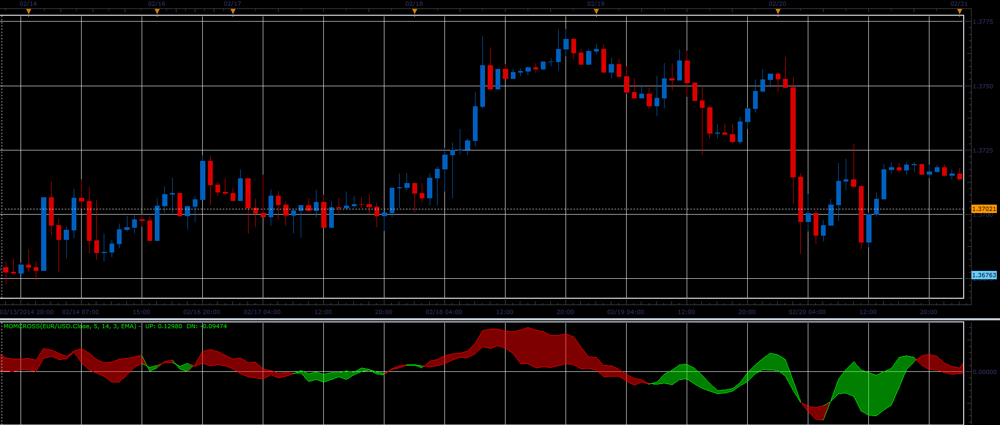

# Momentum cross oscillator

> Source: https://fxcodebase.com/code/viewtopic.php?f=17&t=60363  
> Forum: 17 · Topic 60363 · 2 post(s)

---

## Momentum cross oscillator

**Alexander.Gettinger** · Thu Feb 27, 2014 10:44 am

The oscillator is based on crossing of two momentums.

 

Download:

 [MomCross.lua](files/92924/MomCross.lua)

For this indicator must be installed Averages indicator ([viewtopic.php?f=17&t=2430](https://fxcodebase.com/code/viewtopic.php?f=17&t=2430)) and Momentum oscillator ([viewtopic.php?f=17&t=896&p=1638](https://fxcodebase.com/code/viewtopic.php?f=17&t=896&p=1638)).

The indicator was revised and updated

---

## Re: Momentum cross oscillator

**Apprentice** · Fri Jun 02, 2017 6:45 am

Indicator was revised and updated.
