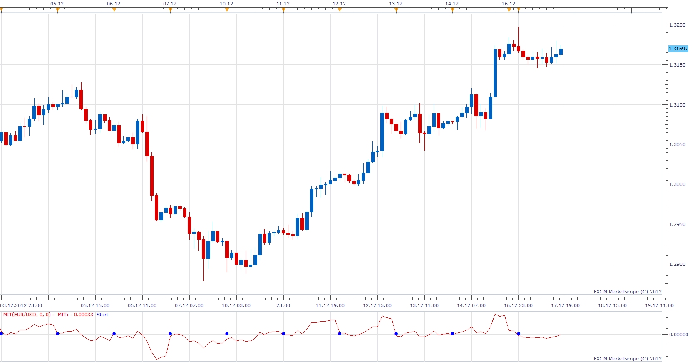
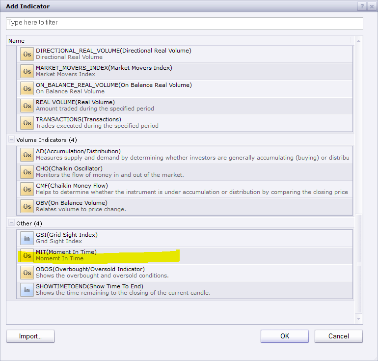

# Momentum In Time

> Source: https://fxcodebase.com/code/viewtopic.php?f=17&t=27768  
> Forum: 17 · Topic 27768 · 11 post(s)

---

## Momentum In Time

**Apprentice** · Mon Dec 17, 2012 12:37 pm

It behaves like an ordinary momentum.
There is one key difference.
Regular momemtum
Price Momentum = [Now] - Price [N periods ago]
Momentum in Time
Momentum In Time = Price [Now] - Price [During Selected Time]
Selected Time is Momemtum origin, anchorage for the entire trading day.

 [MIT.lua](files/48638/MIT.lua)

 [Tick MIT.lua](files/48638/Tick%20MIT.lua)

 [MIT with Alert.lua](files/48638/MIT%20with%20Alert.lua)

This indicator provides Audio / Email Alerts on Start on the "New Period".
Dec 27, 2015: Compatibility issue Fix. _Alert helper is not longer needed.

---

## Re: Momentum In Time

**Coondawg71** · Sun Feb 02, 2014 12:48 pm

An alert function for this indicator would be quite useful.

Alert could be triggered with the 0 center line plus an upper/lower parameter set by the user, such as .5 and 1.0

Thanks,

sjc

---

## Re: Momentum In Time

**Apprentice** · Tue Feb 04, 2014 12:53 pm

MIT with Alert Added.

---

## Re: Momentum In Time

**Alexander.Gettinger** · Wed Jun 04, 2014 5:36 pm

MQL4 version of Momentum In Time oscillator: [viewtopic.php?f=38&t=60773](https://fxcodebase.com/code/viewtopic.php?f=38&t=60773).

---

## Re: Momentum In Time

**Apprentice** · Sun Dec 27, 2015 10:18 am

Dec 26, 2015: Compatibility issue Fix. _Alert helper is not longer needed.

---

## Re: Momentum In Time

**Apprentice** · Tue Aug 01, 2017 5:51 am

The indicator was revised and updated.

---

## Re: Momentum In Time

**GreenPips** · Mon Dec 18, 2017 11:30 am

Hi,

I'm new to trading station. I have installed the indicator according to this guide
[http://fxcodebase.com/wiki/index.php/Custom_Strategies:_How_To_Install_in_Marketscope](https://fxcodebase.com/wiki/index.php/Custom_Strategies:_How_To_Install_in_Marketscope)
but the indicator is not showing in marketscope indicator list. Am I doing something wrong ?

Please help. Thanks.

---

## Re: Momentum In Time

**Apprentice** · Mon Dec 18, 2017 11:58 am

Use these.
[viewtopic.php?f=17&t=17](https://fxcodebase.com/code/viewtopic.php?f=17&t=17)
[viewtopic.php?f=17&t=59681](https://fxcodebase.com/code/viewtopic.php?f=17&t=59681)

 

---

## Re: Momentum In Time

**GreenPips** · Tue Dec 19, 2017 12:14 am

Hi Apprentice,

Just realise indicator that unable to run on tick chart, will not appear in indicator list that open on tick chart.

Can you make it run on tick chart ?
Price Momentum = [Tick Now] - Tick [N seconds ago]

Thanks.

---

## Re: Momentum In Time

**Apprentice** · Tue Dec 19, 2017 4:26 am

Tick MIT.lua added.

---

## Re: Momentum In Time

**Apprentice** · Wed Apr 04, 2018 6:49 am

The Indicator was revised and updated.
