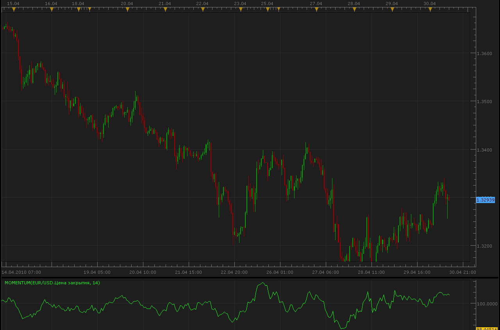

# Momentum

> Source: https://fxcodebase.com/code/viewtopic.php?f=17&t=896  
> Forum: 17 · Topic 896 · 8 post(s)

---

## Momentum

**Alexander.Gettinger** · Fri Apr 30, 2010 11:26 am

The Momentum Technical Indicator measures the amount that a security’s price has changed over a given time span.

Calculation:
Momentum is calculated as a ratio of today’s price to the price several (N) periods ago.

MOMENTUM = CLOSE(i)/CLOSE(i-N)*100

Where:
CLOSE(i) — is the closing price of the current bar;
CLOSE(i-N) — is the closing bar price N periods ago.

 

Code: [Select all](https://fxcodebase.com/code/)
`function Init()
    indicator:name("Momentum");
    indicator:description("Momentum");
    indicator:requiredSource(core.Tick);
    indicator:type(core.Oscillator);
   
    indicator.parameters:addInteger("N", "N", "Period", 14);

    indicator.parameters:addColor("clrMom", "Color of momentum", "Color of momentum", core.rgb(0, 255, 0));
end

local first;
local source = nil;
local N;

function Prepare()
    source = instance.source;
    N=instance.parameters.N;
    first = source:first();
    local name = profile:id() .. "(" .. source:name() .. ", " .. N .. ")";
    instance:name(name);
    Momentum = instance:addStream("Momentum", core.Line, name .. ".Momentum", "Momentum", instance.parameters.clrMom, first);
end

function Update(period, mode)
    if (period>first+N) then
     Momentum[period]=source[period]*100./source[period-N];
    end
end`

 [Momentum.lua](files/1638/Momentum.lua)

 

 [Momentum Price Overlay.lua](files/1638/Momentum%20Price%20Overlay.lua)

Simple momentum strategy.
[viewtopic.php?f=31&t=65737&p=117765#p117765](https://fxcodebase.com/code/viewtopic.php?f=31&t=65737&p=117765#p117765)

 

 [Detrended Momentum.lua](files/1638/Detrended%20Momentum.lua)

---

## Re: Momentum

**Alexey** · Tue Nov 29, 2011 8:16 pm

Hello,

What about **CMO** oscillator in FXCM Marketscope ?
Isn't it the same thing ?

Regards,

---

## Re: Momentum

**Apprentice** · Thu Dec 01, 2011 8:54 am

They are not.
Formula for Momentum
source[period]*100/source[period-N];

Formula for CMO

diff = source[period] - source[period - 1];

 if diff > 0 then
 cmo1[period] = diff;
 elseif diff < 0 then
 cmo2[period] = -diff;
 end

s1 = mathex.sum(cmo1, p, period);
s2 = mathex.sum(cmo2, p, period);
CMO[period] = (s1 - s2) / (s1 + s2) * 100;

---

## Re: Momentum

**Alexey** · Thu Dec 01, 2011 11:40 am

So CMO isn't the old & classical Momentum known by every one ? It is another oscillator ?

---

## Re: Momentum

**Apprentice** · Fri Dec 02, 2011 5:56 pm

Yes, As the difference in the name suggests.

---

## Re: Momentum

**xpertizetrading** · Thu May 28, 2015 10:44 am

Is it possible to code a Momentum Price Overlay, Similar to RSI Price overlay, as we have on fxcodebase?

Thanks,
Xpertize Trading

---

## Re: Momentum

**Apprentice** · Sun Jun 07, 2015 3:38 am

Momentum Price Overlay.lua Added.

---

## Re: Momentum

**Apprentice** · Thu Feb 15, 2018 7:47 am

The Indicator was revised and updated.
