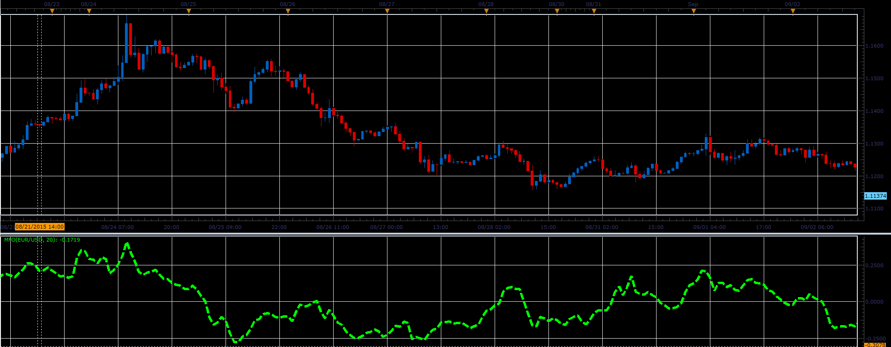

# Money Flow oscillator

> Source: https://fxcodebase.com/code/viewtopic.php?f=17&t=62692  
> Forum: 17 · Topic 62692 · 2 post(s)

---

## Money Flow oscillator

**Alexander.Gettinger** · Tue Sep 22, 2015 11:38 am

This indicator has been described in the Stock&Commodities (October 2015).

Formula:
MFO = Sum(MFV)/Sum(Volume) with [Period] number of periods, where
MFV = Multiplier*Volume,
Multiplier[i] = [(High[i]-Low[i-1])-(High[i-1]-Low[i])]/[(High[i]-Low[i-1])+(High[i-1]-Low[i])].

 

Download:

 [MFO.lua](files/102470/MFO.lua)

---

## Re: Money Flow oscillator

**Apprentice** · Fri Oct 12, 2018 5:09 am

The indicator was revised and updated.
