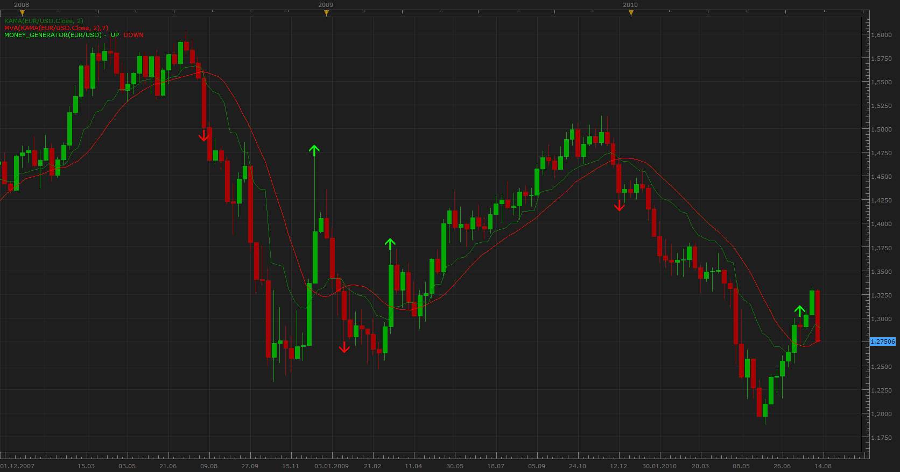

# Money Generator Strategy indicator

> Source: https://fxcodebase.com/code/viewtopic.php?f=17&t=1794  
> Forum: 17 · Topic 1794 · 2 post(s)

---

## Money Generator Strategy indicator

**Apprentice** · Sat Aug 14, 2010 10:47 am

Arrow is generated when KAMA (green line) crosses MVA (red line) .
NOTE: MVA gets its DATA SOURCE from KAMA.

 [Money_Generator.lua](files/3592/Money_Generator.lua)

---

## Re: Money Generator Strategy indicator

**Apprentice** · Sun Jan 08, 2017 10:48 am

Indicator was revised and updated.
