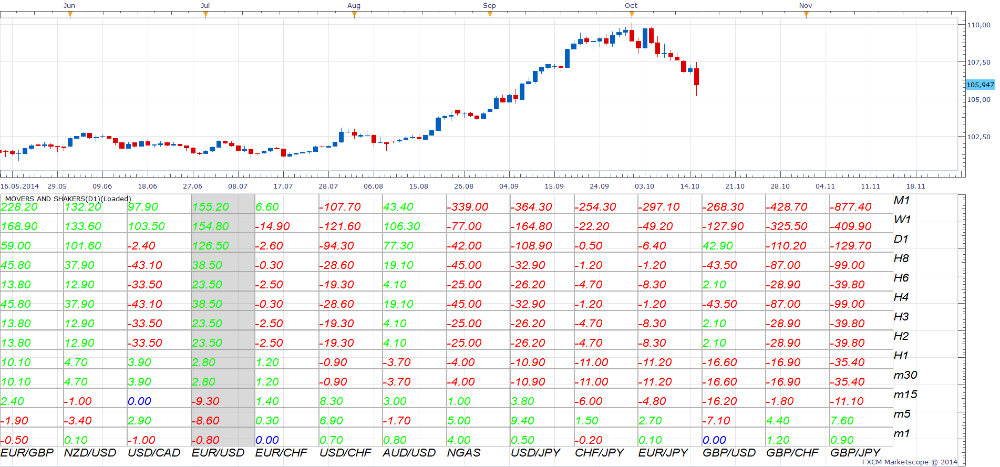
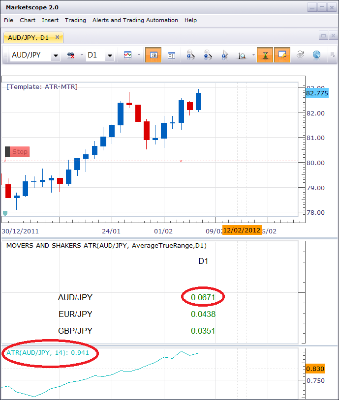
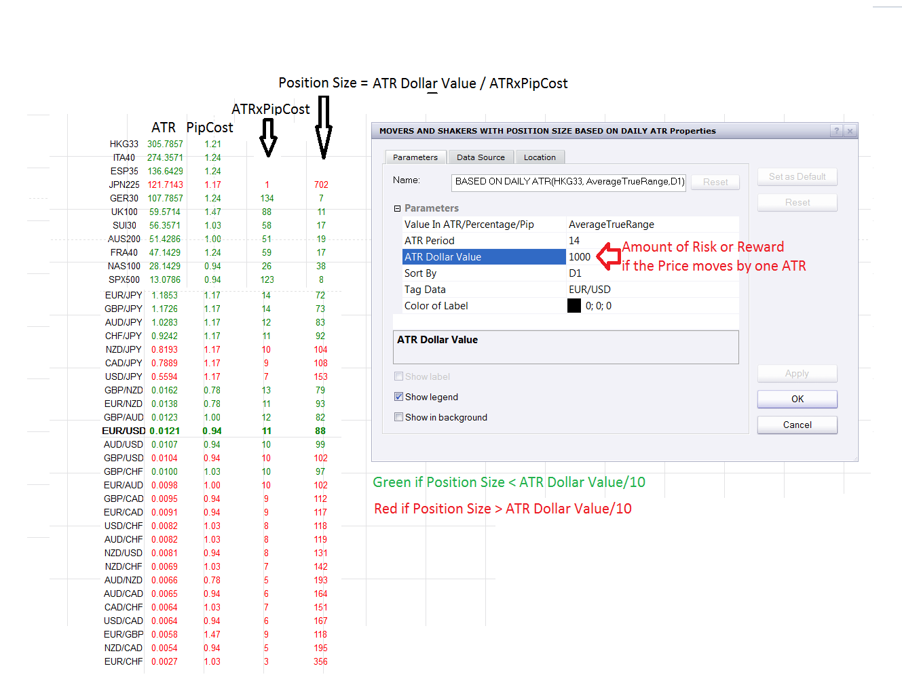
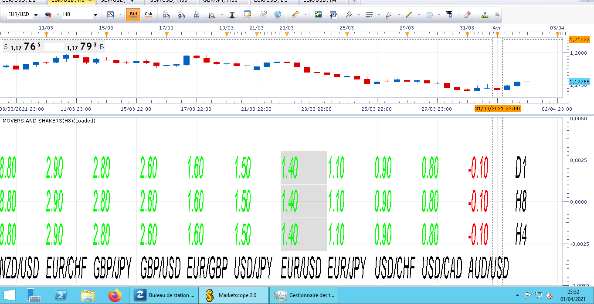

# Movers and Shakers (Price)

> Source: https://fxcodebase.com/code/viewtopic.php?f=17&t=3234  
> Forum: 17 · Topic 3234 · 35 post(s)

---

## Movers and Shakers (Price)

**Apprentice** · Mon Jan 24, 2011 4:17 am

This indicator creates a list of available currency pairs,
Displays Pip or the percentage change for the defined time frames.

Allows sorting by time frame.

By defult period is set to 0
In this case, the indicator shows a change from the beginning of the current period.
If you use a different value.
Change is calculated in relation to the open value n periods ago.

This is a prototype for such indicators.
Improvements in performance, functionality, are likely.

This type of indicators can be written for individual indicator or strategy.

I hope that in future we will have a separate module with a lot more options.

 [Movers and Shakers.lua](files/7668/Movers%20and%20Shakers.lua)

 [Movers and Shakers with ATR.lua](files/7668/Movers%20and%20Shakers%20with%20ATR.lua)

A similar list, which allows you to add up to four filters can be found here.
[viewtopic.php?f=17&t=3262&p=7733&hilit=list#p7733](https://fxcodebase.com/code/viewtopic.php?f=17&t=3262&p=7733&hilit=list#p7733)

A similar list,which allows you to monitor all the currency pairs that contain a defined currency.
[viewtopic.php?f=17&t=8257&p=18259#p18259](https://fxcodebase.com/code/viewtopic.php?f=17&t=8257&p=18259#p18259)

---

## Re: Movers and Shakers (Price)

**Ichi4me** · Tue Feb 07, 2012 8:31 am

Hi Apprentice -

I've tried to add Average True Range to this indicator, but the values I am getting don't match the values from the ATR indicator. Any thoughts on how to fix this?

 

---

## Re: Movers and Shakers (Price)

**Apprentice** · Wed Feb 08, 2012 6:54 am

Try My Version.

You have get almost everything right.
 But not this line.

Code: [Select all](https://fxcodebase.com/code/)
`Total = mathex.avg (temp, period - n + 1, period);`

You are using a "period" as referance.
Your implementation is accurate only for chart time frame.
Something like this would have been better.

Code: [Select all](https://fxcodebase.com/code/)
`Total = mathex.avg (temperature, stream [i * 20 + j]. High [stream [i * 20 + j]: size () - 1] - n + 1, stream [i * 20 + j]. High [stream [i * 20 + j]: size () - 1]);`

But you hava some other problems if you use this line.
My version circumventing them.

---

## Re: Movers and Shakers (Price)

**Ichi4me** · Wed Feb 08, 2012 7:30 am

Dude, you rock!

If you ever come to Australia, I will buy you a very big beer.

Thank you!

---

## Re: Movers and Shakers (Price)

**Apprentice** · Wed Feb 08, 2012 8:23 am

I have a better idea.
Buy me a cocktail, here in Croatia.

---

## Re: Movers and Shakers (Price)

**Pipfind** · Wed Feb 08, 2012 12:38 pm

I really like this movers and shakers.lua.

One challenge I find with this indicator is that once a new candle starts, I don't have much of a gauge for relative strength/weakness.

How about an enhancement that is based on the number of candles for a given time frame? So rather than looking at the current price versus the close of the previous 4hr candle (or daily, etc), how about if it looks at the current price relative to the closing price of 'X' candles ago? That way, If I wanted to keep a consistent look of the past 80 days or eighty 1 hr candles, I can gain a sense of relative strength over a consistent time period.

It seems like this type of modification would be fairly easy. Is it possible?

Thank you!

---

## Re: Movers and Shakers (Price)

**Apprentice** · Wed Feb 08, 2012 5:13 pm

To be honest I have not thought about it.
I have just recreated a tool that I use in my trading.
Someone would say, that for this purpose you have Higer time frame.
But I see your point.
I will try to fix something soon.

---

## Re: Movers and Shakers (Price)

**Apprentice** · Thu Feb 09, 2012 11:22 am

I made small Face lift of top most version,
added some new functionalities.

---

## Re: Movers and Shakers (Price)

**Ichi4me** · Wed Feb 22, 2012 8:49 am

I have modified this by adding Position Sizing based on Daily ATR.

ATR Dollar Value represents the amount you wish to risk (or gain) if the price moves by the current ATR for the given period. You can use this to ensure that your risk or reward is the same for one ATR of movement across different instruments.

I have calculate Position size as ATR Dollar Value / (ATR x PipCost).

Here's an example:
ATR Dollar Value = $1000
EUR/USD 14 Day ATR = 0.0121
EUR/USD PipCost = 0.94
ATR x PipCost = 11 (rounded to the nearest integer)
Position Size = $1000 / 11 = 88

Since contract sizes are multiples of 10, you would us a postion size of 80 (rounding down) or 90 (rounding up).

The other way I use this information is to identify which pairs to trade. I have colored a pair's values green if the Position Size is less than ATR Dollar Value/10, and red if the Position Size is greater than ATR Dollar Value/10. This could be improved by sorting on Position Size.

In general, it does what I need it to. However, my programming abilities are not all that great, and I don't have much time to dedicate to fixing it up. If a high-powered programmer like you, Mr. Apprentice wants to look this over, I'm sure you can make it much more elegant than my hackwork.

I've also used this with my live account, which has access to all pairs, so I have set the limit of the arrays higher than the standard 20 symbols allowed in a demo version. I haven't actually used this on a demo version, so not sure what will happen. Again, if someone wants to do a bit of fixing so that it only allows 20 symbols, go right ahead.

The other obvious issue is that it does not display any text at the top of the columns or the last two values for the first two or three rows. I don't trade any of these symbols, so am not too bothered by it. But if someone wants to fix this, be my guest. I'm thinking that this whole concept is getting a bit far from the original purpose of this thread, so if anyone wants to simply rename this indicator to "Position Sizing" and start a new thread, go for it!

 

---

## Re: Movers and Shakers (Price)

**Pipfind** · Mon Nov 26, 2012 12:38 pm

> **Apprentice wrote:**
>
>
> M&S.PNG
>
>
>
> This indicator creates a list of available currency pairs,
> Displays Pip or the percentage change for the defined time frames.
>
> Allows sorting by time frame.
>
> By defult period is set to 0
> In this case, the indicator shows a change from the beginning of the current period.
> If you use a different value.
> Change is calculated in relation to the open value n periods ago.
>
> This is a prototype for such indicators.
> Improvements in performance, functionality, are likely.
>
> This type of indicators can be written for individual indicator or strategy.
>
> I hope that in future we will have a separate module with a lot more options.
>
>
>
> Movers and Shakers.lua

This is great Apprentice.

As I used this, I noticed some of the cross pairs were not included. My TSII allows for more than 20 pairs. Would it be possible to calculate for the already mentioned 20 pairs + 8 other cross pairs?

Namely, include the following:
EURNZD
GBPNZD
GBPAUD
AUDCHF
CADCHF
NZDCHF
CADCHF
AUDNZD

I like the visual output and would simply like to see the above 8 pairs added to the calculation.

Thank you very much!

---

## Re: Movers and Shakers (Price)

**Apprentice** · Mon Nov 26, 2012 3:28 pm

Try my new version for Beta Version of TS.

---

## Re: Movers and Shakers (Price)

**ddrrbb** · Tue Apr 30, 2013 10:57 am

Is it possible to make a strategy out of movers and shakers? It would be buy any cross pair above .50% (or any percentage) from the start of the week (but could be month, day, hour, 15 min). Also, sell any pair below .50%. With stops .25% below, or trailing stops at a certain percentage (for example, if pair is +2% for the week, stop set at 1.75%). It could check the trade at set intervals to see if it is still valid (to avoid noise) or constantly check (to avoid a big move the other way).

I find that several pairs finish every single week up or down 1-5%. If we traded only those pairs with tight stops, we are guaranteed to be trading the best and worst pairs for the week.

---

## Re: Movers and Shakers (Price)

**Apprentice** · Fri May 03, 2013 3:04 am

Your request is added to the development list.

---

## Re: Movers and Shakers (Price)

**bluegreen** · Fri Jul 05, 2013 5:49 am

I get the following errors when trying to install movers and shakers

attempt to index field host : a nil value
attempt to index global host : a nil value

---

## Re: Movers and Shakers (Price)

**Apprentice** · Mon Jul 22, 2013 6:54 am

Looks like a compatibility issue.
The problem has been corrected.

---

## Re: Movers and Shakers (Price)

**bluegreen** · Tue Jul 23, 2013 5:15 am

Yes, you have fixed it. Thank you very much Apprentice.

---

## Re: Movers and Shakers (Price)

**SenseClash** · Tue Oct 14, 2014 12:07 pm

I love this idea! I would like to get a signal (email) when ALL the time frames become the same color (like when the USDCAD became all green and the CHFJPY became all red in your original picture).

I would also like to choose my own time frames or add a few (e.g., 5 minute or 1 minute) to what you're showing. For example, as a scalper, I might want to look only at 15 minute, 5 minute, and 1 minute time frames and get a signal when they all turn green or red. Or, maybe I like the time frames you have, but I'd like to add a 15 minute and a 5 minute to it and get a signal when they all turn the same color.

---

## Re: Movers and Shakers (Price)

**Apprentice** · Wed Oct 15, 2014 11:22 am

I just released a brand new version of movers and shakers.
See first (topmost) post in this topic.
Please Re-Download.

---

## Re: Movers and Shakers (Price)

**Apprentice** · Mon Apr 23, 2018 8:43 am

The indicator was revised and updated.

---

## Re: Movers and Shakers (Price)

**Avignon** · Sun Jan 31, 2021 4:19 pm

Is possible to add option "End of turn/Live".

Thanks.

---

## Re: Movers and Shakers (Price)

**Apprentice** · Thu Feb 04, 2021 7:38 am

Will the idea to delay the data for one period?

---

## Re: Movers and Shakers (Price)

**Avignon** · Thu Feb 04, 2021 4:35 pm

I don't grasp the implications.

For me, once the choice of the TF, I put an alert every 15 minutes or 4 hours for example, and at the time T, I know which parity has most advanced or declined.

---

## Re: Movers and Shakers (Price)

**Apprentice** · Sat Feb 06, 2021 10:22 am

Your request is added to the development list.
Development reference 157.

---

## Re: Movers and Shakers (Price)

**Apprentice** · Mon Feb 08, 2021 3:22 am

I don't understand what needs to be done.
 Add alerts that will, that will alert every 15 minutes (based on selection)

---

## Re: Movers and Shakers (Price)

**Avignon** · Mon Feb 08, 2021 5:13 am

I misspoke. I don't want an alert.

To put it another way: the moving Christmas garland side stresses me. I select a TF, it will give me the values at instant T without anything moving, and that's it.

I would press F5 when I need it to refresh.

Thanks.

---

## Re: Movers and Shakers (Price)

**Apprentice** · Tue Feb 09, 2021 6:07 am

To show values at the time of addition.
Without subsequent changes.

---

## Re: Movers and Shakers (Price)

**Avignon** · Tue Feb 09, 2021 6:12 am

> **Apprentice wrote:**
> To show values at the time of addition.
> Without subsequent changes.

Yes!

---

## Re: Movers and Shakers (Price)

**Apprentice** · Thu Feb 11, 2021 4:45 am

Your request is added to the development list.
Development reference 178.

---

## Re: Movers and Shakers (Price)

**Apprentice** · Sun Feb 14, 2021 3:00 am

[Movers and Shakers no update.lua](files/140708/Movers%20and%20Shakers%20no%20update.lua)

Something like this?

---

## Re: Movers and Shakers (Price)

**Avignon** · Mon Feb 22, 2021 12:21 pm

It corresponds to what I asked for, thank you, but in the end it is not what I want.

Is it possible to run the indicator at a selected time interval (e.g. 240 min or 1440 min)? With the no update.

If I select the daily at 05:00 in the morning, I have the progress on 5:00 and not on the last 24 hours.

---

## Re: Movers and Shakers (Price)

**Apprentice** · Tue Feb 23, 2021 2:54 am

Your request is added to the development list.
Development reference 222.

---

## Re: Movers and Shakers (Price)

**Apprentice** · Wed Feb 24, 2021 7:45 am

I don't understand the logic required?
Instead of time frame change,
your goal is to have, change in the last X minutes.
After the first readout, the indicator will NOT update.

---

## Re: Movers and Shakers (Price)

**Avignon** · Thu Apr 01, 2021 4:39 pm

That's it! Impossible to know the variation of the last 24 hours or over 8 hours because the new day has just started half an hour ago.

 

---

## Re: Movers and Shakers (Price)

**Apprentice** · Fri Apr 02, 2021 3:57 am

Your request is added to the development list.
Development reference 331.

---

## Re: Movers and Shakers (Price)

**Avignon** · Thu Apr 22, 2021 11:25 am

Up!
