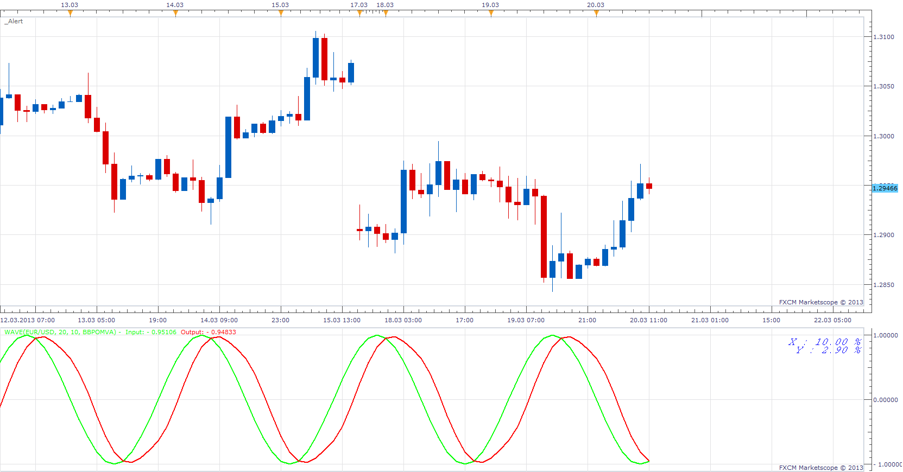

# Moving average comparison tool

> Source: https://fxcodebase.com/code/viewtopic.php?f=17&t=33600  
> Forum: 17 · Topic 33600 · 2 post(s)

---

## Moving average comparison tool

**Apprentice** · Wed Mar 20, 2013 1:14 pm

This is a simple test tool.
U can use it for compare different moving averages.
It has two primary functions.
To Generate sinusoidal test signal.
And to plott a moving average of such sources.

Indicator will provides two pieces of information.
Dampening on the Y axis, as % from Source amplitude.
Lag time on X axis, as % from Source Period .
Both values ​​should be as close as possible to zero.

I am especially proud of the moving average from my workshop.

Bollinger Band Percentage Oscillator Averege
[viewtopic.php?f=17&t=1373&p=55865&hilit=Bollinger#p55865](https://fxcodebase.com/code/viewtopic.php?f=17&t=1373&p=55865&hilit=Bollinger#p55865)

Centred moving average
[viewtopic.php?f=17&t=24476](https://fxcodebase.com/code/viewtopic.php?f=17&t=24476)

Furthermore, I encourage you to continue to develop this tool, in order to have more complex functionalitys.

 [MACT.lua](files/57032/MACT.lua)

The indicator was revised and updated

---

## Re: Moving average comparison tool

**Apprentice** · Wed May 10, 2017 5:47 am

Indicator was revised and updated.
