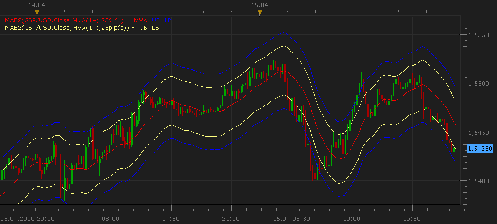

# Moving Average Envelopes (MAE) Customizable version.

> Source: https://fxcodebase.com/code/viewtopic.php?f=17&t=658  
> Forum: 17 · Topic 658 · 33 post(s)

---

## Moving Average Envelopes (MAE) Customizable version.

**Nikolay.Gekht** · Thu Apr 15, 2010 8:13 pm

There is a new customizable version of the Moving Average Envelope.

The indicator provides an ability to:
- choose the moving average method (MVA, EMA, LWMA, SMMA and so on)
- specify the band width either in 1/100 of percent or in pips.

 

Download the indicator:

 [MAE2.lua](files/1187/MAE2.lua)

If you want to use SMMA, Vidya, Wilders smoothing method, please do not forget to download and install these indicators too.
SMMA is here [viewtopic.php?f=17&t=195&p=261](https://fxcodebase.com/code/viewtopic.php?f=17&t=195&p=261)
Vidya is here [viewtopic.php?f=17&t=301&p=570](https://fxcodebase.com/code/viewtopic.php?f=17&t=301&p=570)
Widlers is here [viewtopic.php?f=17&t=248&p=375](https://fxcodebase.com/code/viewtopic.php?f=17&t=248&p=375)

Code: [Select all](https://fxcodebase.com/code/)
`-- Indicator profile initialization routine
-- Defines indicator profile properties and indicator parameters
-- TODO: Add minimal and maximal value of numeric parameters and default color of the streams
function Init()
    indicator:name("Moving Average Envelope (New Version)");
    indicator:description("");
    indicator:requiredSource(core.Tick);
    indicator:type(core.Indicator);

    indicator.parameters:addGroup("Calculation");
    indicator.parameters:addInteger("N", "Number of periods for Moving Average", "", 14);
    indicator.parameters:addString("MET", "Moving Average Method", "The methods marked by an asterisk (*) require the appropriate indicators to be loaded.", "MVA");
    indicator.parameters:addStringAlternative("MET", "MVA", "", "MVA");
    indicator.parameters:addStringAlternative("MET", "EMA", "", "EMA");
    indicator.parameters:addStringAlternative("MET", "LWMA", "", "LWMA");
    indicator.parameters:addStringAlternative("MET", "SMMA*", "", "SMMA");
    indicator.parameters:addStringAlternative("MET", "Vidya (1995)*", "", "VIDYA");
    indicator.parameters:addStringAlternative("MET", "Vidya (1992)*", "", "VIDYA92");
    indicator.parameters:addStringAlternative("MET", "Wilders*", "", "WMA");

    indicator.parameters:addInteger("B", "Band Width", "", 25);
    indicator.parameters:addString("BWU", "Band Width Units", "", "%%");
    indicator.parameters:addStringAlternative("BWU", "In 1/100 of percent", "", "%%");
    indicator.parameters:addStringAlternative("BWU", "In pips", "", "pip(s)");

    indicator.parameters:addGroup("Style");
    indicator.parameters:addBoolean("SM", "Show MA line", "", true);
    indicator.parameters:addColor("MVA_color", "Color of MA line", "", core.rgb(255, 0, 0));
    indicator.parameters:addColor("B_color", "Color of Band", "", core.rgb(0, 0, 255));
end

-- Indicator instance initialization routine
-- Processes indicator parameters and creates output streams
-- TODO: Refine the first period calculation for each of the output streams.
-- TODO: Calculate all constants, create instances all subsequent indicators and load all required libraries
-- Parameters block
local N;
local B;
local BWU;
local MET;
local SM;

local first;
local source = nil;
local IND;

-- Streams block
local MVA = nil;
local UB = nil;
local LB = nil;

-- Routine
function Prepare()
    N = instance.parameters.N;
    B = instance.parameters.B;
    BWU = instance.parameters.BWU;
    MET = instance.parameters.MET;
    SM = instance.parameters.SM;
    source = instance.source;
    IND = core.indicators:create(MET, source, N);
    first = IND.DATA:first();

    local name = profile:id() .. "(" .. source:name() .. "," .. MET .. "(" .. N .. ")," .. B .. BWU .. ")";
    instance:name(name);

    if BWU == "%%" then
        BWU = 1;
    else
        BWU = 2;
        B = B * source:pipSize();
    end

    if SM then
        MVA = instance:addStream("MVA", core.Line, name .. ".MVA", "MVA", instance.parameters.MVA_color, first);
    end
    UB = instance:addStream("UB", core.Line, name .. ".UB", "UB", instance.parameters.B_color, first);
    LB = instance:addStream("LB", core.Line, name .. ".LB", "LB", instance.parameters.B_color, first);
end

-- Indicator calculation routine
-- TODO: Add your code for calculation output values
function Update(period, mode)
    if period >= first then
        IND:update(mode);

        local d = IND.DATA[period];
        local s;

        if BWU == 1 then
            s = d * B / 10000;
        else
            s = B;
        end

        if SM then
            MVA[period] = d;
        end
        UB[period] = d + s;
        LB[period] = d - s;
    end
end`

 [MAE AVERAGES.lua](files/1187/MAE%20AVERAGES.lua)

For, MAE averages, install Averages Indicator.
[viewtopic.php?f=17&t=2430](https://fxcodebase.com/code/viewtopic.php?f=17&t=2430)

---

## Re: Moving Average Envelopes (MAE) Customizable version.

**twitjaksono** · Mon Jun 21, 2010 11:48 pm

Wow, yes this the one that I meant. Thank you very much Sir

---

## Re: Moving Average Envelopes (MAE) Customizable version.

**redkees** · Thu Feb 17, 2011 11:21 am

Hi Guys,

Is it possible to get a calculation of the envelope based on the high, low and close. Ive just read Forex Trading for maximum profit by Raghee Horner and it looks like a good indi to test.

Many thanks

---

## Re: Moving Average Envelopes (MAE) Customizable version.

**Apprentice** · Thu Feb 17, 2011 3:48 pm

Can you tell me more about your request.

It seems to me that this is the case of Typical price.

Typical price
In financial trading, typical price (sometimes called the pivot point) refers to the arithmetic average of the high, low, and closing prices for a given period.

If this is the case.
As a source of MAE choose Typical data source.

---

## Re: Moving Average Envelopes (MAE) Customizable version.

**zaydin** · Wed Jun 22, 2011 12:20 pm

hi,

this is the one that i have been looking for. thank you so much for giving a time to create this indicator. i have a question though. can you also post a signal/alert code for this indicator, so the charting program can give a signal whenver the price touches the envelope bands.
thanks for your effort again.

---

## Re: Moving Average Envelopes (MAE) Customizable version.

**Apprentice** · Wed Jun 22, 2011 1:47 pm

I believe that this version is what you seek.
[viewtopic.php?f=29&t=2222&p=4693&hilit=MAE#p4693](https://fxcodebase.com/code/viewtopic.php?f=29&t=2222&p=4693&hilit=MAE#p4693)

---

## Re: Moving Average Envelopes (MAE) Customizable version.

**zaydin** · Thu Jun 23, 2011 2:31 am

thanks for replying/ but actually it does not work/ because i use the mae2 version but the one you suggested is for mae version/ the difference is in mae version the band is calculated by the percentage value in mae2 version the band is calculated by the pips/ i was looking for the signal that would calculate the band in pips not in percentage. i would appreciate it if somebody can post a signal that would calculate the band in pips. thanks

---

## Re: Moving Average Envelopes (MAE) Customizable version.

**Apprentice** · Thu Jun 23, 2011 5:50 am

MAE2 Version
[viewtopic.php?f=29&t=2222&p=11981#p11981](https://fxcodebase.com/code/viewtopic.php?f=29&t=2222&p=11981#p11981)

---

## Re: Moving Average Envelopes (MAE) Customizable version.

**zaydin** · Fri Jun 24, 2011 2:55 am

dear apprentice thank you so much for your effort. i installed the signal and customized it according to my strategy and waiting for a signal:) hope it will work. will let you know. thank you again. with respect

---

## Re: Moving Average Envelopes (MAE) Customizable version.

**zaydin** · Mon Jul 11, 2011 7:01 am

Dear apprentice,
the signal is working just fine. the only thing is the signal waits for the hourly candle to close and then gives the signal. is it possible to modify it in a way that it gives the signal as the price touches the upper or lower band. that would have been perfected the signal thank you in advance

---

## Re: Moving Average Envelopes (MAE) Customizable version.

**Apprentice** · Tue Jul 12, 2011 2:51 pm

We will try to do something.

---

## Re: Moving Average Envelopes (MAE) Customizable version.

**pk_pro** · Sat Oct 15, 2011 8:01 pm

Hey there, I am trying to apply a 0.6% and 1.2% moving Average to the 5ema but am having trouble any help would be much appreciated

G

---

## Re: Moving Average Envelopes (MAE) Customizable version.

**Apprentice** · Sun Oct 16, 2011 8:11 am

I have add double option to Band Width parameter.
So you can define Envelope widths that are less than 1 percent.

---

## Re: Moving Average Envelopes (MAE) Customizable version.

**boursicoton** · Fri Nov 25, 2011 11:36 am

possible to code an mtf version of this envelopes ?..... with all averages ? thanks.

---

## Re: Moving Average Envelopes (MAE) Customizable version.

**Apprentice** · Sat Nov 26, 2011 4:37 am

Do you mean to me, MTF or higher time-frame
Second is available through the selection of default time frame for data source.

MTF examples.
1. [viewtopic.php?f=17&t=7638&p=17974&hilit=mtf#p17974](https://fxcodebase.com/code/viewtopic.php?f=17&t=7638&p=17974&hilit=mtf#p17974)
2. [viewtopic.php?f=17&t=7337&p=16370&hilit=mtf#p16370](https://fxcodebase.com/code/viewtopic.php?f=17&t=7337&p=16370&hilit=mtf#p16370)

BTF example.
[viewtopic.php?f=17&t=3322&p=16268&hilit=biger#p16268](https://fxcodebase.com/code/viewtopic.php?f=17&t=3322&p=16268&hilit=biger#p16268)

---

## Re: Moving Average Envelopes (MAE) Customizable version.

**Apprentice** · Tue Oct 22, 2013 4:57 am

MAE averages Added.

---

## Re: Moving Average Envelopes (MAE) Customizable version.

**Outside_The_Box** · Mon Nov 04, 2013 2:15 am

> **Apprentice wrote:**
> MAE averages Added.

That is awesome. Any plans to develop a strategy for MAE Averages? Sell when price touches upper band and buy when price touches lower band? That'd be pretty damn cool.

---

## Re: Moving Average Envelopes (MAE) Customizable version.

**Apprentice** · Mon Nov 04, 2013 9:42 am

Try this version.
[viewtopic.php?f=31&t=59802](https://fxcodebase.com/code/viewtopic.php?f=31&t=59802)

---

## Re: Moving Average Envelopes (MAE) Customizable version.

**volnmar** · Tue Jul 08, 2014 7:24 am

Are you able to make alert if indicator Averages 20in1 crosses MAE Averages the upper and bottom band?... Send alert if: bottom envelope is crossed from up and upper envelope is crossed from down.

---

## Re: Moving Average Envelopes (MAE) Customizable version.

**Apprentice** · Thu Jul 10, 2014 5:06 am

Your request is added to the development list.

---

## Re: Moving Average Envelopes (MAE) Customizable version.

**volnmar** · Fri Jul 11, 2014 5:35 am

How long could it take to develop it?

---

## Re: Moving Average Envelopes (MAE) Customizable version.

**Apprentice** · Sun Jul 13, 2014 1:30 pm

Hopefully by the end of the week.
I do not give any promises.

---

## Re: Moving Average Envelopes (MAE) Customizable version.

**Apprentice** · Mon Mar 27, 2017 3:25 pm

Indicator was revised and updated.

---

## Re: Moving Average Envelopes (MAE) Customizable version.

**Recursive Trendline** · Thu Jun 29, 2017 8:55 am

Hi Fxcodebase,

Is it possible to add 'shift' feature in this indicator just like one used in displaced MA?
[http://74.52.98.35/code/viewtopic.php?f ... 09&p=91187](http://74.52.98.35/code/viewtopic.php?f=17&t=60009&p=91187)

The MAE offered by Meta Trader 4 has 'shift' feature pre-installed, but need it in Tradestation II also because it offers "Higher Time Frame View"

Regards,

---

## Re: Moving Average Envelopes (MAE) Customizable version.

**Thumper** · Tue Apr 03, 2018 7:05 pm

Can you add an option that a bar or candle changes color if it closes above or below the envelope, please? Much the same as TrendRisk indicator.lua found at [viewtopic.php?f=17&t=61007&p=101558&hilit=trend+risk#p101558](https://fxcodebase.com/code/viewtopic.php?f=17&t=61007&p=101558&hilit=trend+risk#p101558)

---

## Re: Moving Average Envelopes (MAE) Customizable version.

**Apprentice** · Wed Apr 04, 2018 5:23 am

For both.
Your request is added to the development list under Id Number 4097

---

## Re: Moving Average Envelopes (MAE) Customizable version.

**Apprentice** · Wed Apr 18, 2018 4:41 am

Try this version.

 [MAE2_Thumper.lua](files/118714/MAE2_Thumper.lua)

 [MAE2_Thumper with Alert.lua](files/118714/MAE2_Thumper%20with%20Alert.lua)

---

## Re: Moving Average Envelopes (MAE) Customizable version.

**Thumper** · Sun Jul 15, 2018 6:22 pm

For "MAE2 Thumper" can we have an alert, both email and sound? That is when the bar closes for the first time above the Upper band and below the Lower band. A further option would be above and below the middle line. There would be an option to turn off the MA alert or turn off the band alerts.

---

## Re: Moving Average Envelopes (MAE) Customizable version.

**Apprentice** · Mon Jul 16, 2018 5:59 am

MAE2_Thumper with Alert.lua added.

---

## Re: Moving Average Envelopes (MAE) Customizable version.

**Apprentice** · Tue Jul 17, 2018 10:38 am

Try it now.

---

## Re: Moving Average Envelopes (MAE)

**fortcentral** · Wed Apr 29, 2020 6:59 am

Hi,
Is it possible to have the shift/displacement functionality of the following indicator:
[viewtopic.php?f=17&t=1044](https://fxcodebase.com/code/viewtopic.php?f=17&t=1044) <-> SHIFT_MA.lua indicator

Added to the following "Moving Average Envelope" indicator:
[viewtopic.php?f=17&t=658&hilit=moving+average+envelope](https://fxcodebase.com/code/viewtopic.php?f=17&t=658&hilit=moving+average+envelope) <-> MAE2.lua

This will combine two great indicators and allow the moving average envelope (MAE2.lua) to be shifted in time and/or price as required.

Ideally, it would be great to also have the functionality to shift/displace the moving-average-envelope by "0.5" or "half" time-periods (such as 10.5, 20.5, 50.5, etc.) as required. The plotting of a (calculated) moving-average value, half-way between two price bars, is the recommended plot for some specific moving-averages.

Currently, the "SHIFT_MA.lua" only allows the moving average line to be shifted/displaced in time, by whole-number time-periods.

Thanks,
Fortcentral

---

## Re: Moving Average Envelopes (MAE) Customizable version.

**Apprentice** · Thu Apr 30, 2020 4:08 am

Your request is added to the development list.
Development reference 1173.

---

## Re: Moving Average Envelopes (MAE) Customizable version.

**Apprentice** · Fri May 01, 2020 9:25 am

Try this version.
[viewtopic.php?f=17&t=69779](https://fxcodebase.com/code/viewtopic.php?f=17&t=69779)
