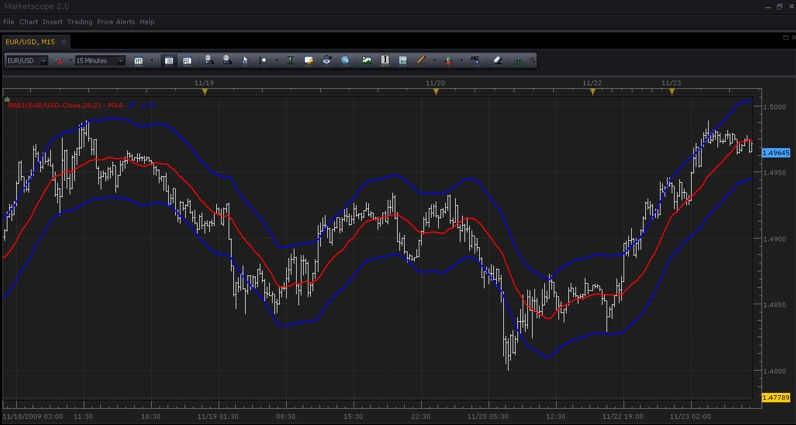
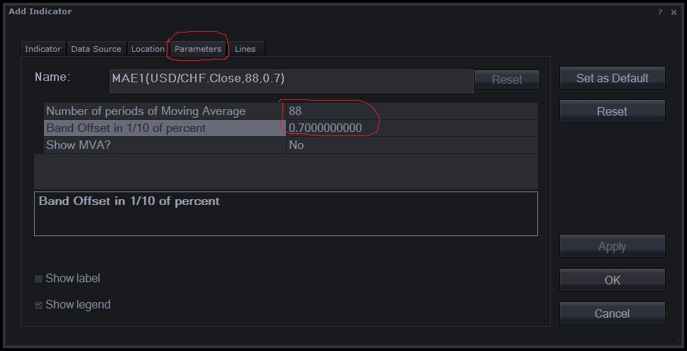
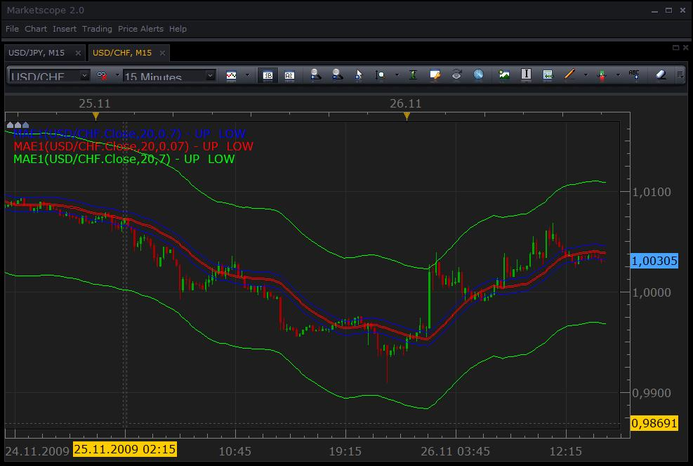

# Moving Average Envelopes (MAE)

> Source: https://fxcodebase.com/code/viewtopic.php?f=17&t=126  
> Forum: 17 · Topic 126 · 17 post(s)

---

## Moving Average Envelopes (MAE)

**TonyMod** · Mon Nov 23, 2009 3:42 pm

**Note: The indicator is updated. The new version can be found here: [viewtopic.php?f=17&t=658](https://fxcodebase.com/code/viewtopic.php?f=17&t=658)**.

Moving Average Envelopes or MAE indicator consists of 2 offset lines calculated off Simple Moving Average. Sometimes 3rd line of actual moving average is displayed between 2 offsetting lines.
These 2 offsetting lines are called “Envelope Factor” and their offset can be set in indicator parameters.

The moving average envelopes can be useful in identifying overbought or oversold conditions, where instrument prices hit the top or bottom of their trading range.

**Calculation (N - number of periods, W - distance in 1/10 of percent)**:
Top Line = Moving Average(N) + (Moving Average(N) x W ÷ 1000)
Bottom Line = Moving Average(N) - (Moving Average(N) x W ÷ 1000)

 



*SCREENSHOT: "Moving Average Envelopes"*

Source Code:

```lua
-- The indicator corresponds to the Moving Average indicator in MetaTrader.
-- The formula is described in the Kaufman "Trading Systems and Methods" chapter 4 "Trend Calculations" (page 67-70)

-- initializes the indicator
function Init()
    indicator:name("Moving Average Envelope (Custom Version)");
    indicator:description("Moving Average Envelope which supports 1/10 of percent in parameters");
    indicator:requiredSource(core.Tick);
    indicator:type(core.Indicator);

    indicator.parameters:addInteger("N", "Number of periods of Moving Average", "", 20, 2, 300);
    indicator.parameters:addDouble("W", "Band Offset in 1/10 of percent", "", 2.5, 0.001, 1000);
    indicator.parameters:addString("SM", "Show MVA?", "", "No");
    indicator.parameters:addStringAlternative("SM", "Yes", "", "Yes");
    indicator.parameters:addStringAlternative("SM", "No", "", "No");
    indicator.parameters:addColor("clrBand", "Color of envelope band", "", core.rgb(0, 0, 255));
    indicator.parameters:addColor("clrMva", "Color of moving average", "", core.rgb(255, 0, 0));
end

local first = 0;        -- first period we can calculate
local n = 0;            -- MVA parameter
local w = 0;            -- band width
local source = nil;     -- source
local mva = nil;        -- moving average
local up = nil;         -- upper band
local low = nil;        -- lower band

-- initializes the instance of the indicator
function Prepare()
    source = instance.source;
    n = instance.parameters.N;
    w = instance.parameters.W;

    first = n + source:first() - 1;
    local name = profile:id() .. "(" .. source:name() .. "," .. n .. "," .. w .. ")";
    instance:name(name);

    if instance.parameters.SM == "Yes" then
        mva = instance:addStream("MVA", core.Line, name .. ".MVA", "MVA", instance.parameters.clrMva,  first)
    end
    up = instance:addStream("UP", core.Line, name .. ".UP", "UP", instance.parameters.clrBand,  first)
    low = instance:addStream("LOW", core.Line, name .. ".LOW", "LOW", instance.parameters.clrBand,  first)
end

-- calculate the value
function Update(period)
    if (period >= first) then
        local v;
        v = core.avg(source, core.rangeTo(period, n));
        if mva ~= nil then
            mva[period] = v;
        end
        up[period] = v * (1 + w / 1000);
        low[period] = v * (1 - w / 1000);
    end
end
```

Download:

 [mae1.lua](files/136/mae1.lua)

---

## Re: Moving Average Envelopes (MAE)

**[email protected]** · Mon Nov 23, 2009 7:30 pm

WOW,
Thanks.....now, how do i get the following parameters
I will use 2 seperate envelopes on 1 chart with the following parameters

88 periods and .07 offset

and 44 and .14 offset.

when i try to put in .14 or .07 it changes to 2

when I use 1 and 2 respectivly, it is close but not quite.

---

## Re: Moving Average Envelopes (MAE)

**admin** · Tue Nov 24, 2009 12:28 pm

Oh, I see the problem with 0.7 percentage. The W parameter was integer instead of double. Now the version in the first post of the this topic is updated. Please, download it again and replace the indicator in Marketscope. To replace the indicator use the "Manage custom indicator" form. First, remove the old indicator and then load a new version. Please, do not forget to restart Trading Station before use the updated indicator.

To setup your own parameters you can use "Parameters" tab of the "Add Indicator" form. You can switch to this tab and fill any applicable parameters when the indicator is selected on the "Indicator tab":

 



---

## Re: Moving Average Envelopes (MAE)

**[email protected]** · Tue Nov 24, 2009 5:20 pm

It's still not quite working.
I can not input the .14 value at all, it just will not take it and the
.7 value isn't giving the same result as the .07
I tried adding a zero to the code and saving as an lua file but could not install it at all.

I haven't tried my 33/2.42 or 44/3.98 or 22/.094 yet.

---

## Re: Moving Average Envelopes (MAE)

**[email protected]** · Tue Nov 24, 2009 5:39 pm

OK the .7 is working correctly (I wasnt showing enough periods in my confirmation)

BUT it will not take the .14 input at all

---

## Re: Moving Average Envelopes (MAE)

**admin** · Wed Nov 25, 2009 2:05 pm

Oh, the minimum for W parameter was 0.5. It looks like Marketscope does not show a error message in this case. I'll report this problem. I updated the indicator again. Now the minimal distance is 0.0001%.

---

## Re: Moving Average Envelopes (MAE)

**[email protected]** · Wed Nov 25, 2009 9:41 pm

I think this is it.
I have to move the decimal point on all, i.e, to get 88/.07 I have to input 88/.7, and to get 44/.94 I need to input 44/9.4 and 88/2.46 needs 88/24.6????/ but I guess the results are the same ??
they are aren't they??

Can't thank you enough.

---

## Re: Moving Average Envelopes (MAE)

**admin** · Thu Nov 26, 2009 3:25 pm

Sorry, I probably don't understand the problem completely. I have tried to create MAE with W=7 (0.7%), green, 0.7 ((7/100)%), blue, and 0.07 ((7/1000)%), red. The result is on the snapshot:

 



.
I have chosen 1/10 of percent instead the whole percent because almost all implementation I saw, such as Omega TS or MT4 use this scale. However, it's easy to change the scale if whole percent is more convenient for you. You have just replace 1000 with 100 in 53 and 54 lines of the code:

```lua
//use W as 1/10 of %
        up[period] = v * (1 + w / 1000);
        low[period] = v * (1 - w / 1000);
```

```lua
//use W as %
        up[period] = v * (1 + w / 100);
        low[period] = v * (1 - w / 100);
```

---

## Re: Moving Average Envelopes (MAE)

**[email protected]** · Mon Nov 30, 2009 1:40 am

New ripple,
Can you base the whole thing on LWMA .
and add the corrected percentage??

---

## Re: Moving Average Envelopes (MAE)

**[email protected]** · Mon Nov 30, 2009 6:38 am

Ignore last. I found it in the Data Source tab I believe.

---

## Re: Moving Average Envelopes (MAE)

**[email protected]** · Mon Nov 30, 2009 8:11 am

is ETB something that MAE is not.
I am having problems on any timeframe other than 1 min.

---

## Re: Moving Average Envelopes (MAE)

**admin** · Tue Dec 01, 2009 11:49 am

Surely, but please give me a couple of days to finish current job for upgrading the core.

---

## Re: Moving Average Envelopes (MAE)

**Murrayjj** · Sat Feb 06, 2010 1:31 pm

Hi Tony and All , can somebody help me to load this custom (MAE) I have try to down load it and I save it in desktop and it loaded but it can open because I did not know the programm they use to save it,pls ,pls and pls can somebody help to load asap, Thanks.

Murray

---

## Re: Moving Average Envelopes (MAE)

**Nikolay.Gekht** · Mon Feb 08, 2010 9:12 am

> **Murrayjj wrote:**
> Hi Tony and All , can somebody help me to load this custom (MAE) I have try to down load it and I save it in desktop and it loaded but it can open because I did not know the programm they use to save it,pls ,pls and pls can somebody help to load asap, Thanks.

Please take a look at the article [How to Download and Install Custom Indicator](https://fxcodebase.com/code/viewtopic.php?f=17&t=17)
Please pay your attention that you have to "Save As" option instead of clicking on the indicator.
The application which "opens" it called "FXCM Trading Station". To install the indicator:
- Open Trade Station
- Login
- Open Marketscope
- Go to "Chart" Menu.
- Choose "Manager Custom Indicators".
- In dialog - press Load button and choose the downloaded indicator.

---

## Re: Moving Average Envelopes (MAE) Strategy Request

**BabyCoder** · Tue Feb 14, 2012 9:03 am

Hi,

I am requesting a strategy based on MAE in which price moves from the MAE towards MA and with the supertrend indicator as an optional filter to confirm the trend.

Therefore for long: If price moves from the lower MAE envelope to the MA and the supertrend indicator is green, then this will trigger a buy from the point where price touches the MAE and the target will be the MA with the option of having a trailing stop loss if trend continues.

Reverse for short.

Thanks for all the good work

---

## Re: Moving Average Envelopes (MAE)

**Apprentice** · Wed Feb 15, 2012 7:07 am

Your request is added to the development list.

---

## Re: Moving Average Envelopes (MAE)

**Apprentice** · Mon Mar 05, 2018 2:04 pm

The Indicator was revised and updated.
