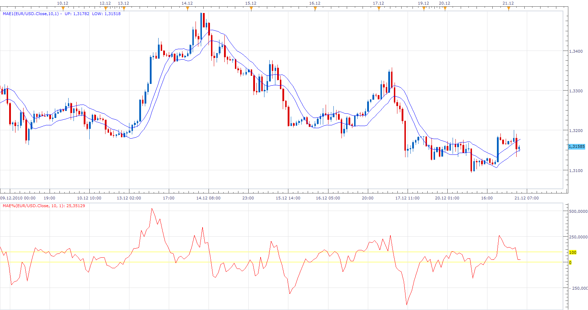

# Moving Average Envelopes Percentage (MAE%)

> Source: https://fxcodebase.com/code/viewtopic.php?f=17&t=2997  
> Forum: 17 · Topic 2997 · 3 post(s)

---

## Moving Average Envelopes Percentage (MAE%)

**Apprentice** · Tue Dec 21, 2010 4:42 am

Oscillator shows Prices as percentage of MAE channels.

 [MAE%.lua](files/6900/MAE.lua)

---

## Re: Moving Average Envelopes Percentage (MAE%)

**Alexander.Gettinger** · Mon Dec 22, 2014 10:27 am

MQL4 version of Moving Average Envelopes Percentage oscillator: [viewtopic.php?f=38&t=61626](https://fxcodebase.com/code/viewtopic.php?f=38&t=61626).

---

## Re: Moving Average Envelopes Percentage (MAE%)

**Apprentice** · Sun Oct 07, 2018 8:57 am

The indicator was revised and updated.
