# Moving Average Indicator: 20 in 1

> Source: https://fxcodebase.com/code/viewtopic.php?f=17&t=2430  
> Forum: 17 · Topic 2430 · 101 post(s)

---

## Moving Average Indicator: 20 in 1

**Alexander.Gettinger** · Sun Oct 17, 2010 3:24 pm

ng, apprentice: The indicator has been updated Mar, 29 2011. Please update the older version!!! Nothing is changed in algorithms except fixing SMMA and T3 methods which were wrong, but the calculations are highly optimized. This is extremely important if you are going to use this indicator and strategies based on this indicator in sdk 2.0 backtester and parameters optimizer. See in the end of this post for performance comparison.

This indicator is a collection of moving averages.

1.	MVA - Simple Moving Average
MVA[i]=(Price[i]+Price[i-1]+…+Price[i-N])/N, where N-period

2.	EMA - Exponential Moving Average
EMA[i]=EMA[i-1]+2*(Price[i]-EMA[i-1])/(1+N)

3.	Wilder - Wilder Exponential Moving Average
Wilder[i]=Wilder[i-1]+(Price[i]-Wilder[i-1])/N

4.	LWMA - Linear Weighted Moving Average
LWMA[i]=Sum/Weight, where
Sum=Price[i]*N+Price[i-1]*(N-1)+…+Price[i-N+1]*(1),
Weight=N+(N-1)+…+1=N*(N+1)/2.

5.	SineWMA - Sine Weighted Moving Average
SineWMA[i]=Sum/Weight, where
Sum=Price[i-N+1]*sin(PI*(N)/(N+1))+Price[i-N+2]*sin(PI*(N-1)/(N+1))+…+Price[i]*sin(PI*1/(N+1))
Weight= sin(PI*(N)/(N+1))+ sin(PI*(N-1)/(N+1))+…+ sin(PI*1/(N+1)).

6.	TriMA - Triangular Moving Average
TriMA[i]=(MVA(i,len)+MVA(i-1,len)+…+MVA(i-len+1,len))/len, where
MVA(i,N) – Simple Moving Average,
len=(N+1)/2.

7.	LSMA - Least Square Moving Average
LSMA[i]=Sum/(N*(N+1)), where
Sum=(1-(N+1)/3)*Price[i-N+1]+(2-(N+1)/3)*Price[i-N+2]+…+(N-(N+1)/3)*Price[1].

8.	SMMA - Smoothed Moving Average
SMMA[i]=(Sum-SMMA[i-1]+Price[i])/N, where
Sum=Price[i-1]+Price[i-2]+…+Price[i-N].

9.	HMA - Hull Moving Average by Alan Hull
HMA[i]=LWMA(i,len,(2*LWMA(i,N/2,Price)-LWMA(i,N,Price))), where
len=Sqrt(N),
LWMA(i,N,Price) - Linear Weighted Moving Average

10.	ZeroLagEMA - Zero-Lag Exponential Moving Average
ZeroLagEMA[i]=Alpha*(2*Price[i]-Price[i-lag])+(1-Alpha)* ZeroLagEMA[i-1], where
Alpha=2/(N+1),
Lag=(N-1)/2.

11.	DEMA - Double Exponential Moving Average by Patrick Mulloy
DEMA[i]=2*D1[i]-D2[i], where
D1[i]=D1[i-1]+2*(Price[i]-D1[i-1])/(1+N),
D2[i]=D2[i-1]+2*(D1[i]-D2[i-1])/(1+N).

12.	T3 - T3 by T.Tillson
T3[i]=DEMA(i,DEMA2), where
DEMA2[i]=DEMA(i,DEMA1),
DEMA1[i]=DEMA(i,Price),
DEMA - Double Exponential Moving Average

13.	ITrend - Instantaneous Trendline by J.Ehlers
ITrend[i]=(Price[i]+2*Price[i-1]+Price[i-2])/4 for i<=7,
ITrend[i]=(Alpha-0.25*Alpha*Alpha)*Price[i]+0.5*Alpha*Alpha*Price[i-1]-(Alpha-0.75*Alpha*Alpha)*Price[i-2]+2*(1-Alpha)*ITrend[i-1]-(1-Alpha)*(1-Alpha)*ITrend[i-2] for i>7, where
Alpha=2/(N+1)

14.	Median - Moving Median
Set of the prices (Price[i], Price[i-1], …, Price[i-N]) is sorted (on increase or decrease) and take value from of the set (N/2).

15. GeoMean - Geometric Mean
GeoMean[i]=Price[i]^(1/N)*Price[i-1]^(1/N)*…*Price[i-N+1]^(1/N).

16.	REMA - Regularized EMA by Chris Satchwell
REMA[i]=(REMA[i-1]*(1+2*Lambda)+Alpha*(Price[i]-REMA[i-1])-Lambda*REMA[i-2])/(1+Lambda), where
Alpha=2/(N+1),
Lambda=0.5.

17.	ILRS - Integral of Linear Regression Slope
ILRS[i]=(N*Sum1-Sum*Sumy)/(Sum*Sum-N*Sum2)+MVA(I,N), where
Sum=N*(N-1)*0.5,
Sum2=N*(N-1)*(2*N-1)/6,
Sum1=1*Price[i-1]+2*Price[i-2]+…+(N-1)*Price[i-N+1],
Sumy=Price[i]+Price[i-1]+…+Price[i-N+1],
MVA(i,N) – Simple Moving Average.

18.	IE/2 - Combination of LSMA and ILRS
IE/2=(ILRS+LSMA)/2

19.	TriMAgen - Triangular Moving Average generalized by J.Ehlers
TriMAgen[i]=Sum/(len+1), where
Sum=MVA(i,len)+MVA(i-1,len)+…+MVA(i-len,len), where
MVA(i,N) – Simple Moving Average,
len=(N+1)/2.

20.	JSmooth - Smoothing by Mark Jurik
JSmooth[i]=J5[i], where
J5[i]=J5[i-1]+J4[i],
J4[i]=(J3[i]-J5[i-1])*(1-Alpha)*(1-Alpha)+J4[i-1]*Alpha*Alpha,
J3[i]=J1[i]+J2[i],
J2[i]=(Price[i]-J1[i])*(1-Alpha)+J2[i-1]*Alpha,
J1[i]=Price[i]*(1-Alpha)+J1[i-1]*Alpha,
Alpha=0.45*N/(0.45*(N-1)+2).

 

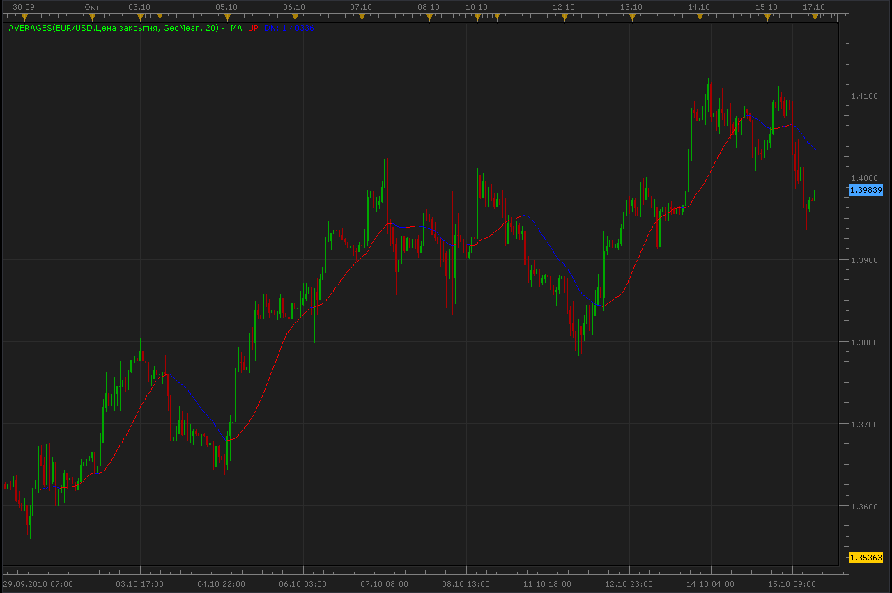

```lua
function Init()
    indicator:name("Averages indicator");
    indicator:description("Averages indicator");
    indicator:requiredSource(core.Tick);
    indicator:type(core.Indicator);

    indicator.parameters:addGroup("Calculation");
    indicator.parameters:addString("Method", "Method", "", "MVA");
    indicator.parameters:addStringAlternative("Method", "MVA", "", "MVA");
    indicator.parameters:addStringAlternative("Method", "EMA", "", "EMA");
    indicator.parameters:addStringAlternative("Method", "Wilder", "", "Wilder");
    indicator.parameters:addStringAlternative("Method", "LWMA", "", "LWMA");
    indicator.parameters:addStringAlternative("Method", "SineWMA", "", "SineWMA");
    indicator.parameters:addStringAlternative("Method", "TriMA", "", "TriMA");
    indicator.parameters:addStringAlternative("Method", "LSMA", "", "LSMA");
    indicator.parameters:addStringAlternative("Method", "SMMA", "", "SMMA");
    indicator.parameters:addStringAlternative("Method", "HMA", "", "HMA");
    indicator.parameters:addStringAlternative("Method", "ZeroLagEMA", "", "ZeroLagEMA");
    indicator.parameters:addStringAlternative("Method", "DEMA", "", "DEMA");
    indicator.parameters:addStringAlternative("Method", "T3", "", "T3");
    indicator.parameters:addStringAlternative("Method", "ITrend", "", "ITrend");
    indicator.parameters:addStringAlternative("Method", "Median", "", "Median");
    indicator.parameters:addStringAlternative("Method", "GeoMean", "", "GeoMean");
    indicator.parameters:addStringAlternative("Method", "REMA", "", "REMA");
    indicator.parameters:addStringAlternative("Method", "ILRS", "", "ILRS");
    indicator.parameters:addStringAlternative("Method", "IE/2", "", "IE/2");
    indicator.parameters:addStringAlternative("Method", "TriMAgen", "", "TriMAgen");
    indicator.parameters:addStringAlternative("Method", "JSmooth", "", "JSmooth");

    indicator.parameters:addInteger("Period", "Period", "", 20);
    indicator.parameters:addBoolean("ColorMode", "ColorMode", "", true);

    indicator.parameters:addGroup("Style");
    indicator.parameters:addColor("MainClr", "Main color", "Main color", core.rgb(0, 255, 0));
    indicator.parameters:addColor("UPclr", "UP color", "UP color", core.rgb(255, 0, 0));
    indicator.parameters:addColor("DNclr", "DN color", "DN color", core.rgb(0, 0, 255));
    indicator.parameters:addInteger("widthLinReg", "Line width", "Line width", 1, 1, 5);
    indicator.parameters:addInteger("styleLinReg", "Line style", "Line style", core.LINE_SOLID);
    indicator.parameters:setFlag("styleLinReg", core.FLAG_LINE_STYLE);
end

local first;
local MainBuff = nil;
local ColorMode, UPclr, DNclr;
local updateParams;
local UpdateFunction;
local name;

function Prepare(onlyName)
    source = instance.source;
    local Method = instance.parameters.Method;

    if Method == "IE/2" then
        Method = "IE_2";
    end

    Period = instance.parameters.Period;
    ColorMode = instance.parameters.ColorMode;

    if _G[Method .. "Init"] == nil or _G[Method .. "Update"] == nil then
        assert(false, "The method " .. Method .. " is unknown");
    end

    name = profile:id() .. "(" .. source:name() .. "," .. instance.parameters.Method .. "," .. Period .. ")";
    instance:name(name);
    if onlyName then
        return ;
    end

    ColorMode = instance.parameters.ColorMode;
    UPclr = instance.parameters.UPclr;
    DNclr = instance.parameters.DNclr;

    updateParams = _G[Method .. "Init"](source, Period);
    UpdateFunction = _G[Method .. "Update"];

    MainBuff = instance:addStream("MainBuff", core.Line, name .. ".MA", "MA", instance.parameters.MainClr, updateParams.first);
    MainBuff:setWidth(instance.parameters.widthLinReg);
    MainBuff:setStyle(instance.parameters.styleLinReg);

    first = updateParams.first;
    updateParams.buffer = MainBuff;
end

function Update(period, mode)
    if period >= first then
        UpdateFunction(updateParams, period, mode);
        if ColorMode then
            if MainBuff[period] > MainBuff[period - 1] then
                MainBuff:setColor(period, UPclr);
            elseif MainBuff[period] < MainBuff[period - 1] then
                MainBuff:setColor(period, DNclr);
            end
        end
    end
end

-- =============================================================================
-- Implementations
-- =============================================================================

--
-- Simple moving average
--
function MVAInit(source, n)
    local  p = {};
    p.first = source:first() + n - 1;
    p.n = n;
    p.offset = n - 1;
    p.source = source;
    return p;
end

function MVAUpdate(params, period, mode)
    params.buffer[period] = mathex.avg(params.source, period - params.offset, period);
end

--
-- Exponential moving average
--
function EMAInit(source, n)
    local p = {};
    p.first = source:first();
    p.k = 2.0 / (n + 1.0);
    p.source = source;
    return p;
end

function EMAUpdate(params, period, mode)
    if period == params.first then
        params.buffer[period] = params.source[period];
    else
        params.buffer[period] = (1 - params.k) * params.buffer[period - 1] + params.k * params.source[period];
    end
end

--
-- Linear-weighted moving average
--
function LWMAInit(source, n)
    local  p = {};
    p.first = source:first() + n - 1;
    p.n = n;
    p.offset = n - 1;
    p.source = source;
    return p;
end

function LWMAUpdate(params, period, mode)
    params.buffer[period] = mathex.lwma(params.source, period - params.offset, period);
end

--
-- Wilders smooting average
--
function WilderInit(source, n)
    local p = {};
    p.n = n;
    p.n1 = 2 * n - 1;
    p.k = 2.0 / (p.n1 + 1.0);
    p.first = source:first() + p.n1 - 1;
    p.source = source;
    return p;
end

function WilderUpdate(params, period, mode)
    if period == params.first then
        params.buffer[period] = mathex.avg(source, period - params.n + 1, period);
    else
        params.buffer[period] = ((params.source[period] - params.buffer[period - 1]) * params.k) + params.buffer[period - 1];
    end
end

--
-- SMMA (smoothed moving average)
--
function SMMAInit(source, n)
    local  p = {};
    p.first = source:first() + n - 1;
    p.n = n;
    p.source = source;
    return p;
end

function SMMAUpdate(params, period, mode)
    if period == params.first then
        params.buffer[period] = mathex.avg(params.source, period - params.n + 1, period);
    else
        params.buffer[period] = (params.buffer[period - 1] * (params.n - 1) + params.source[period]) / params.n;
    end
end

--
-- GeoMean
--
function GeoMeanInit(source, n)
    local  p = {};
    p.first = source:first() + n - 1;
    p.n = n;
    p.exp = 1 / n;
    p.offset = n - 1;
    p.source = source;
    return p;
end

function GeoMeanUpdate(params, period, mode)
    local i, s, src;
    s = 1;
    src = params.source;
    for i = period - params.offset, period, 1 do
        s = s * src[i];
    end
    params.buffer[period] = math.pow(s, params.exp);
end

--
-- SineWMA: Sine weighted moving average
--
function SineWMAInit(source, n)
    local p = {};
    p.source = source;
    p.n = n;
    p.offset = n - 1;
    p.sine = {};
    p.first = source:first() + n - 1;

    local i, w;
    w = 0;
    for i = 1, n, 1 do
        p.sine[i] = math.sin(math.pi * (n - i + 1) / (n + 1));
        w = w + p.sine[i];
    end

    p.weight = w;
    p.alwaysZero = (w == 0);

    return p;
end

function SineWMAUpdate(params, period, mode)
    local sum = 0;
    if not params.alwaysZero then
        local src = params.source;
        local sine = params.sine;
        local n = params.n;
        local p = period - n;
        for i = 1, n, 1 do
            sum = sum + src[p + i] * sine[i];
        end
        sum = sum / params.weight;
    end
    params.buffer[period] = sum;
end

--
-- TriMA: Triangular Moving Average
--
function TriMAInit(source, n)
    local p = {};
    p.source = source;
    p.n = n;
    p.len = math.ceil((n + 1) / 2);
    p.first1 = source:first() + p.len - 1;
    p.mabuffer = instance:addInternalStream(p.first1, 0);
    p.first = p.first1 + p.len - 1;
    p.offset = p.len - 1;
    return p;
end

function TriMAUpdate(params, period, mode)
    local off = params.offset;
    if period == params.first then
        -- fill sma's before the first value
        local i;
        for i = params.first1, params.first, 1 do
            params.mabuffer[i] = mathex.avg(params.source, i - off, i);
        end
    else
        params.mabuffer[period] = mathex.avg(params.source, period - off, period);
    end
    params.buffer[period] = mathex.avg(params.mabuffer, period - off, period);
end

--
-- LSMA: Least Square Moving Average (or EPMA, Linear Regression Line)
--
function LSMAInit(source, n)
    local p = {};
    p.source = source;
    p.n = n;
    p.offset = p.n - 1;
    p.first = source:first() + n - 1;
    return p;
end

function LSMAUpdate(params, period, mode)
    params.buffer[period] = mathex.lreg(params.source, period - params.offset, period);
end

--
-- HMA: Hull Moving Average by Alan Hull
--
function HMAInit(source, n)
    assert(n >= 4, "n must be at least 4");
    local p = {};
    p.source = source;
    p.n = n;
    p.len = n;
    p.halflen = math.max(math.floor(p.len / 2), 1);

    p.first1 = source:first() + p.halflen - 1;
    p.lwma1 = instance:addInternalStream(p.first1, 0);

    p.first2 = source:first() + p.len - 1;
    p.lwma2 = instance:addInternalStream(p.first2, 0);

    p.first3 = math.max(p.first1, p.first2);
    p.tmp = instance:addInternalStream(p.first3, 0);

    p.len1 = math.max(math.floor(math.sqrt(n)), 1) - 1;
    p.first = p.first3 + p.len1 - 1;
    return p;
end

function HMAUpdate(params, period, mode)
    if period == params.first then
        local i;
        local src = params.source;

        for i = params.first1, period, 1 do
            params.lwma1[i] = mathex.lwma(params.source, i - params.halflen + 1, i);
        end

        for i = params.first2, period, 1 do
            params.lwma2[i] = mathex.lwma(params.source, i - params.len + 1, i);
        end

        for i = params.first3, period, 1 do
            params.tmp[i] = 2 * params.lwma1[i] - params.lwma2[i];
        end
    else
        params.lwma1[period] = mathex.lwma(params.source, period - params.halflen + 1, period);
        params.lwma2[period] = mathex.lwma(params.source, period - params.len + 1, period);
        params.tmp[period] = 2 * params.lwma1[period] - params.lwma2[period];
    end
    params.buffer[period] = mathex.lwma(params.tmp, period - params.len1 + 1, period);
end

--
-- Zero-lag EMA
--
function ZeroLagEMAInit(source, n)
    local p = {};
    p.alpha = 2.0 / (n + 1.0);
    p.lag = math.ceil((n - 1) / 2);
    p.first = source:first() + p.lag;
    p.source = source;
    return p;
end

function ZeroLagEMAUpdate(params, period, mode)
    if period == params.first then
        params.buffer[period] = params.source[period];
    else
        params.buffer[period] = params.alpha * (2 * params.source[period] - params.source[period - params.lag]) +
                                (1 - params.alpha) * params.buffer[period - 1];
    end
end

--
-- DEMA: Double Exponential Moving Average (DEMA)
-- DEMA(n) = 2 * EMA(n) - EMA(EMA(n), n)
--
function DEMAInit(source, n)
    local p = {};
    p.first = source:first();
    p.k = 2.0 / (n + 1.0);
    p.ema = instance:addInternalStream(p.first, 0);
    p.ema2 = instance:addInternalStream(p.first, 0);
    p.source = source;
    return p;
end

function DEMAUpdate(params, period, mode)
    if period == params.first then
        params.ema[period] = params.source[period];
        params.ema2[period] = params.source[period];
        params.buffer[period] = params.source[period];
    else
        local ema, ema2, k, k1;
        ema = params.ema;
        ema2 = params.ema2;
        k = params.k;
        k1 = 1 - params.k;

        ema[period] = k1 * ema[period - 1] + k * params.source[period];
        ema2[period] = k1 * ema2[period - 1] + k * ema[period];
        params.buffer[period] = 2 * ema[period] - ema2[period];
    end
end

--
-- T3: T3 by T.Tillson
-- T3 = DEMA(DEMA(DEMA)))
--
function T3Init(source, n)
    local p = {};

    p.dema1 = DEMAInit(source, n);
    p.dema1.buffer = instance:addInternalStream(p.dema1.first, 0);
    p.dema2 = DEMAInit(p.dema1.buffer, n);
    p.dema2.buffer = instance:addInternalStream(p.dema2.first, 0);
    p.dema3 = DEMAInit(p.dema2.buffer, n);
    p.dema3.buffer = nil;
    p.first = p.dema3.first;
    return p;
end

function T3Update(params, period, mode)
    if params.dema3.buffer == nil then
        params.dema3.buffer = params.buffer;
    end
    DEMAUpdate(params.dema1, period, mode);
    DEMAUpdate(params.dema2, period, mode);
    DEMAUpdate(params.dema3, period, mode);
end

--
-- ITrend
--
function ITrendInit(source, n)
    local p = {}, alpha;
    p.first = source:first() + 2;
    p.first7 = p.first + 7;

    alpha = 2.0 / (n + 1.0);
   
    p.k = alpha;
    p.k1 = (alpha - alpha * alpha / 4);
    p.k2 = 0.5 * alpha * alpha;
    p.k3 = (alpha - 0.75 * alpha * alpha);
    p.k4 = 2 * (1 - alpha);
    p.k5 = (1 - alpha) * (1 - alpha);
   
    p.source = source;
    return p;
end

function ITrendUpdate(params, period, mode)
    local src = params.source;
    if period <= params.first7 then
        params.buffer[period] = (src[period] + 2 * src[period - 1] + src[period - 2]) / 4;
    else
        params.buffer[period] = params.k1 * src[period] + params.k2 * src[period - 1] - params.k3 * src[period - 2] +
                                params.k4 * params.buffer[period - 1] - params.k5 * params.buffer[period - 2];
    end
end

--
-- Median: the floating median
--
function MedianInit(source, n)
    local p = {};
    p.source = source;
    p.first = source:first() + n - 1;
    p.middle = math.ceil((n - 1) / 2);
    if p.middle * 2 == (n - 1) then
        p.even = true;
    else
        p.even = false;
    end
    p.array = {};
    p.n = n;
    local i = 1, n, 1 do
        p.array[i] = 0;
    end
    return p;
end

function MedianUpdate(params, period, mode)
    local i, arr, n, src;
    arr = params.array;
    n = params.n;
    src = params.source;
    for i = 1, n, 1 do
        arr[i] = src[period - n + i];
    end
    table.sort(arr);
    if params.even then
        params.buffer[period] = arr[params.middle];
    else
        params.buffer[period] = (arr[params.middle] + arr[params.middle + 1]) / 2;
    end
end

--
-- REMA - Regularized moving average
--          Rp + alpha*(close - Rp) + lambda*(Rp + (Rp-Rpp))
--   REMA = ------------------------------------------------
--                    1 + lambda
-- Lamda is 0.5
--
function REMAInit(source, n)
    local p = {};
    p.first = source:first();
    p.first3 = source:first() + 2;
    p.k = 2.0 / (n + 1.0);
    p.source = source;
    return p;
end

function REMAUpdate(params, period, mode)
    if period <= params.first3 then
        params.buffer[period] = params.source[period];
    else
        local rp = params.buffer[period - 1];
        local rpp = params.buffer[period - 2];
        params.buffer[period] = (params.k * params.source[period] + (1 - params.k) * rp + 0.5 * (2 * rp - rpp)) / 1.5;
    end
end

--
-- ILRS: Integral of Linear Regression Slope
-- ILRS = LINEARREGSLOPE(PRICE, PERIOD) + AVERAGE(PRICE, PERIOD);
--
function ILRSInit(source, n)
    local p = {};
    p.source = source;
    p.n = n;
    p.offset = p.n - 1;
    p.first = source:first() + n - 1;
    return p;
end

function ILRSUpdate(params, period, mode)
    local from = period - params.offset;
    params.buffer[period] = mathex.lregSlope(params.source, from, period) + mathex.avg(params.source, from, period);
end

--
-- IE/2:
-- IE/2 = (ILRS + LSMA) / 2
--
function IE_2Init(source, n)
    local p = {};
    p.source = source;
    p.n = n;
    p.offset = p.n - 1;
    p.first = source:first() + n - 1;
    return p;
end

function IE_2Update(params, period, mode)
    local from = period - params.offset;
    params.buffer[period] = (mathex.lregSlope(params.source, from, period) + mathex.avg(params.source, from, period) + mathex.lreg(params.source, from, period)) / 2;
end

--
-- TriMA: Triangular Moving Average generalized
--
function TriMAgenInit(source, n)
    local p = {};
    p.source = source;
    p.n = n;
    p.len = math.floor((n + 1) / 2);
    p.len2 = math.ceil((n + 1) / 2);
    p.first1 = source:first() + p.len - 1;
    p.mabuffer = instance:addInternalStream(p.first1, 0);
    p.first = p.first1 + p.len2 - 1;
    p.offset = p.len - 1;
    p.offset2 = p.len2 - 1;
    return p;
end

function TriMAgenUpdate(params, period, mode)
    local off = params.offset;
    if period == params.first then
        -- fill sma's before the first value
        local i;
        for i = params.first1, params.first, 1 do
            params.mabuffer[i] = mathex.avg(params.source, i - off, i);
        end
    else
        params.mabuffer[period] = mathex.avg(params.source, period - off, period);
    end
    params.buffer[period] = mathex.avg(params.mabuffer, period - params.offset2, period);
end

--
-- JSmooth
--
--
function JSmoothInit(source, n)
    local p = {};
    p.first = source:first();
    p.first3 = source:first() + 3;
    p.alpha = 0.45 * (n - 1) / (0.45 * (n - 1) + 2);
    p.alpha1 = 1 - p.alpha;
    p.alpha1_2 = math.pow((1 - p.alpha), 2);
    p.alpha_2 = math.pow(p.alpha, 2)
    p.a1 = instance:addInternalStream(source:first(), 0);
    p.a2 = instance:addInternalStream(source:first(), 0);
    p.a3 = instance:addInternalStream(source:first(), 0);
    p.a4 = instance:addInternalStream(source:first(), 0);
    p.source = source;
    return p;
end

function JSmoothUpdate(params, period, mode)
    if period < params.first3 then
        params.a1[period] = params.source[period];
        params.a2[period] = 0;
        params.a3[period] = params.source[period];
        params.a4[period] = 0;
        params.buffer[period] = params.source[period];
    else
        local price = params.source[period];
        params.a1[period]     = params.alpha1 * price + params.alpha * params.a1[period - 1];
        params.a2[period]     = (price - params.a1[period]) * params.alpha1 + params.alpha * params.a2[period - 1];
        params.a3[period]     = params.a1[period] + params.a2[period];
        params.a4[period]     = (params.a3[period] - params.buffer[period - 1]) * params.alpha1_2 + params.alpha_2 * params.a4[period - 1];
        params.buffer[period] = params.buffer[period - 1] + params.a4[period];
    end
end
```

 [Averages.lua](files/5268/Averages.lua)

 [Averages Dot.lua](files/5268/Averages%20Dot.lua)

 [Averages with Alert.lua](files/5268/Averages%20with%20Alert.lua)

This indicator will provides Audio / Email Alerts on Averages slope change.

Dec 14, 2015: Compatibility issue Fixed. _Alert helper is not longer needed.

If you want to use updated version of this indicator,
please make sure to use TS Version 01.14.101415. or higher.

 

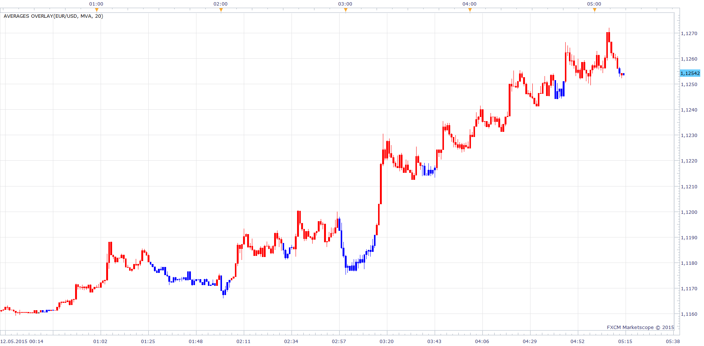

 [Averages Overlay.lua](files/5268/Averages%20Overlay.lua)

Averages Update.
In addition to improving performance,
Some algorithms are changed, or corrected.

Fully compatible with the old version.

Please note that some of methods are faster than another. To compare please use the chart below. The hight bar means the faster method (the data is for the optimized version and indicore 1.0):

 

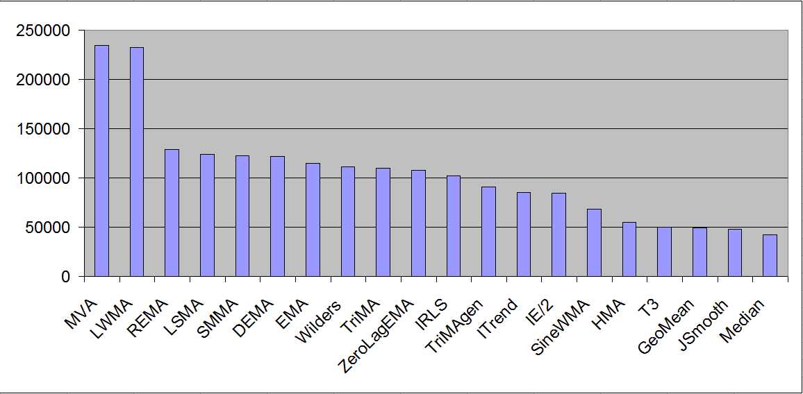

Just to reference here is the comparison of performance of old and new version of the indicator. The higher bar means better performance improvements:

 

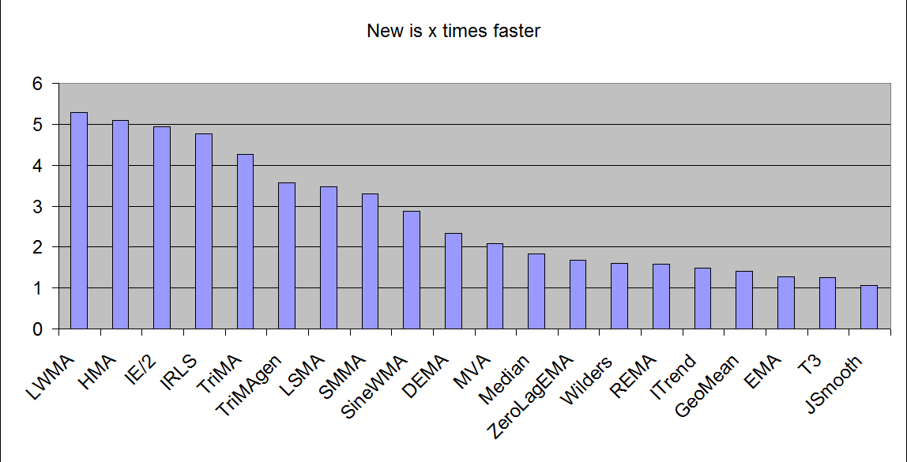

To read how such improvements was made please refer this article:
[viewtopic.php?f=28&t=3785&start=0](https://fxcodebase.com/code/viewtopic.php?f=28&t=3785&start=0)

p.s. The original indicator indicator, as far as I see is made on the base of MA_AllAverages indicator by Copyright © 2007-08, TrendLaboratory:
[http://desynced.no-ip.org/fx/eas/mq4script-2829.php](http://desynced.no-ip.org/fx/eas/mq4script-2829.php)

Old version. For the new version see above.

 [Averages_Old_Version.lua](files/5268/Averages_Old_Version.lua)

 


 [Averages Arrows.lua](files/5268/Averages%20Arrows.lua)

 [AveragesNonStandardTimeframe.lua](files/5268/AveragesNonStandardTimeframe.lua)

MT4/MQ4 version.
[viewtopic.php?f=38&t=66535](https://fxcodebase.com/code/viewtopic.php?f=38&t=66535)

---

## Re: Moving Average Indicator: 20 in 1

**sedraude** · Sun Oct 17, 2010 10:33 pm

Hi Alexander,

Thank you for your great indi...

---

## Re: Moving Average Indicator: 20 in 1

**Nikolay.Gekht** · Mon Oct 18, 2010 9:28 am

great idea!

---

## Re: Moving Average Indicator: 20 in 1

**Alexander.Gettinger** · Sun Oct 24, 2010 10:19 am

Thank you!

---

## Re: Moving Average Indicator: 20 in 1

**smartfx** · Mon Nov 01, 2010 2:40 am

It's really precious work! Thank you so much for this indicator!

If it is possible could be made MACD, which has options of choice of those 20 different moving averages? Hope it would be possible, and I am sure it would benefit all of us.

Thank you again!

---

## Re: Moving Average Indicator: 20 in 1

**Apprentice** · Mon Nov 01, 2010 5:37 am

Requested can be found here.
[viewtopic.php?f=17&t=2564&p=5712#p5712](https://fxcodebase.com/code/viewtopic.php?f=17&t=2564&p=5712#p5712)

---

## Re: Moving Average Indicator: 20 in 1

**Alexander.Gettinger** · Thu Dec 09, 2010 4:11 am

Bigger timeframe version of Averages indicator.

 

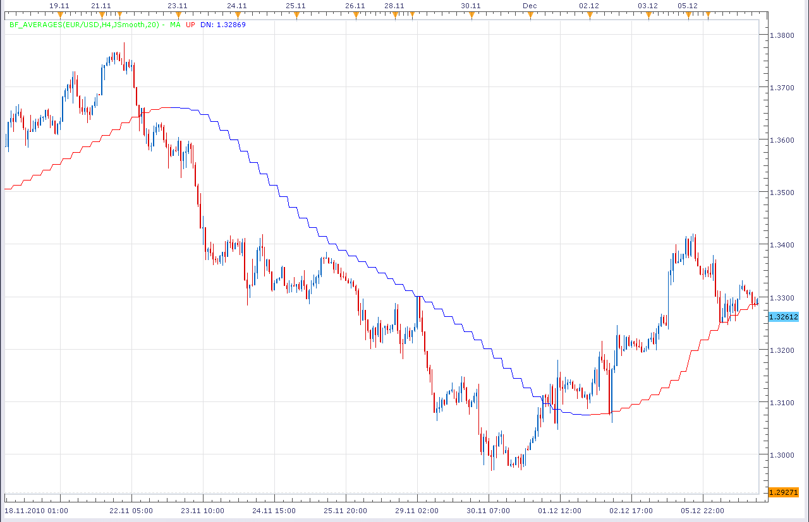

Download:

 [BF_Averages.lua](files/6662/BF_Averages.lua)

---

## Re: Moving Average Indicator: 20 in 1

**Alexander.Gettinger** · Fri Dec 10, 2010 12:00 am

Bigger timeframe and other instrument version of Averages indicator.

For example MA for USD/SEK H4 on EUR/USD H1 chart:

 

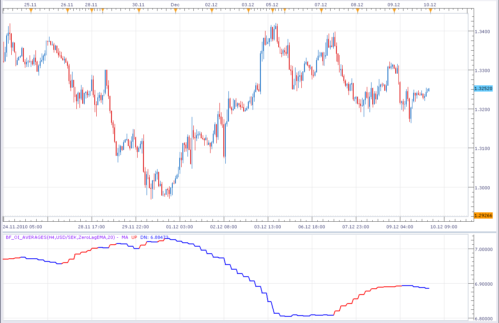

Download:

 [BF_OI_Averages.lua](files/6686/BF_OI_Averages.lua)

For this indicator must be installed Averages indicator from top of this topic.

---

## Re: Moving Average Indicator: 20 in 1

**spinemaligna** · Sun Jan 02, 2011 11:49 am

Not sure if this is the correct place for this post but here goes.
Is it possible to trace a second plot above or below an MA off set by a variable number of pips.
What I am trying to achieve is a plot to show how a trailing stop would perform so the offset would be the trailing stop and the Fast MA tracks the price.

Thanks, Ross

---

## Re: Moving Average Indicator: 20 in 1

**Apprentice** · Sun Jan 02, 2011 3:05 pm

Something Like this.
[viewtopic.php?f=17&t=1434&p=3155&hilit=trailing+stop#p3155](https://fxcodebase.com/code/viewtopic.php?f=17&t=1434&p=3155&hilit=trailing+stop#p3155)

But instead of percentage or ATR, that you can set a specific value in the PIPS.

Otherwise a better place to give requests of this type is Indicator and Signal Requests section.
[viewforum.php?f=27](https://fxcodebase.com/code/viewforum.php?f=27)

---

## Re: Moving Average Indicator: 20 in 1

**spinemaligna** · Sun Jan 02, 2011 3:59 pm

This is something like what I was looking for. So for instance you could select a fast MA (which is closely following price) and select trailing stop figures to compare their performance.
Hope this makes sense.
p.s. Wasn't sure what ATR is.

Ross

---

## Re: Moving Average Indicator: 20 in 1

**Apprentice** · Mon Jan 03, 2011 10:24 am

When calculating Trailing stop as the initial value we use the current Average True Range (ATR) value.

You can try TickTS.lua, you can find it here.
[viewtopic.php?f=17&t=1434&p=3150#p3150](https://fxcodebase.com/code/viewtopic.php?f=17&t=1434&p=3150#p3150)

As a source for TickTS choose moving average which you want to use.

---

## Re: Moving Average Indicator: 20 in 1

**Apprentice** · Wed Mar 30, 2011 4:50 am

Averages Update.

In addition to improving performance,
Some algorithms are changed, or corrected.

Fully compatible with the old version was held.

---

## Re: Moving Average Indicator: 20 in 1

**Nikolay.Gekht** · Wed Mar 30, 2011 1:34 pm

Updated: Please read the first post for details.

---

## Re: Moving Average Indicator: 20 in 1

**abrown8703** · Wed Mar 30, 2011 3:41 pm

Thanks for this excellent indicator! Personally, my trading has improved significantly with this indicator as part my core strategy. Thanks Again!

---

## Re: Moving Average Indicator: 20 in 1

**sunshine** · Sat Apr 23, 2011 10:23 am

I've added an option to set reducing of lag to the Averages indicator.
The image below shows how lag has been reduced compared with the initial curve:

 

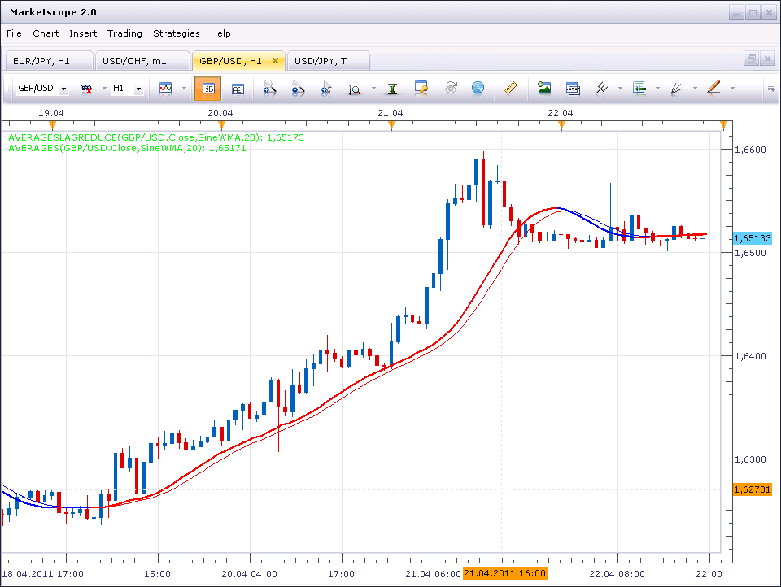

---

## Re: Moving Average Indicator: 20 in 1

**station0524** · Sat Jun 11, 2011 11:08 pm

Is it possible to add "KAMA" average to the AVERAGES and Bigger time frame AVERAGES indicators?

---

## Re: Moving Average Indicator: 20 in 1

**Apprentice** · Sun Jun 12, 2011 5:43 am

First.
It is possible.
Second.
BF Version Averages of indicators, has already been written.
It is Posted within this topic.

---

## Re: Moving Average Indicator: 20 in 1

**station0524** · Thu Jun 16, 2011 1:26 pm

Can you add "KAMA" to the indicator when possible? Thank you in advance

---

## Re: Moving Average Indicator: 20 in 1

**Apprentice** · Thu Jun 16, 2011 1:59 pm

Alexis already committed to this task.

---

## Re: Moving Average Indicator: 20 in 1

**Alexander.Gettinger** · Tue Jul 26, 2011 2:02 am

KAMA is added to the indicator.

Download:

 [Averages.lua](files/13125/Averages.lua)

---

## Re: Moving Average Indicator: 20 in 1

**Alexander.Gettinger** · Wed Jul 27, 2011 11:57 pm

Moving average as candle.
Open of candle is a MA for open price and etc.

 

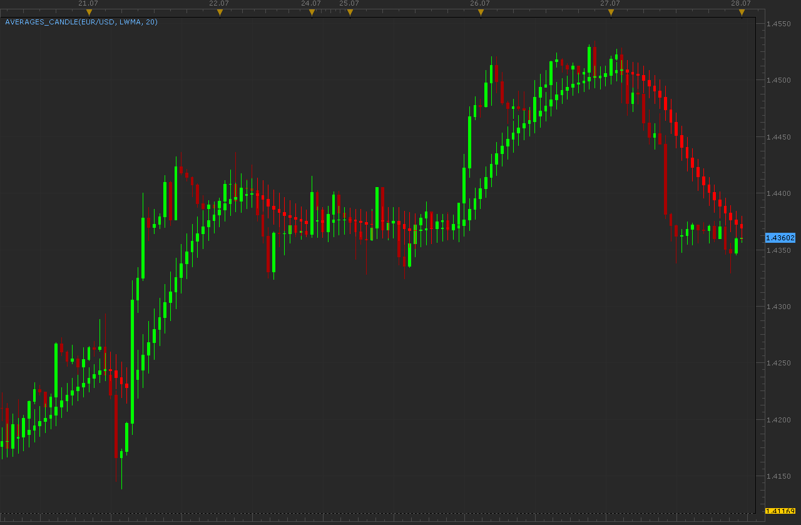

Download:

 [Averages_Candle.lua](files/13210/Averages_Candle.lua)

For this indicator must be installed AVERAGES indicator from first post of this topic.

---

## Re: Moving Average Indicator: 20 in 1

**station0524** · Thu Jul 28, 2011 6:51 pm

The T3 moving average is incorrect. In the old version of the 20 in 1 indicator the T3 is correct but not in the new version. Don't know why they changed it when they wrote the new version. You can compare it with any charting package and you will see that the T3 in the old 20 in 1 version is similar to all other charting packages but the T3 in the new version is totally different.

Is it possible to change the T3 back to the correct version?

---

## Re: Moving Average Indicator: 20 in 1

**Trader1** · Thu Sep 01, 2011 6:56 pm

thanks for all the work you have done on this indicator,
it's one of the most useful indicators I ever tried.
and not to forget the original developer,
GREAT WORK!

---

## Re: Moving Average Indicator: 20 in 1

**thetruth** · Wed Sep 14, 2011 10:03 am

This indicator is an exellent tool, great work and thank you!!
i need in the same indicator other indicators options like DXMA, Laguerre Filter, and Ehlers_Twopole_Smooted_Filter, Can you add the options?

Thanks!!

---

## Re: Moving Average Indicator: 20 in 1

**Apprentice** · Thu Sep 15, 2011 4:59 am

Your request is added to the developmental cue.

---

## Re: Moving Average Indicator: 20 in 1

**Trader1** · Thu Sep 15, 2011 5:51 pm

could you please add alert when the MA is changing color

---

## Re: Moving Average Indicator: 20 in 1

**Alexander.Gettinger** · Fri Sep 16, 2011 1:51 am

> **thetruth wrote:**
> This indicator is an exellent tool, great work and thank you!!
> i need in the same indicator other indicators options like DXMA, Laguerre Filter, and Ehlers_Twopole_Smooted_Filter, Can you add the options?
>
> Thanks!!

Do you want to see these indicators in the form of candles?

---

## Re: Moving Average Indicator: 20 in 1

**thetruth** · Fri Sep 16, 2011 12:24 pm

just the same of averages 20 in 1 concept, like kama modification, thanks.

---

## Re: Moving Average Indicator: 20 in 1

**Hailkay** · Wed Sep 28, 2011 7:23 pm

Hi folks, thanks for all the work that is good job from you, I agree, if that's possible to make an alert when Moving average indicator 20/1 changes color, after the candle closed of course; it'd be great.

Muchos gracias like we say!

---

## Re: Moving Average Indicator: 20 in 1

**Apprentice** · Thu Sep 29, 2011 2:52 am

This strategy might help.
[viewtopic.php?f=31&t=3859](https://fxcodebase.com/code/viewtopic.php?f=31&t=3859)

---

## Re: Moving Average Indicator: 20 in 1

**Alexander.Gettinger** · Mon Jan 23, 2012 1:21 am

Indicator with horizontal shift.

Download:

 [Averages_With_Shift.lua](files/24123/Averages_With_Shift.lua)

---

## Re: Moving Average Indicator: 20 in 1

**Hailkayy** · Sat Feb 04, 2012 10:24 pm

No backward shift possible

---

## Re: Moving Average Indicator: 20 in 1

**Apprentice** · Sun Feb 05, 2012 3:11 am

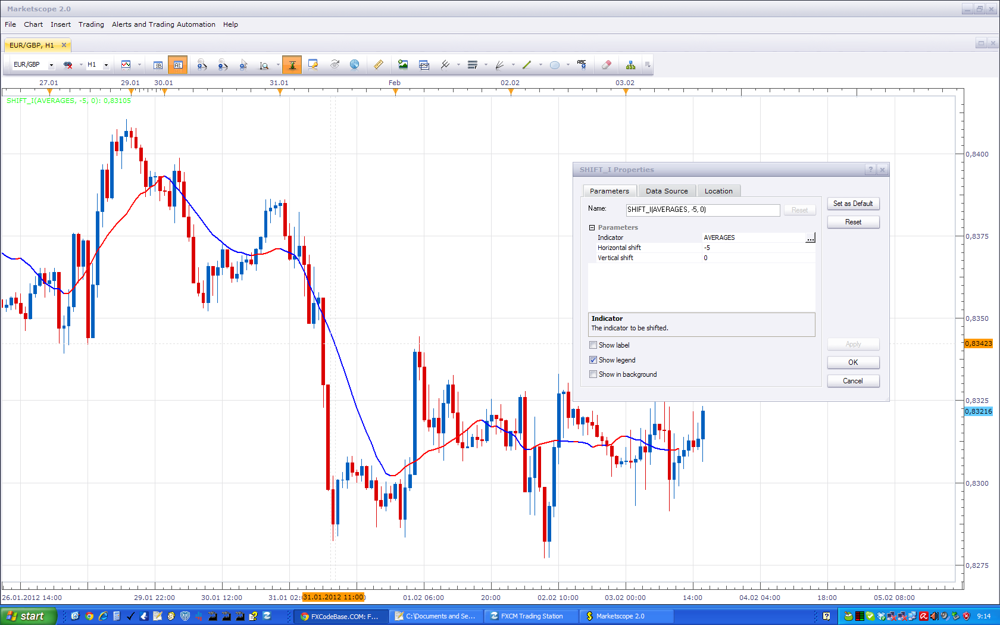

Try to use standard buildin Shift_I and Shift_O indicators.

---

## Re: Moving Average Indicator: 20 in 1

**Jigit Jigit** · Fri Feb 10, 2012 3:43 am

Hello there
Could you possibly add VAMA to this excellent indicator?

Thanks a million

---

## Re: Moving Average Indicator: 20 in 1

**Apprentice** · Fri Feb 10, 2012 4:40 am

Your request is added to the list for development.

---

## Re: Moving Average Indicator: 20 in 1

**Alexander.Gettinger** · Fri Feb 17, 2012 3:01 pm

> **Jigit Jigit wrote:**
> Hello there
> Could you possibly add VAMA to this excellent indicator?

It's impossible in the current version of indicator.
Indicator use tick data and don't have access to volume data.

---

## Re: Moving Average Indicator: 20 in 1

**briansummy** · Sat Mar 17, 2012 2:20 pm

Would you be able to develop an MTF Averages_Candle.lua strategy where a short term Averages_Candle.lua is the signal and a longer term Averages_Candle.lua is the conditional trend?

Also allow the same time frame like H4/H4 and length is difference like a MA crossover?
Please let me know if this is possible and time frame. I can offer some funds for faster development. Thanks!

---

## Re: Moving Average Indicator: 20 in 1

**Apprentice** · Mon Mar 19, 2012 1:00 am

Your request is added to the list of developers.

---

## Re: Moving Average Indicator: 20 in 1

**Apprentice** · Mon Mar 19, 2012 1:39 pm

Requested can be found here.
[viewtopic.php?f=31&t=14928&p=28285#p28285](https://fxcodebase.com/code/viewtopic.php?f=31&t=14928&p=28285#p28285)

---

## Re: Moving Average Indicator: 20 in 1

**briansummy** · Tue Mar 20, 2012 10:01 pm

This indicator would also be great in another strategy that just came to mind.

Using Heikin-Ashi Charting and a MVA of about 5. When candles agree buy/sell after n+1 close to prevent a false signal. This looks great on AUDCAD Daily chart. Trade exits when only MVA changes color and reenters when they agree again.

---

## Re: Moving Average Indicator: 20 in 1

**Panther** · Fri Jun 01, 2012 10:10 am

Hi, I downloaded the BF_Averages.lua on page one twice.
The file size is 8.7 KiB not 9.51KiB; and there is only one color option not two.
Thanks

---

## Re: Moving Average Indicator: 20 in 1

**Apprentice** · Mon Jun 04, 2012 1:41 am

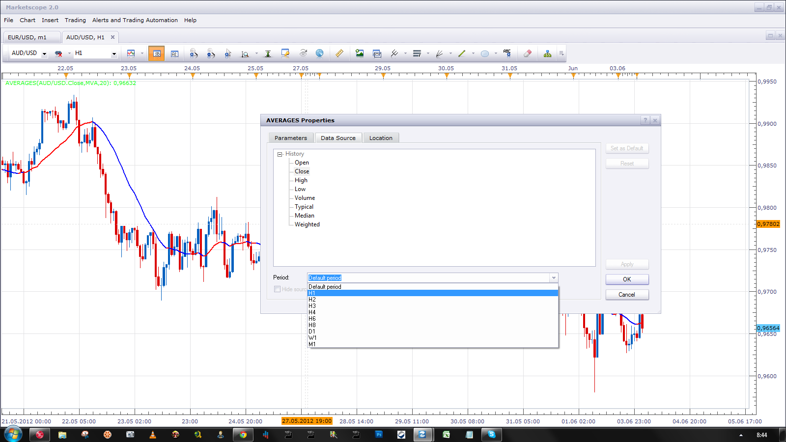

You can use the standard indicator, And then change Source time frame.

---

## Re: Moving Average Indicator: 20 in 1

**Panther** · Sun Jun 10, 2012 9:15 am

There is a problem with the standard indicator on the tick chart.
When I change source time frame to anything other than default,
it disappears.

---

## Re: Moving Average Indicator: 20 in 1

**Apprentice** · Tue Jun 12, 2012 2:30 am

If you use tick, and then change a source to H1.
Moving average chart will be on, but you will not see it.
Because you are using too much magnification.

---

## Re: Moving Average Indicator: 20 in 1

**Panther** · Tue Jun 12, 2012 5:57 am

I am using tick with standard indicator. I tried an EMA 8 with an M1, M5 source.
The line appeared, then disappeared. I tried a MVA 8, M1 then M5 source the line did not appear.
If you are able to use, then there is a problem on my end.
I am having great success using standard with default , and BF Indie with M1 and M5.
Would it be possible to make the BF Indie two color? Thanks.

---

## Re: Moving Average Indicator: 20 in 1

**Panther** · Mon Jul 02, 2012 8:10 am

Hi. I still need a 2 color BF_Averages that will function on the tick chart.
I called FXCM support and they had the same problem. The BF_Averages is the only indicator
that will work on a tick chart with a higher time frame designation.
Thanks for all your work.

---

## Re: Moving Average Indicator: 20 in 1

**Panther** · Tue Oct 09, 2012 5:36 am

I would like to again request a two color BF_averages.lua.
The averages.lua still disappears when the data source is changed from default to M1 or M5 on a tick
chart. Please see my previous posts.

---

## Re: Moving Average Indicator: 20 in 1

**Apprentice** · Wed Oct 10, 2012 3:58 am

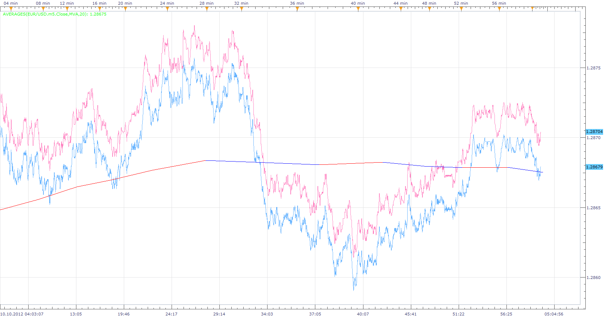

I have no such problems.
True, i have the Beta version of TS,
this could make a difference.
As for the disappearance of MA, you must bear in mind, that you use a very large magnifying glass, your MA is possible just outside of your chart area.

---

## Re: Moving Average Indicator: 20 in 1

**Panther** · Wed Oct 10, 2012 5:28 am

Apprentice, I understand your point. However, I am currently using the BF_averages on a tick chart with M1 and M5 time frames. It works very well. All I want is a 2 color version.

Now, regarding the averages.lua , I just used a MVA 5 with a M1 data source. It did not appear, I zoomed out it appeared, then disappeared. This is true for ANY AND EVERY indicator that you put on a tick chart. Only the time frame format that you developed for the BF_averages indie works.

Your beta version is the only reason it works . Please see previous post, I talked with FXCM support. They had the same problem: it DOES NOT work. PLEASE forgive my emphasis, but I am exasperated.
I have waited four months.

---

## Re: Moving Average Indicator: 20 in 1

**Apprentice** · Wed Oct 10, 2012 5:42 am

U can try to use the Beta version.
Downlaod link can be found here.
[viewtopic.php?f=30&t=20383](https://fxcodebase.com/code/viewtopic.php?f=30&t=20383)

---

## Re: Moving Average Indicator: 20 in 1

**Panther** · Wed Oct 10, 2012 5:01 pm

Apprentice, the beta version works. Thanks, I like the averages.lua better than the BF_averages.
Other indies work as well. Any estimate of when Trading Station/Marketscope will be updated?

---

## Re: Moving Average Indicator: 20 in 1

**Apprentice** · Thu Oct 11, 2012 2:45 am

The next version is expected in prod by the end of year.

---

## Re: Moving Average Indicator: 20 in 1

**Apprentice** · Tue Nov 20, 2012 6:46 am

KAMA moving average added.

---

## Re: Moving Average Indicator: 20 in 1

**Panther** · Fri May 03, 2013 9:33 am

Apprentice, I have been using this indicator on the latest version of TS II Tick charts with great success. Thanks.
I would like to be able to use the high, low choices under the "data source" tab. However, when
I apply this indicator to the Tick chart those options are not available.
Would it be to much trouble to make those available? I would like to apply it to M1 and M5 periods. Thanks again!

---

## Re: Moving Average Indicator: 20 in 1

**Apprentice** · Sun May 05, 2013 6:06 am

This is not possible,
Averages indicator need Bar, not Tick as a source...
The reason ... some moving averages ... require Bar as a source ...

---

## Re: Moving Average Indicator: 20 in 1

**Outside_The_Box** · Thu Oct 10, 2013 7:40 pm

Is it possible to create a strategy that, when color mode is selected, buys when the MA changes to the "UP color", and sells when the MA changes to the "DN color"? It could also be able to open multiple positions in one direction, set stops, limits, and everything else that an automated strategy should have.

If you put on a 9 period ILRS moving average of the typical price on a chart you'll see the potential. It does a good job of catching the beginning of a move and a pretty good job keeping you in for the extent of the move.

I tried using strategy builder in TS2 to see if I could do this myself but it said the indicator was not supported. As a side note I'd love to see the strategy builder become more robust. I'd have a ball building strategies all day.

---

## Re: Moving Average Indicator: 20 in 1

**Apprentice** · Fri Oct 11, 2013 2:15 am

Your request is added to the development list.

---

## Re: Moving Average Indicator: 20 in 1

**dell123** · Fri Oct 11, 2013 4:17 pm

Apprentice, the strategy request above on 10/10-10/11would be great. I hope under the basic parameters that it would have the option to set up trade times. 1. start time 2. stop time 3. use mandatory closing yes/no 4. mandatory closing time, and the ability to set up to 3 separate ones in a 24 hour time frame. A cycle-identifer as a direction filter on/off with the option 1. to trade only major cycles 2. all cycles in the same direction as the major,3. all cycles major and minor. or something close to it to keep the lower time frames scalping in the right direction.

Thank you

---

## Re: Moving Average Indicator: 20 in 1

**Outside_The_Box** · Thu Nov 07, 2013 2:25 am

> **Apprentice wrote:**
> Your request is added to the development list.

Disregard. I found the Averages strategy. It is what I was looking for.

[viewtopic.php?f=31&t=3859&hilit=averages](https://fxcodebase.com/code/viewtopic.php?f=31&t=3859&hilit=averages)

---

## Re: Moving Average Indicator: 20 in 1

**volnmar** · Tue Jun 17, 2014 1:58 am

Can you please make an alert which send email when colour of the average changes?

---

## Re: Moving Average Indicator: 20 in 1

**Apprentice** · Wed Jun 18, 2014 6:00 am

Averages with Alert added.

---

## Re: Moving Average Indicator: 20 in 1

**volnmar** · Thu Jun 19, 2014 2:37 am

Thats great! thank you very much, last thing which would be usefull is send alert when price cross the average, and if is it possible to may change sound no to be same as alert when colour change

---

## Re: Moving Average Indicator: 20 in 1

**Apprentice** · Thu Jun 19, 2014 3:53 am

For Price/MA cross use Price Averages Cross Alert.lua
[viewtopic.php?f=17&t=59311&p=88941#p88941](https://fxcodebase.com/code/viewtopic.php?f=17&t=59311&p=88941#p88941)

---

## Re: Moving Average Indicator: 20 in 1

**volnmar** · Fri Jul 04, 2014 1:41 am

Is it possible to show angle of moving average? Lets say 10 last points of moving average against price and time axys?

---

## Re: Moving Average Indicator: 20 in 1

**Apprentice** · Fri Jul 04, 2014 5:46 am

Try Slope in Degrees Indicator.
[viewtopic.php?f=17&t=60870&p=94756#p94756](https://fxcodebase.com/code/viewtopic.php?f=17&t=60870&p=94756#p94756)

---

## Re: Moving Average Indicator: 20 in 1

**volnmar** · Fri Jul 04, 2014 6:09 am

Thank you

---

## Re: Moving Average Indicator: 20 in 1

**easytrading** · Mon Feb 16, 2015 1:37 pm

hello Apprentice,

is it posible to add HPF to the Averages 20 in 1 please?
thank you.

---

## Re: Moving Average Indicator: 20 in 1

**Apprentice** · Tue Feb 17, 2015 3:33 pm

Your request is added to the development list.

---

## Re: Moving Average Indicator: 20 in 1

**easytrading** · Tue Feb 24, 2015 12:09 am

> **easytrading wrote:**
> hello Apprentice,
>
> is it posible to add HPF to the Averages 20 in 1 please?
> thank you.

and also allow me to add slope direction line -the colored version- to the Averages 20 in 1 please, with much appreciation as always.

---

## Re: Moving Average Indicator: 20 in 1

**CeresTrader** · Sun Mar 08, 2015 1:40 pm

Hi all

I was wondering if you could add Arsi (Adaptive rsi) and Vidya to the indicators

thanks in advance

---

## Re: Moving Average Indicator: 20 in 1

**Apprentice** · Tue Mar 10, 2015 3:37 am

Your request is added to the development list.

---

## Re: Moving Average Indicator: 20 in 1

**Victor.Tereschenko** · Sun May 03, 2015 6:31 am

> **CeresTrader wrote:**
> Hi all
>
> I was wondering if you could add Arsi (Adaptive rsi) and Vidya to the indicators
>
> thanks in advance

Implemented.

---

## Re: Moving Average Indicator: 20 in 1

**Apprentice** · Tue May 12, 2015 4:49 am

Averages Overlay.lua Added
(First, Topmost post)

---

## Re: Moving Average Indicator: 20 in 1

**Victor.Tereschenko** · Tue May 12, 2015 11:40 pm

Two new methods added: HPF and VAMA

---

## Re: Moving Average Indicator: 20 in 1

**mulligan** · Thu May 14, 2015 8:39 am

Installed the new Averages with HPF and VAMA. With HPF I get the following, Averages.lua:66:Bar source should be selected for HPF. When VAMA is selected, the line simply does not show up on the chart.

---

## Re: Moving Average Indicator: 20 in 1

**Apprentice** · Fri May 15, 2015 2:41 am

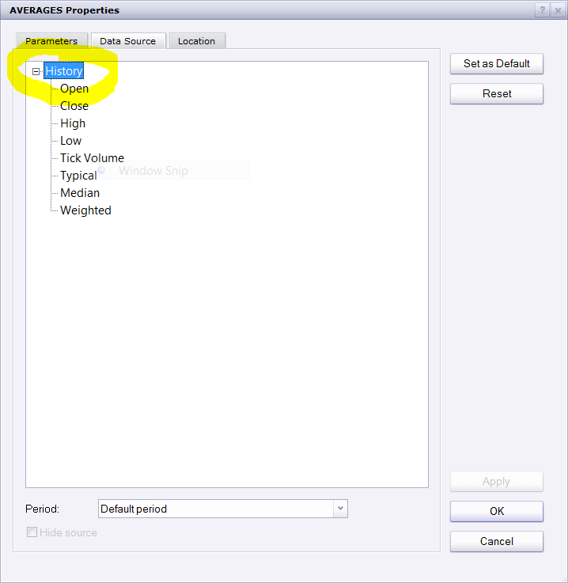

Please click on history for the moving averages that require full bar.

---

## Re: Moving Average Indicator: 20 in 1

**xpertizetrading** · Mon Jun 01, 2015 3:15 am

Hi apprentice,

Kindly see if this strategy can be coded. Very simple rules:

Buy: Average colour changes to UP
Sell: Average colour changes to DOWN

Regards,
Xpertize Trading

---

## Re: Moving Average Indicator: 20 in 1

**Apprentice** · Sun Jun 07, 2015 4:17 am

Try Averages Strategy.
[viewtopic.php?f=31&t=3859&p=9454&hilit=Averages.lua#p9454](https://fxcodebase.com/code/viewtopic.php?f=31&t=3859&p=9454&hilit=Averages.lua#p9454)

---

## Re: Moving Average Indicator: 20 in 1

**jacklrfx** · Tue Oct 13, 2015 11:09 am

Hi,
Can you include a Non Lag MA (simple I suppose because EMA there is already) in this indicator?
And also make a Filter option (for all the type of average), I mean a filter to cacth better the trend?

Thanks

---

## Re: Moving Average Indicator: 20 in 1

**Apprentice** · Thu Oct 15, 2015 3:15 am

Your request is added to the development list.

---

## Re: Moving Average Indicator: 20 in 1

**mrlnb2016** · Thu Mar 03, 2016 4:24 am

The decimal place showing in the legend of this indicator is different than the real decimal value - the value in the legend has been rounded.

For example, for EUR/USD, it's showing 4 decimal place in the legend and 5 decimal place in the real value.

Is it possible to make the legend show the full decimal place of the current MVA value?

Thanks a lot for the help.

---

## Re: Moving Average Indicator: 20 in 1

**Apprentice** · Thu Mar 03, 2016 5:05 am

Try it now.

---

## Re: Moving Average Indicator: 20 in 1

**mrlnb2016** · Thu Mar 03, 2016 8:39 am

It's working now, thanks a lot.

---

## Re: Moving Average Indicator: 20 in 1

**easytrading** · Fri Aug 12, 2016 4:26 am

> **Victor.Tereschenko wrote:**
> by Victor.Tereschenko » Tue May 12, 2015 11:40 pm
>
> Two new methods added: HPF and VAMA
> ATTACHMENTS
> Averages.lua
> New methods: HPF and VAMA
> (25.53 KiB) Downloaded 395 times

kindly Apprentice,
could you please, provide us the price overlay of (two Averages crossing) from the last version of this indicator that was provided by Victor ? many thanks in advance.

---

## Re: Moving Average Indicator: 20 in 1

**Apprentice** · Fri Aug 12, 2016 11:51 am

1. MA / 2. MA & MA /Price filters added to Averages Overlay.lua

---

## Re: Moving Average Indicator: 20 in 1

**easytrading** · Fri Aug 12, 2016 2:48 pm

It will be great Apprentice if you add HPF & VAMA that are already existing in Victor's version of this indicator to the MA methods for crossing 2 MA Overlay please ?? with many thanks .

---

## Re: Moving Average Indicator: 20 in 1

**Apprentice** · Sun Aug 14, 2016 3:58 am

Can you provide a link,
The exact filename?

---

## Re: Moving Average Indicator: 20 in 1

**easytrading** · Sun Aug 14, 2016 3:34 pm

this is the link:
[http://www.fxcodebase.com/code/viewtopi ... 70#p100440](http://www.fxcodebase.com/code/viewtopic.php?f=17&t=2430&start=70#p100440)

and this is a copy of Victor's work it is on page 8 of this post :

Victor.Tereschenko wrote:
by Victor.Tereschenko » Tue May 12, 2015 11:40 pm

Two new methods added: HPF and VAMA
ATTACHMENTS
Averages.lua
New methods: HPF and VAMA
(25.53 KiB) Downloaded 395 times

---

## Re: Moving Average Indicator: 20 in 1

**Apprentice** · Mon Aug 15, 2016 2:09 am

Have overwrite Averages.lua from first page with victors work.

---

## Re: Moving Average Indicator: 20 in 1

**easytrading** · Mon Aug 15, 2016 7:54 pm

if you please Apprentice , could you add them (HPF & VAMA) also TO Averages Overlay.lua by adding History option in price source (cause they need whole bar) ? many thanks in advance.

---

## Re: Moving Average Indicator: 20 in 1

**Apprentice** · Tue Aug 16, 2016 4:27 am

Overlay need whole bar.

---

## Re: Moving Average Indicator: 20 in 1

**Panther** · Sun Aug 21, 2016 10:16 pm

When I use the averages.lua on a Tick chart the only history choice is tick. Would it be possible to include all the choices ( open, close, high, low, tick volume, typical, median, weighted)? Thanks.

---

## Re: Moving Average Indicator: 20 in 1

**Apprentice** · Mon Aug 22, 2016 7:12 am

These choices are not available on tick time frame chart.
We can write indicator, which will load higher time frames sources.
To have this choice.

---

## Re: Moving Average Indicator: 20 in 1

**Panther** · Mon Aug 22, 2016 7:50 am

If it too time consuming to include all the choices, maybe just the high, low history.
For example, when you choose a period(m1, m5, etc.), then the tick and the high, low choices for the period appear under history.

---

## Re: Moving Average Indicator: 20 in 1

**Apprentice** · Tue Aug 23, 2016 2:17 pm

Please use "End of Turn" mode.

---

## Re: Moving Average Indicator: 20 in 1

**Sospool** · Tue May 02, 2017 6:34 am

Hello Apprentice and Alexander,

Is it possible to add the arrow option for this indicator ?

Thank you

---

## Re: Moving Average Indicator: 20 in 1

**Apprentice** · Tue May 02, 2017 10:01 am

Averages Arrows.lua added.

---

## Re: Moving Average Indicator: 20 in 1

**Sospool** · Tue May 02, 2017 12:38 pm

Thanks apprentice

---

## Re: Moving Average Indicator: 20 in 1

**dell123** · Wed Jan 02, 2019 10:44 pm

Were can I fined MT4 of this indicator. Thank you

---

## Re: Moving Average Indicator: 20 in 1

**Apprentice** · Thu Jan 03, 2019 4:52 am

Try this version.
[viewtopic.php?f=38&t=66535](https://fxcodebase.com/code/viewtopic.php?f=38&t=66535)
