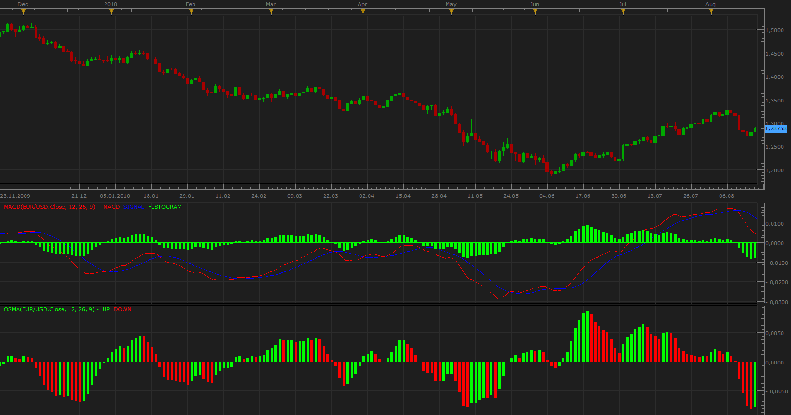

# Moving Average of Oscillator (OsMA)

> Source: https://fxcodebase.com/code/viewtopic.php?f=17&t=1856  
> Forum: 17 · Topic 1856 · 11 post(s)

---

## Moving Average of Oscillator (OsMA)

**Apprentice** · Wed Aug 18, 2010 9:15 am

Moving Average of Oscillator (OsMA) is difference between the Moving Average Convergence/Divergence and the signal line.

OSMA = MACD-SIGNAL

Those who know the formulas for classic MACD will notice that this is precisely the formula for MACD histogram.

Although this solution already exists, now is available to you as OsMA.

 [OsMA.lua](files/3712/OsMA.lua)

MT4/MQ4 version.
[viewtopic.php?f=38&t=65456&p=116504#p116504](https://fxcodebase.com/code/viewtopic.php?f=38&t=65456&p=116504#p116504)

 

 Cumulative OsMA will summarize swing Osma values (in pips).

 [Cumulative OsMA.lua](files/3712/Cumulative%20OsMA.lua)

---

## Re: Moving Average of Oscillator (OsMA)

**54trader54** · Wed Aug 18, 2010 10:12 am

thanks very much, I appreciate it. It works perfectly.

---

## Re: Moving Average of Oscillator (OsMA)

**Apprentice** · Fri Nov 19, 2010 2:30 pm

Update

---

## Re: Moving Average of Oscillator (OsMA)

**JJBungles** · Sat Jan 01, 2011 6:27 pm

Thanks Apprentice for the indicator. May I make one request please? Can you programme the colours as per the attached where increasing above zero are bright green, decreasing above zero is dark green, decreasing below 0 is bright red, increasing below zero is dark red?

Thanking you in advance.

KR,

JJ

---

## Re: Moving Average of Oscillator (OsMA)

**Apprentice** · Sun Jan 02, 2011 8:50 am

Request noted.
But I would wait for the new version platforms,
 this will then be easier to write.
And in order not to repeat all the work twice.

---

## Re: Moving Average of Oscillator (OsMA)

**Apprentice** · Sun Jan 09, 2011 12:17 pm

This version allows you to define different colors for this four cases.

 [OsMA.lua](files/7294/OsMA.lua)

---

## Re: Moving Average of Oscillator (OsMA)

**crusader1** · Mon Sep 10, 2012 7:03 am

Many thanks for these great update!!
I have looking for this indi long time!

again many thanks

---

## Re: Moving Average of Oscillator (OsMA)

**crusader1** · Mon Sep 10, 2012 7:05 am

Many thanks for this color update!!!

---

## Re: Moving Average of Oscillator (OsMA)

**Apprentice** · Sun Oct 06, 2013 10:30 am

OsMA Indicator Update.
MA Method selector Added.

---

## Re: Moving Average of Oscillator (OsMA)

**Apprentice** · Sun Oct 06, 2013 1:30 pm

Cumulative OsMA Added,

---

## Re: Moving Average of Oscillator (OsMA)

**Apprentice** · Mon Feb 05, 2018 7:37 am

The Indicator was revised and updated.
