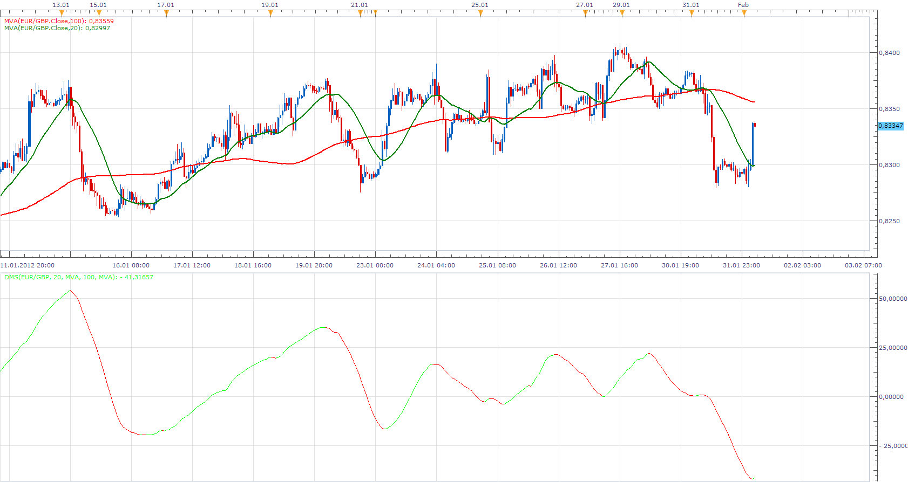

# Moving Average Relative Position

> Source: https://fxcodebase.com/code/viewtopic.php?f=17&t=12602  
> Forum: 17 · Topic 12602 · 9 post(s)

---

## Moving Average Relative Position

**Apprentice** · Wed Feb 01, 2012 5:12 am

The indicator has two Algoritam Historic and Live

Live shows the position of the short moving average, in relation to, the long period moving average.
Historic view, given the position of the short period moving average within a maximum deviation from Long moving average. From First Thill last period.

The maximum value is 100
Shows that the short moving average, is at a maximum historic distance from long period moving average.

 [Moving Average Relative Position.lua](files/24823/Moving%20Average%20Relative%20Position.lua)

The indicator was revised and updated

---

## Re: Moving Average Relative Position

**lifes2simple** · Wed Feb 01, 2012 5:26 am

You're my hero. Thank you so much! There are many confirmation tools available to confirm with my original approach, but this is like a custom made confirmation tool. I cannot thank you enough!

---

## Moving Average Relative Position

**Anariamic** · Thu Feb 02, 2012 9:44 am

Effectively?

---

## Re: Moving Average Relative Position

**luigipg** · Thu Oct 31, 2013 5:45 am

Hi Apprentice, can we have the position of the slow period moving average "in pips" from fast moving average? From first till last period. Thans for ever. Luigi!!!

---

## Re: Moving Average Relative Position

**Apprentice** · Thu Oct 31, 2013 2:31 pm

[Absolute Moving Average Relative Position.lua](files/90461/Absolute%20Moving%20Average%20Relative%20Position.lua)

As here.
Not a big difference.
Can you explain, on a theoretical example,
perhaps, above indicator, is not a good template.

---

## Re: Moving Average Relative Position

**luigipg** · Sun Nov 03, 2013 2:49 pm

Sure, thanks. I would need an oscillator that shows the difference "in pips" between two moving averages. Thats all. Thanks a lot for ever. Luigi!!!

---

## Re: Moving Average Relative Position

**Apprentice** · Mon Nov 04, 2013 9:19 am

Try This Version

 [MA Difference.lua](files/90559/MA%20Difference.lua)

---

## Re: Moving Average Relative Position

**Paul W** · Sun Apr 30, 2017 12:21 pm

could you add a "line width" options pls

Thanks

---

## Re: Moving Average Relative Position

**Apprentice** · Mon May 01, 2017 3:57 am

Try it now.
