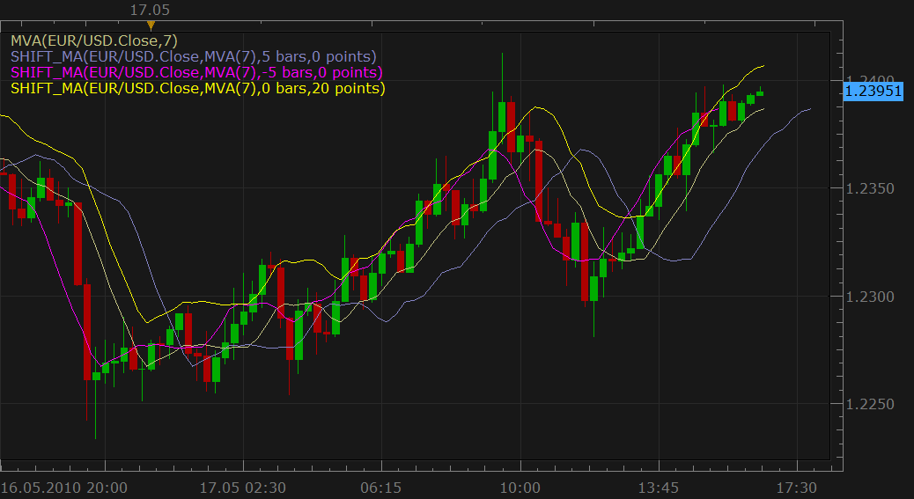
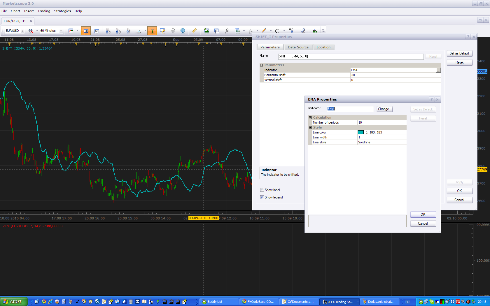

# Moving Average shifted by time and price axis (displaced MA)

> Source: https://fxcodebase.com/code/viewtopic.php?f=17&t=1044  
> Forum: 17 · Topic 1044 · 13 post(s)

---

## Moving Average shifted by time and price axis (displaced MA)

**Nikolay.Gekht** · Mon May 17, 2010 3:42 pm

The indicator just shows the chosen moving average with chosen parameters but shifted by the specified number of bars and by the specified number of points.

 

Download:

 [SHIFT_MA.lua](files/1965/SHIFT_MA.lua)

 [SHIFT_MA with Alert.lua](files/1965/SHIFT_MA%20with%20Alert.lua)

The indicator is also called displaced moving average.

 

 [SHIFT MA Paint Bar.lua](files/1965/SHIFT%20MA%20Paint%20Bar.lua)

---

## Re: Moving Average shifted by time and price axis (displaced MA)

**jsi@jp** · Tue Jun 22, 2010 9:47 am

Thank you very much for this Indicator.

"KAMA" was able to be added.
But "ARSI" was not able to be added.
I hope to add "ARSI".

---

## Re: Moving Average shifted by time and price axis (displaced MA)

**Nikolay.Gekht** · Tue Jun 22, 2010 10:41 am

If you wouldn't like to wait until I do this, just:
Go to the "C:\Program Files\Candleworks\FXTS2\indicators\Custom\" folder
Open the file SHIFT_MA.lua using any text editor, for example notepad
scroll to the line

Code: [Select all](https://fxcodebase.com/code/)
`indicator.parameters:addStringAlternative("MA", "TMA", "", "TMA");`
and add the following two lines after this line

Code: [Select all](https://fxcodebase.com/code/)
`indicator.parameters:addStringAlternative("MA", "KAMA", "", "KAMA");
indicator.parameters:addStringAlternative("MA", "ARSI", "", "ARSI");`

And then restart the Trading Station.

You can also add ANY **indicator** (not oscillator) which take only one **N-periods** parameter, can be applied on **ticks** and produces only **one** output line. The name to specify is the name of the file without lua extension in capital letters. For example - REGRESSION conforms to these conditions.

---

## Re: Moving Average shifted by time and price axis (displaced MA)

**jsi@jp** · Wed Jun 23, 2010 6:21 am

Thank you very much Nikolay
I was able to load it by your comprehensible explanation.

---

## Re: Moving Average shifted by time and price axis (displaced MA)

**Merchantprince** · Thu Sep 23, 2010 12:33 pm

Would it be possible to add this indicator to the development queue to update it with the new line thickness feature?

Thanks!

---

## Re: Moving Average shifted by time and price axis (displaced MA)

**Apprentice** · Thu Sep 23, 2010 1:45 pm

While we do not fulfill your request you can use Shift Indicator Indicator.

---

## Re: Moving Average shifted by time and price axis (displaced MA)

**Apprentice** · Tue Sep 28, 2010 4:56 am

Style Update.

---

## Re: Moving Average shifted by time and price axis (displaced

**Apprentice** · Thu Jan 21, 2016 3:55 am

SHIFT MA Paint Bar.lua Added.

---

## Re: Moving Average shifted by time and price axis (displaced

**Apprentice** · Wed Jun 15, 2016 4:18 am

SHIFT_MA with Alert.lua Added.

---

## Re: Moving Average shifted by time and price axis (displaced

**Apprentice** · Mon Jul 09, 2018 5:25 am

The indicator was revised and updated.

---

## Re: Moving Average shifted by time and price axis (displaced

**Gilles** · Wed Aug 07, 2019 6:20 am

Hi apprentice,

A simple request to ask you for a SHIFT_MA_strategy.

If MA.DATA[period] > MA.DATA[period-1] then BUY(); else SELL(); end;

thanks,
see you soon

---

## Re: Moving Average shifted by time and price axis (displaced

**Apprentice** · Wed Aug 07, 2019 4:57 pm

Your request is added to the development list under Id Number 4828

---

## Re: Moving Average shifted by time and price axis (displaced

**Apprentice** · Sat Aug 10, 2019 5:38 am

Try this version.
[viewtopic.php?f=31&t=68768](https://fxcodebase.com/code/viewtopic.php?f=31&t=68768)
