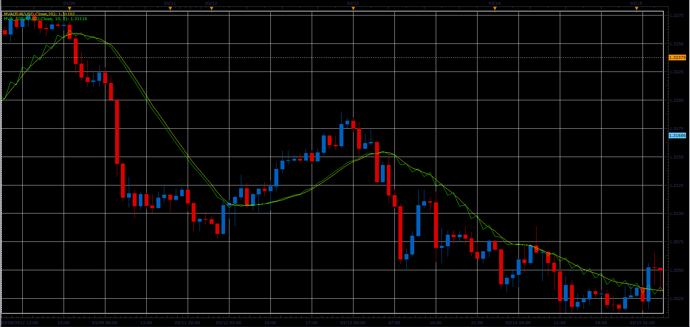

# Moving average with step

> Source: https://fxcodebase.com/code/viewtopic.php?f=17&t=14876  
> Forum: 17 · Topic 14876 · 3 post(s)

---

## Moving average with step

**Alexander.Gettinger** · Fri Mar 16, 2012 2:15 pm

This indicator is very similar to MVA, but it does not use all the values ​​for the calculation.

Formula:
MVA_S[i]=(Price[i]+Price[i-Step]+Price[i-2*Step]+...+Price[i-(Period-1)*Step])/Period.

For example, if Period=4 and Step=2:
MVA_S[i]=(Price[i]+Price[i-2]+Price[i-4]+Price[i-6])/4.

 

Download:

 [MVA_S.lua](files/28173/MVA_S.lua)

The indicator was revised and updated

---

## Re: Moving average with step

**Alexander.Gettinger** · Fri Apr 27, 2012 12:38 pm

MQL4 version of Moving average with step: [viewtopic.php?f=38&t=16427](https://fxcodebase.com/code/viewtopic.php?f=38&t=16427)

---

## Re: Moving average with step

**Apprentice** · Mon Apr 03, 2017 6:10 am

Indicator was revised and updated.
