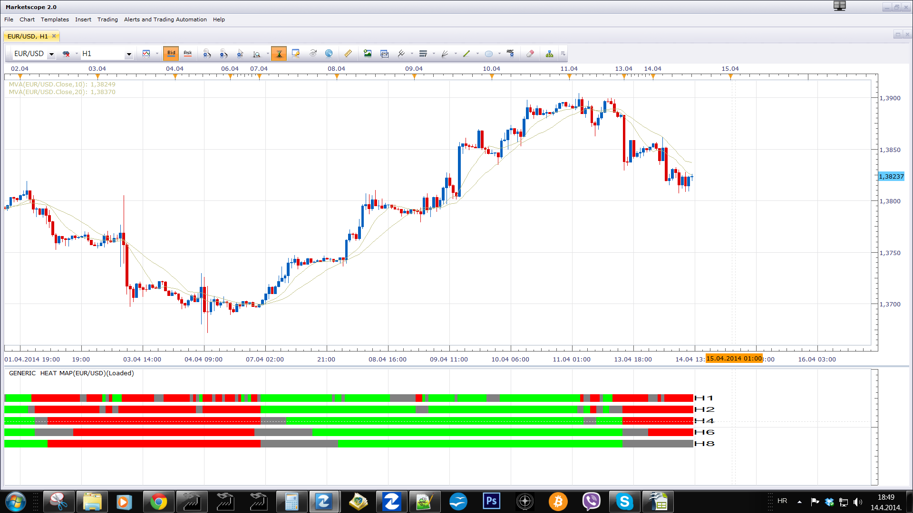

# Moving Averages Channel Heat Map

> Source: https://fxcodebase.com/code/viewtopic.php?f=17&t=60541  
> Forum: 17 · Topic 60541 · 4 post(s)

---

## Moving Averages Channel Heat Map

**Apprentice** · Mon Apr 14, 2014 11:46 am

Based on the request.
[viewtopic.php?f=27&t=60538&p=93516#p93516](https://fxcodebase.com/code/viewtopic.php?f=27&t=60538&p=93516#p93516)

Moving Averages Channel
Indications is determined by the position of the closing price in relation to channel, generated by two moving averages

Positive indication – Closing Price is above the channel
Negativ indication – Closing Price is below the channel
Neutal indication – Closing Price is within the channel

 [Moving Averages Channel Heat Map.lua](files/93515/Moving%20Averages%20Channel%20Heat%20Map.lua)

MT4/MQ4 version.
[viewtopic.php?f=38&t=65045&p=114587#p114587](https://fxcodebase.com/code/viewtopic.php?f=38&t=65045&p=114587#p114587)

---

## Re: Moving Averages Channel Heat Map

**Dimitri** · Mon Apr 14, 2014 3:55 pm

Thanks Apprentice. is it possible for to have an option which of the timeframes are shown? for example if i only want to use the timeframe of my chart and not mtf

Thanks

---

## Re: Moving Averages Channel Heat Map

**Apprentice** · Tue Apr 15, 2014 11:50 am

Time Frame (On/Off) switch Added.

---

## Re: Moving Averages Channel Heat Map

**Apprentice** · Thu Apr 12, 2018 6:42 am

The indicator was revised and updated.
