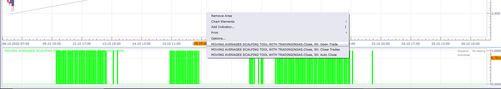

# Moving Averages Scalping Tool

> Source: https://fxcodebase.com/code/viewtopic.php?f=17&t=70538  
> Forum: 17 · Topic 70538 · 20 post(s)

---

## Moving Averages Scalping Tool

**Apprentice** · Wed Oct 14, 2020 9:40 am

 

 [Moving Averages Scalping Tool.lua](files/138280/Moving%20Averages%20Scalping%20Tool.lua)

 

 [All Time Frames All Currency Moving Averages Scalping Tool Oscillator View.lua](files/138280/All%20Time%20Frames%20All%20Currency%20Moving%20Averages%20Scalping%20Tool%20Oscillator%20View.lua)

 [Moving Averages Scalping Tool Oscillator.lua](files/138280/Moving%20Averages%20Scalping%20Tool%20Oscillator.lua)

 

Version with trading functionality.

 [Moving Averages Scalping Tool with Trading.lua](files/138280/Moving%20Averages%20Scalping%20Tool%20with%20Trading.lua)

 [Moving Averages Scalping Tool with Alert.lua](files/138280/Moving%20Averages%20Scalping%20Tool%20with%20Alert.lua)

---

## Re: Moving Averages Scalping Tool

**bruno2017** · Wed Oct 14, 2020 11:14 am

hello
 I do not have the color green and red ...

---

## Re: Moving Averages Scalping Tool

**Apprentice** · Wed Oct 14, 2020 12:17 pm

This will happen if we do not have an active signal.
Try Tesla on "m5"

---

## Re: Moving Averages Scalping Tool

**Apprentice** · Wed Oct 14, 2020 12:44 pm

Fixed.

---

## Re: Moving Averages Scalping Tool

**opita04** · Wed Oct 14, 2020 5:54 pm

Hey Mario,

So far this tool is fantastic.
Could it be possible to create a Dashboard with alerts for this?

It would save a lot of time and give a broad set of options on all timeframes.

Cheers,

Jaime

---

## Re: Moving Averages Scalping Tool

**Apprentice** · Thu Oct 15, 2020 1:18 am

Your request is added to the development list.
Development reference 2192.

---

## Re: Moving Averages Scalping Tool

**yolerap** · Thu Oct 15, 2020 3:02 am

Hi,

Is exist a strategy with this indicator ?

Thank you,

---

## Re: Moving Averages Scalping Tool

**opita04** · Thu Oct 15, 2020 4:12 am

> **yolerap wrote:**
> Hi,
>
> Is exist a strategy with this indicator ?
>
> Thank you,

Have you tried it? Your question doesn't make sense, it is a visual indicator. There are no alerts currently.

Exit would be the SL or TP you can see visually in the chart.

---

## Re: Moving Averages Scalping Tool

**Apprentice** · Thu Oct 15, 2020 4:16 am

Have not considered it.

My idea was to have it as a visual aid,
The final decision will be ultimately traders.

In the coming weeks, we will roll out additional functionality.
I will reconsider when I finalize it.

---

## Re: Moving Averages Scalping Tool

**Apprentice** · Thu Oct 15, 2020 1:50 pm

All Time Frames All Currency Moving Averages Scalping Tool Oscillator View.lua added.

---

## Re: Moving Averages Scalping Tool

**Sospool** · Fri Oct 16, 2020 11:09 am

A nice project Mario, i can't wait to see the evolutions

---

## Re: Moving Averages Scalping Tool

**Apprentice** · Sat Oct 17, 2020 6:43 am

Please re-download Moving Averages Scalping Tool Oscillator,
some optimizations are applied.

---

## Re: Moving Averages Scalping Tool

**bruno2017** · Tue Nov 10, 2020 12:07 pm

hello
 what is the condition for a green area to appear

---

## Re: Moving Averages Scalping Tool

**Apprentice** · Wed Nov 11, 2020 2:31 pm

Price > MA1
MA1 Slope is Up
MA2 Slope is Up
MA3 Slope is Up
MA2 > MA3

---

## Re: Moving Averages Scalping Tool

**bruno2017** · Fri Nov 13, 2020 4:12 am

thank you

---

## Re: Moving Averages Scalping Tool with Trading

**mulligan** · Sun Nov 15, 2020 8:56 am

Could we please get the options show alert, sound, and recurrent sound when the trade signal is triggered.

Thanks

---

## Re: Moving Averages Scalping Tool

**Apprentice** · Mon Nov 16, 2020 4:17 am

Indicator or Dashboard?

---

## Re: Moving Averages Scalping Tool

**mulligan** · Mon Nov 16, 2020 7:44 am

indicator please

---

## Re: Moving Averages Scalping Tool

**Apprentice** · Tue Nov 17, 2020 6:14 am

Your request is added to the development list.
Development reference 2317.

---

## Re: Moving Averages Scalping Tool

**Apprentice** · Wed Nov 18, 2020 9:19 am

Moving Averages Scalping Tool with Alert.lua added.
