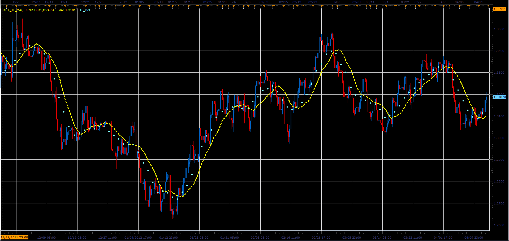

# Moving averages with different timeframes

> Source: https://fxcodebase.com/code/viewtopic.php?f=17&t=15881  
> Forum: 17 · Topic 15881 · 4 post(s)

---

## Moving averages with different timeframes

**Alexander.Gettinger** · Thu Apr 12, 2012 3:00 pm

Indicator draws the MA with a specified period for the selected timeframe (dots) and MA with equivalent period on current timeframe (line).

For example:
Period=10,
Timeframe=D1,
Current timeframe=H6.
Dots - MA(Period=10) on D1, line - MA(Period=40) on H6.

 

Download:

 [Diff_TF_MA.lua](files/29815/Diff_TF_MA.lua)

For this indicator must be installed Averages indicator ([viewtopic.php?f=17&t=2430](https://fxcodebase.com/code/viewtopic.php?f=17&t=2430)).

The indicator was revised and updated

---

## Re: Moving averages with different timeframes

**Alexander.Gettinger** · Tue Apr 17, 2012 1:20 pm

Strategy based on moving averages with different timeframes: [viewtopic.php?f=31&t=16210](https://fxcodebase.com/code/viewtopic.php?f=31&t=16210)

---

## Re: Moving averages with different timeframes

**Alexander.Gettinger** · Fri Apr 27, 2012 12:39 pm

MQL4 version of indicator: [viewtopic.php?f=38&t=16421](https://fxcodebase.com/code/viewtopic.php?f=38&t=16421)

---

## Re: Moving averages with different timeframes

**Apprentice** · Mon Apr 03, 2017 6:18 am

Indicator was revised and updated.
