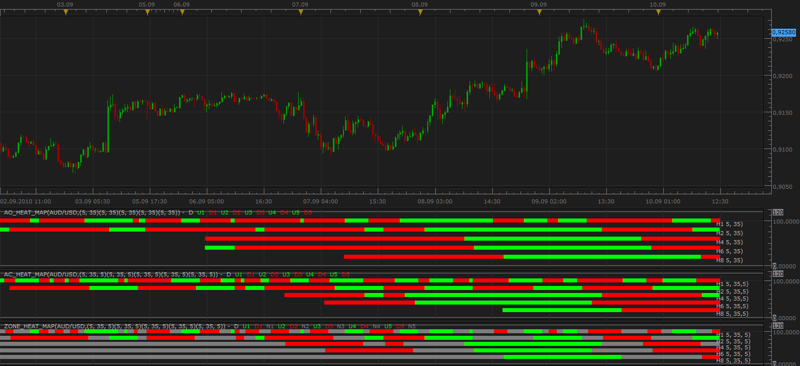

# MTF Acceleration / Deceleration Oscillator Heat Map

> Source: https://fxcodebase.com/code/viewtopic.php?f=17&t=2126  
> Forum: 17 · Topic 2126 · 4 post(s)

---

## MTF Acceleration / Deceleration Oscillator Heat Map

**Apprentice** · Fri Sep 10, 2010 11:23 am

 [AC_Heat_Map.lua](files/4380/AC_Heat_Map.lua)

The indicator was revised and updated
MT4/MA4 version
[viewtopic.php?f=38&t=65977](https://fxcodebase.com/code/viewtopic.php?f=38&t=65977)

---

## Re: MTF Acceleration / Deceleration Oscillator Heat Map

**Apprentice** · Mon Jan 10, 2011 9:13 am

AC multi-timeframe heat map is updated,
in order it could work with the new version of platform.

---

## Re: MTF Acceleration / Deceleration Oscillator Heat Map

**vstrelnikov** · Tue Oct 25, 2011 5:18 pm

New version "AC_Heat_Map2.lua" with improved performance was added.
Indicator uses different visualization method, so I add it as a separate indicator.
Please use it with newer versions of platform.

---

## Re: MTF Acceleration / Deceleration Oscillator Heat Map

**Apprentice** · Fri Mar 17, 2017 7:31 am

Indicator was revised and updated.
