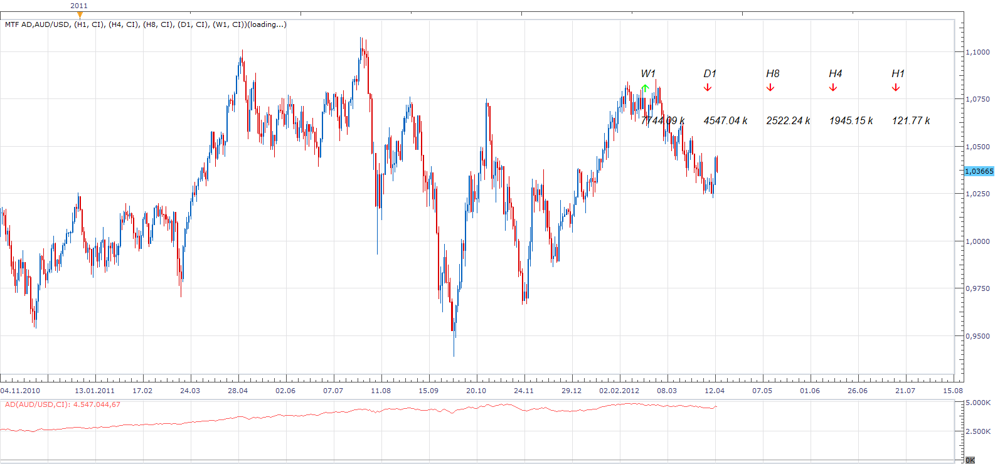

# MTF AD & AD Heat_Map

> Source: https://fxcodebase.com/code/viewtopic.php?f=17&t=15963  
> Forum: 17 · Topic 15963 · 5 post(s)

---

## MTF AD & AD Heat_Map

**Apprentice** · Sat Apr 14, 2012 4:38 am

MTF Accumulation/Distribution

 [MTF AD.lua](files/29935/MTF%20AD.lua)

The indicator was revised and updated

---

## Re: MTF AD

**Apprentice** · Sat Apr 14, 2012 6:28 am

 [AD Heat_Map.lua](files/29938/AD%20Heat_Map.lua)

---

## Re: MTF AD

**nsaale** · Fri Oct 26, 2012 1:09 am

What is the difference between classic , classic incremental and blank options?

---

## Re: MTF AD & AD Heat_Map

**Apprentice** · Fri Oct 26, 2012 4:00 am

Classic, Classic Incremental and Trade Station are three AD calculation algorithms.

Classic and Classic Incremental use this formula
 AD[period] = ((c[period] - l[period]) - (h[period] - c[period])) / (h[period] - l[period]) * v[period];

Trade Station use this one
AD[period] = (c[period] - o[period]) / (h[period] - l[period]) * v[period];

Classic Incremental & Trade Station are Incremental
AD[period] = AD[period] + AD[period - 1];

---

## Re: MTF AD & AD Heat_Map

**Apprentice** · Tue May 09, 2017 5:02 am

Indicator was revised and updated.
