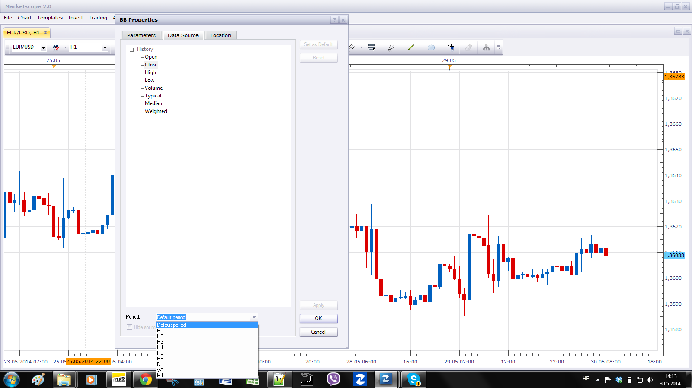

# MTF Bollinger Bands

> Source: https://fxcodebase.com/code/viewtopic.php?f=17&t=60739  
> Forum: 17 · Topic 60739 · 2 post(s)

---

## MTF Bollinger Bands

**Apprentice** · Fri May 30, 2014 7:08 am

This indicator allows you to add up to three Bollinger Bands.
All with Different parameters or/and timeframes.

 [MTF BB.lua](files/94211/MTF%20BB.lua)

 

For your information.
U can use Indicator Data Source Period of any indicator to selector desired Time.
Therefore, this or similar indicators are obsolete.

---

## Re: MTF Bollinger Bands

**Apprentice** · Fri Apr 13, 2018 9:13 am

The indicator was revised and updated.
