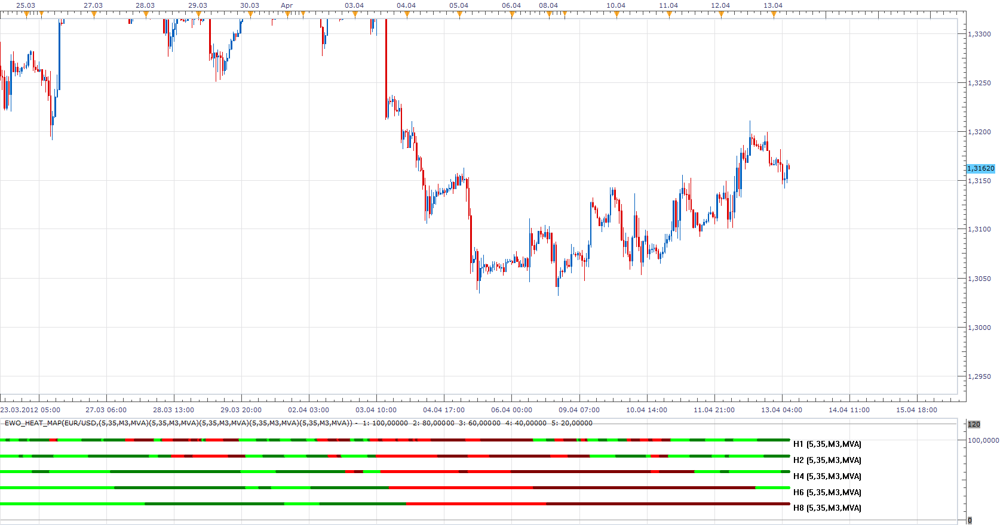

# MTF EWO & EWO Heat Map

> Source: https://fxcodebase.com/code/viewtopic.php?f=17&t=15935  
> Forum: 17 · Topic 15935 · 15 post(s)

---

## MTF EWO & EWO Heat Map

**Apprentice** · Fri Apr 13, 2012 5:31 am

 [MTF EWO.lua](files/29889/MTF%20EWO.lua)

 

 [EWO_Heat_Map.lua](files/29889/EWO_Heat_Map.lua)

MT4 version.
[viewtopic.php?f=38&t=63204](https://fxcodebase.com/code/viewtopic.php?f=38&t=63204)

---

## Re: MTF EWO & EWO Heat Map

**Coondawg71** · Thu Sep 06, 2012 12:29 pm

Can we please request a MTF Multiple Currency Pair Heatmap for the EWO Oscillator...like the one created for "MTF MCP Linear Regression Slope".

Thanks,

sjc

---

## Re: MTF EWO & EWO Heat Map

**cave76** · Sun May 25, 2014 10:55 am

hi could you make the mtf ewo heat map indicator so that I can turn off time frame you don't want or need to use thanks

---

## Re: MTF EWO & EWO Heat Map

**Apprentice** · Mon May 26, 2014 6:07 am

I have updated MTF & MTF / MCP versions.
Will bring performance improvement,
TF On / Off is also added.

---

## Re: MTF EWO & EWO Heat Map

**Apprentice** · Sun Feb 04, 2018 8:16 am

The indicator was revised and updated.

---

## Re: MTF EWO & EWO Heat Map

**amazon1a** · Wed Jul 08, 2020 10:21 am

Hi Apprentice,

Could you prepare a MT4 version of the EWO heatmap. I like very much your .lua for TS2.

Thanks, AG

---

## Re: MTF EWO & EWO Heat Map

**Apprentice** · Thu Jul 09, 2020 4:27 am

Your request is added to the development list.
Development reference 1656.

---

## Re: MTF EWO & EWO Heat Map

**fx1954** · Wed Jul 15, 2020 9:04 am

Is is possible to implement an option for crossover of two different kinds of MAs, like EMA with MVA e.g.

---

## Re: MTF EWO & EWO Heat Map

**Apprentice** · Wed Jul 15, 2020 9:55 am

As filter?
EWO above/below the MA?

---

## Re: MTF EWO & EWO Heat Map

**Apprentice** · Wed Jul 15, 2020 11:03 am

MT4 version.
[viewtopic.php?f=38&t=63204](https://fxcodebase.com/code/viewtopic.php?f=38&t=63204)

---

## Re: MTF EWO & EWO Heat Map

**fx1954** · Thu Jul 16, 2020 4:50 am

As far as I understand gives the inidicator a signal, when the faster MA is crossing the slower MA.
Is this right?

---

## Re: MTF EWO & EWO Heat Map

**Apprentice** · Fri Jul 17, 2020 4:31 am

EWO indicator color/slope is shown.

---

## Re: MTF EWO & EWO Heat Map

**fx1954** · Sun Jul 19, 2020 3:32 am

Would you consider an advance when given the option for other kind of MAs as well not only just the simple MA?

---

## Re: MTF EWO & EWO Heat Map

**Apprentice** · Sun Jul 19, 2020 5:05 pm

Your request is added to the development list.
Development reference 1722.

---

## Re: MTF EWO & EWO Heat Map

**Apprentice** · Tue Jul 21, 2020 9:41 am

Something like this?
[viewtopic.php?f=17&t=70206](https://fxcodebase.com/code/viewtopic.php?f=17&t=70206)
