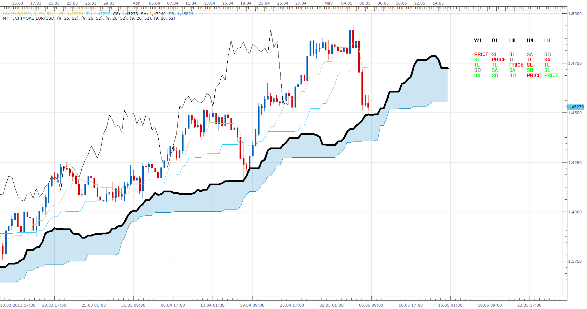
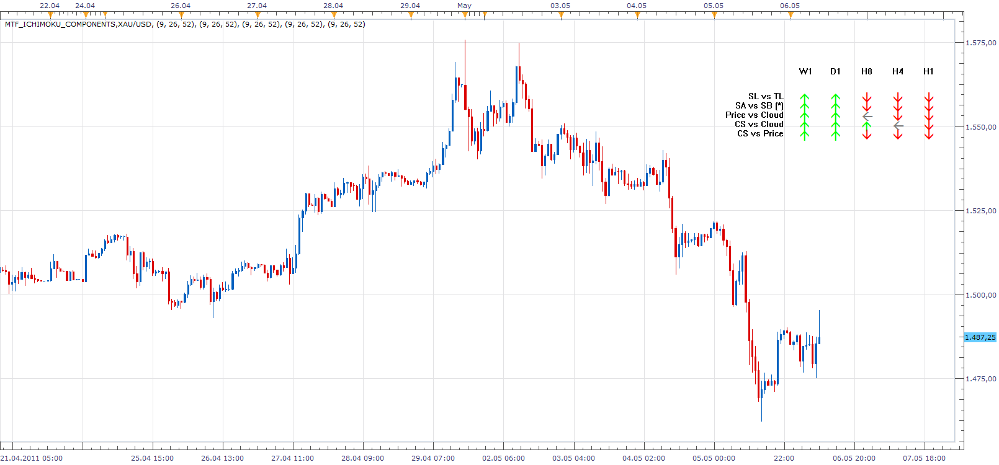

# MTF Ichimoku

> Source: https://fxcodebase.com/code/viewtopic.php?f=17&t=4127  
> Forum: 17 · Topic 4127 · 8 post(s)

---

## MTF Ichimoku

**Apprentice** · Fri May 06, 2011 4:12 am

This indicator shows the relative position of ichimoku components at different time frames.

 [MTF_Ichimoku.lua](files/10356/MTF_Ichimoku.lua)

Legend
 TS = Tenkan-sen
KS = Kijun-sen
 SA =Senkou span A
 SB = Senkou span B

---

## Re: MTF Ichimoku

**Apprentice** · Fri May 06, 2011 8:47 am

 [MTF_Ichimoku_Components.lua](files/10360/MTF_Ichimoku_Components.lua)

---

## Re: MTF Ichimoku

**Apprentice** · Fri May 06, 2011 11:11 am

Update

---

## Re: MTF Ichimoku

**DS0167** · Fri May 27, 2011 2:44 am

Hello Masters of our indicators

Could it be possible to have a signal for the "MTF_Ichimoku_Componenets" ?

A sound signal (or strategy) for which we just need to determine our TF to get the signal ?

Many thank you in advance for your hard work

All the best,
Danielle

---

## Re: MTF Ichimoku

**Apprentice** · Fri May 27, 2011 3:11 am

Your request was added to the developmental cue.

---

## Re: MTF Ichimoku

**Apprentice** · Fri May 27, 2011 3:19 am

Additional notes.
Daniell wants to define an arbitrary number of time frames.
All must give positive indication.
Add an additional parameter, the minimum number of positive indications for the signal.

---

## Re: MTF Ichimoku

**Apprentice** · Wed Apr 08, 2015 11:04 am

Major Update

---

## Re: MTF Ichimoku

**Apprentice** · Sun Feb 04, 2018 7:41 am

The indicator was revised and updated.
