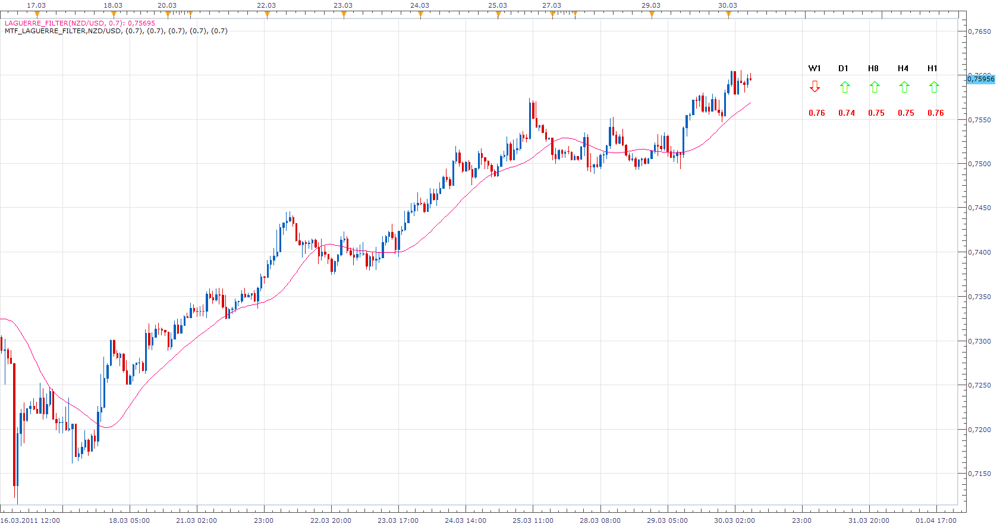

# MTF Laguerre Filter

> Source: https://fxcodebase.com/code/viewtopic.php?f=17&t=3779  
> Forum: 17 · Topic 3779 · 5 post(s)

---

## MTF Laguerre Filter

**Apprentice** · Wed Mar 30, 2011 6:56 am

A version that shows multiple time frames values of Laguerre Filter.

 [MTF_Laguerre_Filter.lua](files/9194/MTF_Laguerre_Filter.lua)

Please download and install Laguerre_Filter.
[viewtopic.php?f=17&t=331](https://fxcodebase.com/code/viewtopic.php?f=17&t=331)

The indicator was revised and updated

---

## Re: MTF Laguerre Filter

**bingyunid** · Fri Apr 01, 2011 1:28 am

> **Apprentice wrote:**
>
>
> MTF_Laguerre_Filter.png
>
>
>
> A version that shows multiple time frames values of Laguerre Filter.
>
>
>
> MTF_Laguerre_Filter.lua
>
>
>
> Please download and install Laguerre_Filter.
> [viewtopic.php?f=17&t=331](https://fxcodebase.com/code/viewtopic.php?f=17&t=331)

Hi,Apprentice,Thanks very much for developing so many indicators for us. Now, Could you explain this indicator for us, what does the color of the arrow or values of Laguerre Filter mean? i am puzzled at the color, thanks very much!

---

## Re: MTF Laguerre Filter

**Apprentice** · Sun Apr 03, 2011 3:58 pm

Hi,
The upper row.
If the indicator rises, the green arrow is pointing upwards and vice versa,
Lower row.
Shows the position of indicators in relation to price.
Green if the indicator is above price, and vice versa.

---

## Re: MTF Laguerre Filter

**bingyunid** · Mon Apr 04, 2011 12:06 pm

Apprentice,Thank you very much for your explaination. And i have another question, i searched the whole site to find a hpfo strategy, it seems there isn't a available signal or strategy,right? Thanks

---

## Re: MTF Laguerre Filter

**Apprentice** · Sun Mar 05, 2017 7:11 am

Indicator was revised and updated.
